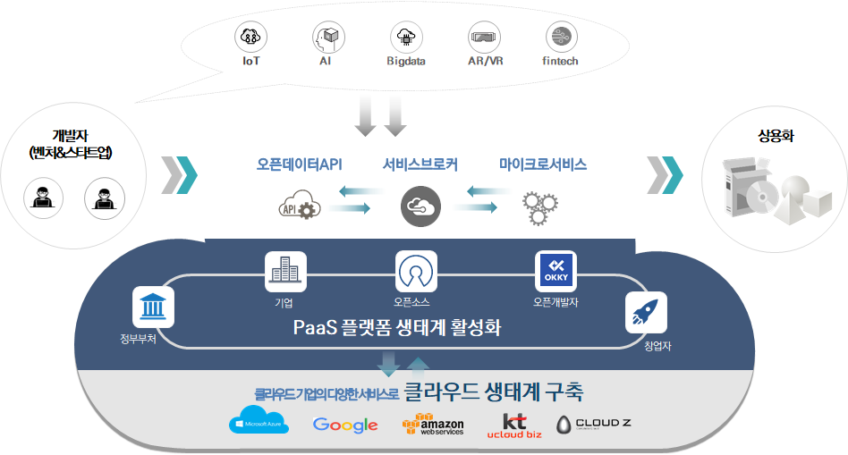

## 클라우드 기반 개발지원 플랫폼 활용 개요

클라우드 기반 개발 지원 플랫폼은 정부에서 지원하는 공모사업으로 개발된 시스템으로 클라우드 기반의 다양한 오픈데이터API를 한곳에 모아 서비스 할 수 있는 오픈데이터 마켓과 PaaS-TA 기반의 마이크로서비스 아키텍처 기반 애플리케이션 개발을 지원하는 도구를 제공하는 개발자를 위한 플랫폼(도구)입니다. 

- ### **오픈데이터API 게이트웨이 시스템**

  http://203.245.1.104:3000/?

  - 공공에서 제공하는 오픈API, 파일데이터를 포털 시스템에서 한번의 인증만으로 오픈데이터를 이용하여 개발할 수 있는 기능을 포털로 제공

  - 인기 랭킹서비스

  - 분야별 분류 체계 제공 및 통합 검색 기능

  - 오픈데이터 제공처를 위한 운영자 포털 제공

  - 마이크로서비스 스튜디오를 이용하여 개발한 애플리케이션의 API도 공개 가능함

    

- ### **마이크로서비스 스튜디오**

  http://203.245.1.101:8080/login

  - PaaS-TA 기반의 마이크로서비스 아키텍처 기반의 애플리케이션 개발을 위한 서비스 구성을 비주얼 편집기 기능을 제공하여 쉽고 정확하게 애플리케이션을 구성할 수 있는 도구

  - 마이크로서비스 애플리케이션을 API 공유 기능을 통해 외부에 공개할 수 있는 API 등록 및 API 모니터링 기능 제공

  - PaaS-TA 계정이 있어야 사용이 가능하기 때문에 먼저 PaaS-TA 계정 신청 및 승인을 거쳐야 함

    

  

