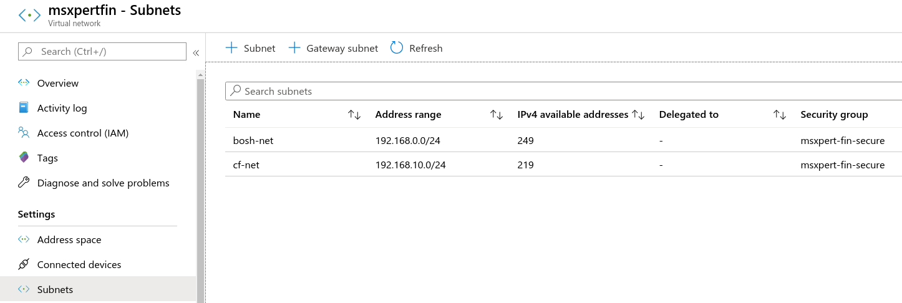

# Technical Report
## 
 #### [MsXpert 설치](#msxpert-설치-1)
  >##### [IaaS 구성 ( Azure )](#iaas-구성-azure-)
  >##### [Bosh 설치](#bosh-설치)
  >##### [CloudFoundry 설치](#cloudfoundry-설치)
  >##### [MsXpert 설치](#msxpert-설치)
 #### [MsXpert 운영](#msxpert-운영-1)
  >##### [Trouble Shooting](#trouble-shooting)
 #### [MsXpert Reference](#msxpert-reference-1)
  >##### [Database 구조](#database-구조)

***

### MsXpert 설치

#### IaaS 구성( Azure )

##### 1-1 .  리소스 그룹 생성
 

##### 1-2 .  Application 등록
 - Active Directory에서 Application 등록
    

 - 생성한 Application의 secret 생성
    

 - 생성한 Application을 Azure Subscription의 Contributer로 권한 부여
    

 - 생성한 Resource Group에 사용하고자 하는 User를 Contributer로 등록 
    


##### 1-3 .  Storage Account 생성 
  - Azure의 Log를 기록하는 곳 
 

  - 컨테이너 생성
 

  - 테이블 생성
 

##### 1-4 .  네트워크 구성
  1. NSG(Network Security Group) 구성
     *8080, 443, 80, 8082, 9088포트는 msxpert에 따로 적용을 위해 등록한 port*
     

     CloudFoundry 설치에 필요한 port관련 사항: https://github.com/cloudfoundry/bosh-deployment
     


  2. 가상 네트워크 구성

   - Address Space
  
      

   - Subnets

      

  3. Route Table 구성 - route table 생성 후 bosh-net 서브넷 할당
      


##### 1-5 . vm 생성 (bosh-inception)
   


#### Bosh 설치
##### 2-1 . bosh-cli 설치
  ```shell
    # 다운 받은 바이너리 파일을 /usr/local/bin폴더 아래에 위치시키는 것으로 설치 완료
    $ wget https://github.com/cloudfoundry/bosh-cli/releases/download/v6.2.1/bosh-cli-6.2.1-linux-amd64
    $ chmod +x ./bosh-cli-6.2.1-linux-amd64
    $ sudo mv ./bosh-cli-6.2.1-linux-amd64 /usr/local/bin/bosh
  ```

##### 2-2 . bosh deploy
  ```shell
      # bosh deploy 전 사전 준비 작업
      $ sudo apt-get update
      $ sudo apt-get install -y build-essential zlibc zlib1g-dev ruby ruby-dev openssl libxslt-dev libxml2-dev libssl-dev libreadline6 libreadline6-dev libyaml-dev libsqlite3-dev sqlite
      
      # bosh-deploy clone
      $ git clone https://github.com/cloudfoundry/bosh-deployment.git
      
      # Deploy Bosh 예시 스크립트
      #!/bin/bash
      
      $ bosh create-env ~/workspace/bosh/bosh-deployment/bosh.yml \
          --state=state.json \
          --vars-store=creds.yml \
          -o bosh-deployment/azure/cpi.yml \
          -o bosh-deployment/uaa.yml \
          -o bosh-deployment/jumpbox-user.yml \
          -v director_name=bosh \
          -v internal_cidr=192.168.0.0/24 \ # Azure에서 bosh용으로 설정한 subnet address-space
          -v internal_gw=192.168.0.1 \
          -v internal_ip=192.168.0.6 \
          -v vnet_name=msxpertfin \ # Azure에서 생성한 Virtual Network
          -v subnet_name=bosh-net \ # Azure에서 bosh용으로 설정한 subnet 이름
          -v subscription_id=ff38~~~~~~~~~~~~~~~~~~~~~~~~~~ \ # 사용할 Azure subscription ID
          -v tenant_id=8be9~~~~~~~~~~~~~~~~~~~~~~~~~~~~~~~~ \ # 사용할 Azure App DirectoryID
          -v client_id=383b~~~~~~~~~~~~~~~~~~~~~~~~~~~~~~~~ \ # 사용할 Azure App Client ID
          -v client_secret=6hs8i~~~~~~~~~~~~~~~~~~~~~~~~~~~ \ # 사용할 Azure App Secret ID
          -v resource_group_name=msxpert_fin \ # Azure resource Group 이름
          -v storage_account_name=msxpertfin \ # Azure storage-account 이름
          -v default_security_group=msxpert-fin-secure # Azure NSG 이름    
  ```

 ##### 2-3. bosh target 설정
  ```shell
      # target 설정 및 로그인
      #!/bin/bash
      
      # Configure local alias
      $ bosh alias-env [지정할 이름] -e [Deploy -- Internal_IP] --ca-cert <(bosh int [Deploy -- creds.yml 파일 경로 ]/creds.yml --path /director_ssl/ca)
      
      # Log in to the Director
      $ export BOSH_CLIENT=admin
      $ export BOSH_CLIENT_SECRET=`bosh int [Deploy -- creds.yml 파일 경로]/creds.yml --path /admin_password`
      
      # Query the Director for more info
      $ echo $BOSH_CLIENT_SECRET
      $ bosh -e bosh env
      $ bosh -e bosh login
  ```

#### CloudFoundry 설치
 ##### 3-1. Upload a Cloud-Config
  ```shell
      $ bosh -e [target 설정시 지정한 이름] ucc iaas-support/azure/cloud-config.yml
  ```

 ##### 3-2. ~~Runtime-config Upload~~

 ##### 3-3. Upload a Stemcell
  ```shell
       $ bosh -e bosh upload-stmecell [설치 할 때 사용할 stemcell]
  ```

 ##### 3-4. Deploy CF
  ```shell
      #!/bin/bash
      
      $ bosh -e bosh -d cf deploy cf-deployment/cf-deployment.yml \
        --vars-store=./env-repo/deployment-vars.yml \
        -v system_domain=paastaxxxxx.co.kr \ # 사용할 Domain
        -v haproxy_public_network_name=vip \ # 사용할 haproxy_public_network 이름
        -v haproxy_public_ip=[xxx.xxx.xxx.xxx] \ # IaaS에서 할당한 Public IP
        -o cf-deployment/operations/use-postgres.yml \
        -o cf-deployment/operations/azure.yml \
        -o cf-deployment/operations/use-haproxy.yml \
        -o cf-deployment/operations/use-haproxy-public-network.yml
  ```

#### MsXpert 설치
 ##### 4-1. angular/cli 설치
  ```shell
      $ curl -sL https://deb.nodesource.com/setup_8.x | sudo -E bash -
      $ sudo apt-get install -y nodejs
      $ npm install -g @angular/cli@1.6.7
      
      # npm install 명령어 실행시 sudo npm install은 권장하지 않음.
      # -g: global 옵션으로 설치시 발생하는 permission 문제는 https://docs.npmjs.com/resolving-eacces-permissions-errors-when-installing-packages-globally 참조
      
      # ~/.profile 파일에서 PATH변수에 node_modules 폴더 아래의 @angular/cli/bin 폴더를 등록
      # node_modules 폴더의 위치에 따라 적절하게 PATH값 등록
      # source ~/.profile 명령을 통해 PATH적용
      # 예시 export PATH=$PATH:/home/[linux유저ID]/.npm/node_modules/@angular/cli/bin
  ```

 ##### 4-2. node_module 설치   
  ```shell
      # git clone 을 통해 MsXpert 프로젝트 다운로드
      $ cd microservice/src/crossent/micro/studio/web
      $ npm install
  ```

 ##### 4-3. golang 설치(go install go-bindata)  
  ```shell
      # golang 1.9.7을 다운로드
      $ wget https://dl.google.com/go/go1.9.7.linux-amd64.tar.gz
      
      # /usr/local경로 아래에 golang 압축풀기
      $ sudo tar -C /usr/local -xzf go1.9.7.linux-amd64.tar.gz
      
      # ~/.profile 에서 PATH 등록하기
      # export PATH=$PATH:/usr/local/go/bin
      $ vi ~/.profile
      $ source ~/.profile
      
      # git clone [MsXpert Studio] 
      # cd [ project folder ]
      $ cd microservice
      $ export GOPATH=$PWD
      $ export PATH=$PWD/bin:$PATH
      $ go install vendor/github.com/jteeuwen/go-bindata/go-bindata
  ```

 ##### 4-4. API 서버 주소 확인
  ```shell
      $ vi microservice/src/crossent/micro/studio/web/src/environments/environment.prod.ts
      # 예시
      # msxpert portal에 할당하기 위해 생성해 놓은 public IP : 101.101.XXX.XXX
      # IaaS영역에서 설정해둔 IP와 port번호를 이용하여 apiUrl, swaggerApiUrl 작성
      export const environment = {
        production: true,
        apiUrl: 'http://101.101.XXX.XXX:8080/api/v1',  
        swaggerApiUrl: 'http://101.101.XXX.XXX:8080/swagger/',
        cfEnvNameMSA: 'msa',
        cfEnvNamePrivate: 'private',
        msServices: 'config-server,registry-server,gateway-server',
        sampleApps: 'front,back',
        nodeTypeApp: 'App',
        nodeTypeService: 'Service',
        configService: 'config-server',
        registryService: 'registry-server',
        configServiceLabel: 'micro-config-server',
        registryServiceLabel: 'micro-registry-server'
      };
  ```

 ##### 4-5. Web Binary 생성
  ```shell
      $ cd microservice/src/crossent/micro/studio
      $ make
  ```
 ##### 4-6. Spring-Cloud Application 준비  
  ```shell
      # https://github.com/startupcloudplatform/Microservices/releases 에서 
      # - config-0.0.1-SNAPSHOT.jar
      # - gateway-0.0.1-SNAPSHOT.jar
      # - registry-0.0.1-SNAPSHOT.jar
      # 3개의 jar파일을 다운 받아서 각 폴더에 위치시켜야함.
      
      $ cp config-0.0.1-SNAPSHOT.jar microservice/src/crossent/micro/broker/config/assets/configapp
      
      $ cp registry-0.0.1-SNAPSHOT.jar microservice/src/crossent/micro/broker/config/assets/registryapp
      
      $ cp gateway-0.0.1-SNAPSHOT.jar microservice/src/crossent/micro/broker/config/assets/gatewayapp
  ```
 ##### 4-7. Blob 준비  
  ```shell
        
        $ cf microservice
        $ bosh add-blob golang-linux-amd64-1.8.3.tar.gz golang/golang-linux-amd64-1.8.3.tar.gz
        $ bosh add-blob jq-linux64-1.5 jq/jq-linux64-1.5
        $ bosh add-blob grafana-5.3.4.linux-x64.tar.gz grafana/grafana-5.3.4.linux-x64.tar.gz
        $ bosh add-blob nginx-1.10.3.tar.gz nginx/nginx-1.10.3.tar.gz
        $ bosh add-blob binary/pcre-8.42.tar.gz nginx/pcre-8.42.tar.gz
        $ bosh add-blob prometheus-2.5.0.linux-amd64.tar.gz prometheus/prometheus-2.5.0.linux-amd64.tar.gz
        $ bosh add-blob traefik-1.6.5_linux-amd64.gz traefik/traefik-1.6.5_linux-amd64.gz
  ```
 ##### 4-8. CF org, space 생성  
  ```shell
      # cf-cli 설치
      $ curl -L "https://cli.run.pivotal.io/stable?release=linux64-binary" | tar -zx
      $ sudo cp cf /usr/local/bin/
      $ cf --version

      $ cf create-org org-micro
      $ cf create-space space-micro -o org-micro
  ```

 ##### 4-9. UAA Client 등록
  ```shell
      # cf-uaac 설치
      $ gpg --keyserver hkp://pool.sks-keyservers.net --recv-keys 409B6B1796C275462A1703113804BB82D39DC0E3 7D2BAF1CF37B13E2069D6956105BD0E739499BDB
      $ \curl -sSL https://get.rvm.io | bash -s stable
      $ source ~/.rvm/scripts/rvm
      $ rvm install ruby-2.3.0
      $ gem install cf-uaac
      
      # cf-uaac target 설정
      ## bosh-lite.com 부분은 상황에 맞게 Domain을 넣어줘야함.
      $ uaac target https://uaa.bosh-lite.com --skip-ssl-validation
      $ uaac token client get admin -s [cf 설치시 생성된 uaa_admin_client_secret]

      $ uaac client add micro --name micro -s micro-secret \
         --authorities "oauth.login,scim.write,clients.read,scim.userids,password.write,clients.secret,clients.write,uaa.admin,scim.read,doppler.firehose" \
         --authorized_grant_types "authorization_code,client_credentials,password,refresh_token" \
         --scope "cloud_controller.read,cloud_controller.write,openid,cloud_controller.admin,scim.read,scim.write,doppler.firehose,uaa.user,routing.router_groups.read,uaa.admin,password.write" \
         --redirect_uri "https://uaa.bosh-lite.com/login"
  ```

 ##### 4-10. Deploy MsXpert  
  ```shell
       $ cd microservice
       $ bosh -e vbox update-cloud-config cloud-config.yml
       $ bosh -e vbox create-release --name msxpert-nipa --force
       $ bosh -e vbox upload-release --name msxpert-nipa
       $ bosh -e vbox -d msxpert-nipa deploy microservice-msxpert.yml --vars-file vars-file.yml
       # vars-file.yml 예시
        ---
        cf_api_url: https://api.[Domain 주소]
        uaa_url: https://uaa.[Domain 주소]
        cf_username: admin
        cf_password: [cf_admin_password]
        cf_skip_cert_check: true
        external_url: http:[IaaS에서 설정한 studio public IP 및 port번호] 
        # 문서 4-4에서 apiUrl에 넣어준 IP:port와 동일
        haproxy_backend_port: 8089
        grafana_admin_password: admin

       $ bosh -e vbox -d msxpert-nipa run-errand broker-registrar
  ```

  < cloud-config.yml 예시 >

  ```yaml
       azs:
       - name: z1
       - name: z2
       - name: z3
       
       vm_types:
       - name: small
         cloud_properties:
           instance_type: Standard_A1_v2
       - name: medium
         cloud_properties:
           instance_type: Standard_A2_v2
       - name: large
         cloud_properties:
           instance_type: Standard_A4_v2
       - name: xlarge
         cloud_properties:
           instance_type: Standard_D4s_v3
       
       disk_types:
       - name: default
         disk_size: 3000
       - name: small
         disk_size: 5000
       - name: medium
         disk_size: 10000
       - name: large
         disk_size: 50_000
       - name: xlarge
         disk_size: 100_000
       
       networks:
       - name: default
         type: manual
         subnets:
         - range: 192.168.10.0/24 # 내부망
           gateway: 192.168.10.1
           azs: [z1, z2, z3]
           dns: [8.8.8.8]
           reserved: 192.168.10.2-192.168.10.100 # 이미 사용중인 네트워크
       #    static: ((static_ips))
           cloud_properties:
             virtual_network_name: msxpertfin # network-toplogy 사진 참고 
             subnet_name: cf-net # network-toplogy 사진 참고
             security_group: msxpert-fin-secure # network-toplogy 사진 참고
       
       - name: vip # cf 배포시 haproxy_public_network_name
         type: vip
       
       compilation:
         workers: 5
         reuse_compilation_vms: true
         az: z1
         vm_type: medium
         network: default
  ```

  - range == cf-subnet --------------------------------------------------------------------------------------------------------------
       
       
  - network-toplogy ---------------------------------------------------------------------------------------------------------------
       
       

  < microservice-msxpert.yml  예시 >
  ```yaml
       ---
       name: msxpert-nipa
       
       releases:
       - name: msxpert-nipa
         version: latest
       - name: postgres
         version: 23
         url: https://bosh.io/d/github.com/cloudfoundry/postgres-release?v=23
         sha1: 4b5265bfd5f92cf14335a75658658a0db0bca927
       - name: haproxy
         version: 9.3.0
         url: https://github.com/cloudfoundry-incubator/haproxy-boshrelease/releases/download/v9.3.0/haproxy-9.3.0.tgz
         sha1: 384de4ad378b940641a34cda1c63fdc02c901b8f
       
       stemcells:
       - alias: trusty
         os: ubuntu-trusty
         version: latest
       
       instance_groups:
       - name: studio-nipa
         instances: 1
         vm_type: small
         vm_extensions: []
         stemcell: trusty
         azs: [z1]
         networks: [{name: default}]
         jobs:
         - name: studio
           release: msxpert-nipa
           properties:
             bind_ip: 0.0.0.0
             bind_port: 8080
             external_url: ((external_url))
             postgresql:
               database: &db_name microservice-nipa
               role: &db_role
                 name: microservice
                 password: dummy-postgres-password
             cf:
               api_url: ((cf_api_url))
               uaa_url : ((uaa_url))
               username: ((cf_username))
               password: ((cf_password))
               skip_cert_check: ((cf_skip_cert_check))
               client_id: micro
               client_secret: micro-secret
         - name: microservice-broker
           release: msxpert-nipa
           properties:
             broker:
               username: admin
               password: admin
               port: 3000
             cf:
               api: ((cf_api_url))
               username: ((cf_username))
               password: ((cf_password))
               organization: org-micro
               space: space-micro
               skip_cert_check: ((cf_skip_cert_check))
       
         - name: haproxy
           release: haproxy
           consumes:
             http_backend: {from: haproxy_traefik}
           properties:
             ha_proxy:
               backend_port: ((haproxy_backend_port))
       
         - name: nginx
           release: msxpert-nipa
       
       - name: db-nipa
         instances: 1
         vm_type: small
         stemcell: trusty
         persistent_disk_type: small #5GB
         azs: [z1]
         networks: [{name: default}]
         jobs:
         - name: postgres
           release: postgres
           properties:
             databases:
               port: 5432
               databases:
               - name: *db_name
               roles:
               - *db_role
       
       - name: broker-registrar-micro
         instances: 1
         azs: [z1]
         lifecycle: errand
         vm_type: small
         stemcell: trusty
         networks: [{name: default}]
         jobs:
         - name: broker-registrar
           release: msxpert-nipa
           properties:
             servicebroker:
               name: microservicebroker
               username: admin
               password: admin
             cf:
               api_url: ((cf_api_url))
               username: ((cf_username))
               password: ((cf_password))
               skip_ssl_validation: ((cf_skip_cert_check))
       
       - name: broker-deregistrar-micro
         instances: 1
         azs: [z1]
         lifecycle: errand
         vm_type: small
         stemcell: trusty
         networks: [{name: default}]
         jobs:
         - name: broker-deregistrar
           release: msxpert-nipa
           properties:
             servicebroker:
               name: microservicebroker
             cf:
               api_url: ((cf_api_url))
               username: ((cf_username))
               password: ((cf_password))
               skip_ssl_validation: ((cf_skip_cert_check))
       
       - name: traefik-nipa
         instances: 1
         azs: [z1]
         stemcell: trusty
         vm_type: small
       #  persistent_disk_type: small
         env:
           bosh: { swap_size: 0 }
         networks: [{name: default}]
         jobs:
           - name: traefik
             release: msxpert-nipa
             provides:
               traefik: {as: haproxy_traefik}
             properties:
               traefik:
                 log_level: DEBUG
                 access_logs: { enabled: true }
                 http: { enabled: true, port: ((haproxy_backend_port)) }
                 web:
                   enabled: true
                   basic_auth:
                     username: test
                     password: test1234
                 file:
                   enabled: true
                   watch: true
                   rules: |
                     [frontends]
       
                       [frontends.frontend1]
                       backend = "backend1"
                         [frontends.frontend1.routes.test_1]
                         rule = "Path:/api/customers"
       
                     [backends]
       
                       [backends.backend1]
       
                           [backends.backend1.servers.server1]
                             url = "http://node.bosh-lite.com"
                             weight = 1
       
       - name: grafana-nipa
         azs: [z1]
         instances: 1
         vm_type: small
       #  persistent_disk_type: small
         stemcell: trusty
         networks: [{name: default}]
         jobs:
           - name: grafana
             release: msxpert-nipa
             properties:
               grafana:
                 auth:
                   proxy:
                     enabled: true
                     header_name: X-MSXPERTAUTH-USER
                     auto_sign_up: true
                 security:
                   admin_user: admin
                   admin_password: ((grafana_admin_password))
       
         stemcell: trusty
         vm_type: small
       #  persistent_disk_type: small
         env:
           bosh: { swap_size: 0 }
         networks: [{name: default}]
       
       update:
         canaries: 1
         max_in_flight: 1
         serial: false
         canary_watch_time: 1000-60000
         update_watch_time: 1000-60000
  ```

  < vars-file.yml 예시 >
  ``` yaml
       ---
       cf_api_url: https://api.bosh-lite.com # [cf api endpoint]
       uaa_url: https://uaa.bosh-lite.com
       cf_username: admin
       cf_password: # [CF_Admin_Password]
       cf_skip_cert_check: true
       external_url: # [studio-nipa VM과 연결시킬 Public IP]:8080
       haproxy_backend_port: 8089
       grafana_admin_password: admin 
  ```

### MsXpert 운영 

#### Trouble Shooting
 #### Contents
  >##### [MsXpert 의 DB에 접근하기](#msxpert-의-db에-접근하기-1)
  >##### [MsXpert 상에서 앱의 Url 주소가 정상적으로 조회되지 않는 경우](#msxpert-상에서-앱의-url-주소가-정상적으로-조회되지-않는-경우-1)
  >##### [1-3.  API  등록시 RestAPI가 조회되지 않을때 RestAPI 확인 방법](#api--등록시-restapi가-조회되지-않을때-restapi-확인-방법-1)
  >##### [1-4.  cf에 deploy 되어 있는 application의 env 확인 방법 ( Application 접근 비밀번호 확인법)](#cf에-deploy-되어-있는-application의-env-확인-방법--application-접근-비밀번호-확인법-1)
  >##### [1-5. Spring-cloud-Eureka  에러](#spring-cloud-eureka--에러-1)
  >##### [1-6. msxpert-nipa의 각 instance에 접근하는 방법](#sxpert-nipa의-각-instance에-접근하는-방법-1)
  >##### [1-7. 등록해둔 API가 정상적으로 호출되지 않는 상황에서 대처법](#등록해둔-api가-정상적으로-호출되지-않는-상황에서-대처법-1)

 #####  MsXpert 의 DB에 접근하기
  ```shell
      # bosh Inception에서 아래의 과정을 실행
      $ bosh envs
      # 예시 결과: url: 10.10.1.10,  Alias: bosh_dev
      
      # vm 확인
      $ bosh -e bosh_dev vms  
      # Deployment 'msxpert-nipa'의 'db-nipa' vm에  bosh ssh 명령어를 이용하여 접속
      $ bosh -e bosh_dev -d msxpert-nipa ssh db-nipa
      
      # bosh 명령어 사용시 아래와 같은 에러가 발생하면 bosh login 을 실행하여 해결
      # refreshing token: Refreshing token: UAA responded with non-successful status code '401' response '{"error":"invalid_token","error_description":"Invalid refresh token expired at Wed Feb 26 07:07:41 UTC 2020"}'
      
      # bosh login을 정상적으로 진행헀음에도 같은 오류가 발생한다면 bosh 명령어 내릴때 auth 정보를 부여
      # 예시 $ bosh -e bosh_dev --client [계정] --client-secret [비밀번호] vms
      
      # ssh 접속 이후에는 아래의 명령어를 통해 DB에 접근이 가능
      $ sudo -u vcap /var/vcap/packages/postgres-9.6.4/bin/psql microservice-nipa
  ```

 #####  MsXpert 상에서 앱의 Url 주소가 정상적으로 조회되지 않는 경우
  - backendApp은 보안을 위해서 url이 공개 되지 않는 것이 기본 Setting
    
      ```shell
      # 예시 cf target 명령어를 통해 작업 공간을 설정해둔 상태에서 cf map-route 명령어 실행
      # api endpoint:   https://api.bosh-lite.com
      # api version:    2.121.0
      # user:           test
      # org:            test-org
      # space:          space
      $ cf map-route crs-front-lkop bosh-lite.com --hostname crs-front-lkop
      ```

 #####  API  등록시 RestAPI가 조회되지 않을때 RestAPI 확인 방법 
  - 우선적으로 swagger페이지가 정상 동작하는지 확인
    
      ```shell
      # 브라우저를 통해 http://[ 확인하고 싶은 Application URL ]/swagger-ui.html 접속 후 확인하고 싶은 컨트롤러 클릭
      # 사진 예시: http://crs-front-lkop.bosh-lite.com/swagger-ui.html
      
      # 이 부분에서 확인되지 않으면 코드를 확인
      # 'microservice-nipa' DB의 'micro_app' 테이블 항목에서 해당하는 데이터의 swagger 데이터에 ''(빈 값)을 넣어주어 DB에 정상적인 데이터가 채워지게 함.
      # 해당 작업 이후에도 문제가 발생한다면 Application 쪽에서 swagger부분 코드를 확인해야함.
      ```
 

 #####  cf에 deploy 되어 있는 application의 env 확인 방법 ( Application 접근 비밀번호 확인법)
  ```shell
      # cf env [ Application 이름 ]
      $ cf env configapp508a6971-870b-45a7-a4df-ac94f5d54987
      
      # application의 basic auth 정보를 확인할 수 있음.
      # 결과 예시
      #Getting env variables for app configapp508a6971-870b-45a7-a4df-ac94f5d54987 in org user3-org / space space as user3...
      #OK
      
      System-Provided:
      {
       "VCAP_APPLICATION": {
        "application_id": "e10ad7e7-d401-404e-af77-7547c3ab3ecd",
        "application_name": "configapp508a6971-870b-45a7-a4df-ac94f5d54987",
        "application_uris": [
         "configapp508a6971-870b-45a7-a4df-ac94f5d54987.bosh-lite.com"
        ],
        "application_version": "c2384821-37d1-4c91-913f-3d3a24f34005",
        "cf_api": "https://api.bosh-lite.com",
        "limits": {
         "disk": 1024,
         "fds": 16384,
         "mem": 1024
        },
        "name": "configapp508a6971-870b-45a7-a4df-ac94f5d54987",
        "space_id": "c5914e3f-8716-46cc-9a54-3c1020bb27dd",
        "space_name": "space",
        "uris": [
         "configapp508a6971-870b-45a7-a4df-ac94f5d54987.bosh-lite.com"
        ],
        "users": null,
        "version": "c2384821-37d1-4c91-913f-3d3a24f34005"
       }
      }
      User-Provided:
      basic-secret: 76e0a~~~~~~~~~~~~~~~~~~~~~~~~~~~~~
      basic-user: 508a6971-870b-45a7-a4df-ac94f5d54987
  ```
  - basic auth 사용 예시1) cf env를 통해 확인한 basic auth 정보를 이용하여 application에 접근 가능
      

  - basic auth 사용 예시2) 
  ```shell
      # curl 명령 사용 
      # config application refresh
      $ curl -d {} -u 508a6971-870b-45a7-a4df-ac94f5d54987:76e0a~~~~~~~~~~~~~~~~~~~~~~~~~~~~~   configapp508a6971-870b-45a7-a4df-ac94f5d54987.bosh-lite.com/refresh
  ```
 ##### Spring-cloud-Eureka  에러
  ```shell
      # EMERGENCY! EUREKA MAY BE INCORRECTLY CLAIMING INSTANCES ARE UP WHEN THEY'RE NOT. RENEWALS ARE LESSER THAN THRESHOLD AND HENCE THE INSTANCES ARE NOT BEING EXPIRED JUST TO BE SAFE.
      
      # Renews threshold값이 Renews(last min) 보다 크면 spring-cloud-config 앱이 재시작한 상태에서 spring-cloud-eureka를 재시작하는 과정이 필요
  ```

 

 ##### msxpert-nipa의 각 instance에 접근하는 방법
  ```shell
      # msxpert-nipa의 deploy 상황이 아래와 같을때 각 instance에 접근하는 방법
      # Deployment 'msxpert-nipa'
      
      # Instance                                           Process State  AZ  IPs  
      # db-nipa/cad4df9b-05af-4c61-8aa6-46494b6972e3       running        z1  10.10.20.152
      # grafana-nipa/6ac55edb-dc2d-4ee4-b7c9-62ac3d2d0f70  running        z1  10.10.20.154
      # studio-nipa/4d9d4f20-cdb3-4dce-8631-977952110404   running        z1  10.10.20.151
      # traefik-nipa/2dccbac6-4840-4ad6-bb8a-cf181466ecd7  running        z1  10.10.20.153
      # 4 vms
  ```
  - 첫번째 방법: IaaS에서 생성한 public IP(Floating IP)에 해당 vm 결합

  - 두번째 방법:  haproxy사용

    ```shell
        # haproxy 설치
        $ sudo apt install haproxy
        # haproxy 설치 확인
        $ sudo systemctl status haproxy
        # haproxy.cfg 수정
        $ sudo vi /etc/haproxy/haproxy.cfg 
        
        ### 수정 예시 ###
        # frontend studio-trafik
        # bind *:9088
        # option forwardfor
        # default_backend traefik-back
        
        # backend traefik-back
        # balance roundrobin
        # server webserver5 10.10.20.153:8080
        # option httpchk
        
        # haproxy 재시작
        $ sudo systemctl restart haproxy
        
        # 브라우저를 통해 접속 
        # haproxy를 동작시킨 vm의 IP가 10.10.0.1이라면 studio-traefik 접근 URL은 10.10.0.1:9088
    ```
    < 접속 화면 >
    

 ##### 등록해둔 API가 정상적으로 호출되지 않는 상황에서 대처법
 


  < 상황1. API 호출시 에러 >
 

  < 상황2. vm상 확인시 traefik 정상 동작 >
 

  < 상황3. Traefik 화면에서 web 태그 확인이 안될때 >
  

  < 상황3 비교. Traefik 화면에서 web 태그가 정상적으로 확인 >
  ```shell
      #상황 1, 2, 3 이 동시에 확인되는 경우에는 Traefik 이 다시 올라간 경우라고 보고 새로 API를 등록해주는 것으로 해결 가능함. API등록은 API관리나 마이크로서비스 편집에서 시도.
  ```

### MsXpert Reference

#### Database 구조
  - DB 테이블 reference
    - 파란색: micro_app의 id
    - 빨간색: micro_api의 id

  - micro_app: MsXpert에서 생성한 마이크로서비스

    

  - micro_app_service: 각각의 마이크로서비스에서 사용하고 있는 cf상의 service (config-service, registry-service)

    

  - micro_app_app: 각각의 마이크로서비스를 구성하고 있는 cf상의 application

    

  - micro_api: MsXpert에 공개되어 있는 API

    

  - micro_api_frontend: micro_app과 micro_api의 관계 확인 가능, 마이크로서비스 API 생성시 Update

    

  - micro_app_api: 각각의 마이크로서비스에서 사용하고 있는 micro_api

    

  - micro_api_rule: traefik서버에서 저장하고 있는 micro_api들의 정보, micro_app_api에 관한 내용도 확인 가능

    

  - migration_version: Database-migration 정보,  Database Connection 생성시 사용

    

