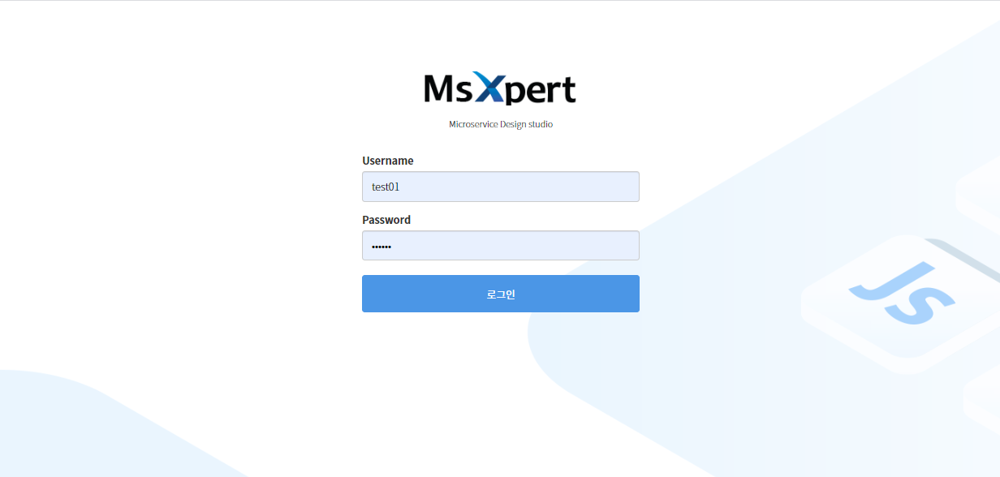
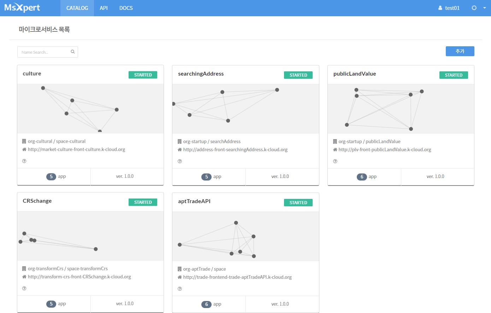
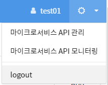

# 마이크로서비스 사용자 가이드


 ## 개요

마이크로서비스 스튜디오는 각 컴포넌트가 독립적으로 구성되어 있는 마이크로서비스 기반 개발을 지원하는 도구이다. 마이크로서비스 아키텍처를 사용하여 설계된 결과물을 시각적으로 표현할 수 있고, 제공되는 디자인 기능을 이용하여 직관적으로 서비스를 구성하고 관리할 수 있다. 높은 가시성을 제공하고 있어 마이크로서비스 현황을 한눈에 파악이 가능하고 복잡한 아키텍처 연관성을 쉽게 확인 가능한 토폴로지 형태로 조회하는 기능도 제공한다. 


### 마이크로서비스란 무엇인가?

"마이크로서비스는 한가지 기능(비지니스 관련 기능/역할)을 수행하는 초점을 맞춘 서비스를 독립적이고 배포 가능한 가장 작은 단위의 서비스(=atom)로 분리하고 API를 통해 다른 서비스와 연계하며 각각 자율적으로 개발, 운영 즉, 독립적인 팀이 각 서비스의 개발과 운영을 담당하는 것이다"

\-       업무상의 기능 또는 역할을 하나의 기능 묶음으로 개발된 컴포넌트 → 한 가지의 역할만 수행  

\-       REST API 등을 통하여 서비스들의 기능을 제공하고 사용 

\-       데이터를 공유하지 않고 서비스 별로 독립적으로 가공하고 저장함


### 마이크로서비스 스튜디오 아키텍처

클라우드 기반 창업플랫폼에서 제공하는 마이크로서비스 스튜디오는 기본적으로 아래와 같은 구조를 하고 있다. 


운영자는 마이크로서비스 스튜디오를 통해 만들어진 어플리케이션을 Zuul 기반의 API 게이트웨이, Eureka 기반의 레지스트리를 이용하여  Spring-config 기반으로 구성하고, Swagger API를 통해 API의 상세 스펙을 정의 및 명시하여 공개할 수 있다. 공개된 API는 다른 개발자가 자신의 마이크로서비스를 구성할 때 사용 가능하다.


### 주요 기능

#### 마이크로서비스 디자인 도구 제공

기존의 모놀리식 아키텍처와 달리 각 컴포넌트는 서비스라는 형태로 구현되고 API를 이용하여 타 서비스와 통신 서비스 경계는 구문 또는 업무 영역(도메인)에 따르기 때문에 작은 단위로 쪼갠 업무 영역을 앱 단위로 쉽게 표현할 수 있는 가시성 기능을 제공한다. 마이크로서비스 기반 개발 시 레지스트리정보, Config 정보는 필수 정보이나 디자인 시에는 화면에 노출시키지 않아 복잡성을 줄였다.


#### 그래픽 토폴로지 제공

마이크로서비스로 생성된 앱 간의 관계를 한눈에 보여주는 기능으로 토폴로지 형태로 제공하여 복잡한 앱 간의 관계를 시각적으로 표현하여 가시성을 높였다. 앱 상태가 장애가 발생했거나 중지 상태와 같은 경우도 표시해주고 있어 문제 발생 시 즉각적인 대응이 가능하도록 구성하였다. 


#### 사용 용어 정의

| **용어**              | **설명**                                                     |
| :-------------------- | ------------------------------------------------------------ |
| **Frontend**          | 백엔드 API에서 가져온 데이터의 출력, 입력을 통한 비지니스 로직 구성과 사용자와 대화하는 사용자 인터페이스 부분을 말한다. |
| **Backend**           | 프론트에서 전달된 데이터의 포맷이나 데이터베이스 입출력 및 다양한 비즈니스 프로세스를 프로그래밍 코드로 구현하는 역할을 한다. |
| **Gateway**           | 모든 클라이언트 요청에 대한 end point를 통합하는 서버이며, 마치 프록시 서버처럼 동작한다. 그리고 인증 및 권한, 모니터링, logging 등 추가적인 기능이 있다. |
| **Registry   Server** | 서비스를 등록하는 서버이다.                                  |
| **Config Server**     | 서비스의 상세 설정을 할 수 있는 Configuration 서버이다.      |


## 마이크로서비스 스튜디오 시작하기

마이크로서비스 스튜디오는 웹 기반으로 제공하는 마이크로서비스 개발 지원 도구로 누구나 쉽게 마이크로서비스로 설계된 내용을 앱과 연관된 게이트웨이, 백앤드 앱 간의 관계를 디자인할 수 있다. 웹 기반으로 자신이 개발하고자 하는 마이크로서비스 기반 시스템을 쉽게 표현할 수 있다. 

### 로그인

PaaS-TA 사용자 포털에 접속하면 배포 메뉴에 마이크로서비스 스튜디오가 포함되어 있다. 마이크로서비스 스튜디오는 포털을 통하거나, 별도 URL을 통해 사용자가 기존에 사용하던 PaaS-TA 계정을 통해 로그인이 가능하다.

아래 그림은 마이크로서비스 스튜디오를 단독으로 실행했을 경우 로그인 화면이다.

    

​                                                                                <로그인 화면>



​                                                                                     <메인 화면>


### 마이크로서비스 생성하기

마이크로서비스 아키텍처 메뉴를 통해 마이크로서비스를 생성하려면 PaaS-TA 사용자 포털의 배포 메뉴의 마이크로서비스 아키텍처를 선택한다. 초기 화면은 마이크로서비스 목록이 조회된다. 조회되는 목록은 현재 선택되어 있는 프로젝트(조직)이 기본으로 보이고 리스트 박스를 통해 프로젝트(조직)을 변경할 수 있다. 

 

1. 마이크로서비스 스튜디오를 접속하면 초기 화면은 CATALOG 목록이 기본 페이지이다.

2.     추가 버튼을 이용하여 마이크로서비스를 생성하여 구성한다.

3. 생성 화면에서 필수 입력값을 채워서 생성한다. 이때 PaaS-TA에 자신이 권한을 갖고 있는 조직과 영역을 지정해야 한다.

   

   ​                                                                          < 마이크로서비스 생성 >

   

4. 초기 화면에는 Gateway 아이콘만 화면에 보일 것이다.


#### 드래그 앤 드롭 기능 사용하기(앱 배치)

1. 오른쪽에 메뉴바에서 APP을 선택한다.

2. 등록되어있는 앱 목록이 조회된다.

3. 앱목록에서 앱을 디자인 영역으로 드래그 앤 드롭 기능을 이용하여 배치한다.

4. App List에 보이는 목록은 PaaS-TA를 이용하여 푸시한 앱 목록이다.

   

   ​                                                                           < 드래그앤드롭 기능 >

   

5. 둘 다 화면에 배치한 후 앱 간의 네트워크 정보는 선으로 연결한다. 선을 연결할 때는 시작하는 앱을 **Shift키**를 누른 상태로 다른 앱으로 마우스를 이동한다.

6. 네트워크 연결 시에는 반드시 순서를 지켜야 하는데 Gateway를 통해 Registry에 등록되기 때문에 프론트앤드 앱과 Gateway를 연결해야 하고 Gateway와 백엔드 앱을 연결해야 한다.


#### 서비스 구성하기

PaaS-TA에 배포된 서비스 브로커는 모두 사용할 수 있다. 창업 플랫폼으로 새로 추가된 빅데이터 서비스 브로커와 AI기반 상권 분석 브로커 등을 이용할 수 있다. 본 샘플 앱에서는 빅데이터 및 AI서비스 브로커를 이용하여 관련된 서비스를 같이 구성해야 한다.

1. 마이크로서비스 구성 화면의 오른쪽 메뉴에서 Service 를 선택한다.

2. 서비스 목록이 조회된다. 앱 구성과 마찬가지로 드로잉 영역으로 해당 되는 서비스를 드래그앤 드롭하여 배치한다.

3. 서비스를 연결하는 경우 백엔드 앱을 통해 서비스를 연결해야 한다.

4. 위의 과정을 통하면 마이크로서비스 구성이 완료된다.

   
   
   ​                                                         < 마이크로서비스 수정화면>

#### 마이크로서비스 저장하기

마이크로서비스 생성 기능을 이용하여 앱을 배치하고 선을 연결하여 구성을 완료하면 디자인 영역에 있는 툴박스의 아이콘을 이용하여 마이크로서비스를 저장한다. 

마이크로서비스 저장은 배치된 앱을 저장하고 재시작을 진행한다. 확인하려면 화면 상단의 마이크로서비스 상세를 클릭한다. 


### 마이크로서비스 조회 및 수정

생성과정을 통해 마이크로서비스 구성이 완료되었다면 Deploying 까지 완료된 상태이다. 외부에 오픈 가능한 도메인을 사용했다면 웹사이트 URL를 통해 어디에서든지 접속이 가능하다.

마이크로서비스 상세 조회화면에는 아래와 같은 정보를 확인할 수 있다.

- App

  App 목록을 통해 접근 가능한 URL을 확인할 수 있다.

  [](https://github.com/startupcloudplatform/Sample-App-Tutorial/blob/master/images/appdesc.png)

  ​                                                                              < App 목록 >

  

- Service

 마이크로서비스에 포함된 모든 서비스 목록을 제공한다.

- App & Service

- Network

- App Rest API

  API 호출 테스트를 실행할 수 있다.

  [](https://github.com/startupcloudplatform/Sample-App-Tutorial/blob/master/images/apitest.png)

- Gateway

- Registry

- Configuration

- App Logging

 마이크로서비스로 구성된 앱의 로그 정보를 뷰어롤 통해 제공한다. 동시에 여러개의 앱의 로그를 볼 수도 있다.

[](https://github.com/startupcloudplatform/Sample-App-Tutorial/blob/master/images/applog.png)

#### 마이크로서비스 수정하기

이미 구성을 완료한 경우 수정 화면을 통해서 기존 마이크로서비스 구성 상태를 변경할 수 있다. 상단 메뉴바에서 CATALOG를 선택하고 해당되는 마이크로서비스 목록의 이름을 클릭한다.

조회화면에서 연필모양 아이콘을 클릭하면 수정화면으로 변경된다.


수정화면에서 앱을 시작, 종료 상태를 변경할 수 있고 현재 페이지의 결과를 완전히 삭제할 수도 있다. 드로잉 영역의 이미지를 확대하거 축소하는 경우(+,-) 아이콘을 이용한다.


### REST API 테스트 기능

튜토리얼에서 소개하는 샘플앱은 프론트엔드 앱과 백엔드 앱 두개로 구성되어 있다. 백엔드 앱에는사용한 빅데이터 서비스 브로커를 이용하여 창업지역API 를 호출할 수 있게 개발되었고 프론트엔드 앱에서는 오픈된 API를 호출하여 프론트 영역에 사용자가 원하는 정보를 호출하도록 개발되었다. 개발하면서 정의한 API 목록을 swagger API로 조회하고 테스트해볼 수 있는 기능을 제공한다.

### 외부 API 활용

마이크로서비스 추가화면에서 외부 api 추가하는 기능을 사용할 수 있다. 이 샘플앱에서는 외부 API를 활용하지 않았지만 개발 범위 내에 외부 API를 활용할 필요가 있다면 아래와 같은 절차를 이용하면 외부 API를 활용할 수 있다.

1. 마이크로서비스 추가 화면 또는 수정화면을 이용한다.
2. 오른쪽 메뉴에서 API 메뉴을 선택한다.
3. 사용 가능한 API 목록이 조회된다.
4. 사용할 API 오른쪽 옆에 + 버튼을 누르면 API를 사용할 수 있는데 접속할 계정을 등록해야 한다.
5. 여기에서의 계정은 사용자가 추가한 API를 접속할 때 이용하는 계정 정보이다. 유출되지 않도록 해야 하고 잊어버리지 않도록 주의하자.

[](https://github.com/startupcloudplatform/Sample-App-Tutorial/blob/master/images/bauth.png)

6. 아이콘을 누르면 API 목록과 상세 정보를 조회할 수 있다.

   

## API 관리

마이크로서비스 기반으로 개발된 앱을 다른 사용자에게 공유를 위해 공개 설정을 할 수 있다. 공개 설정은 프론트엔드 앱에 정의한 API 설정 정보 기반으로 공개된다. 프론트엔드 앱에 백엔드 앱 호출 API를 정의해야 한다.

프론트엔드 앱 개발 시 Controller에 정의한 @GetMapping 정보가 공개된다.

API 공개 구조는 다음과 같다.

[](https://github.com/startupcloudplatform/Sample-App-Tutorial/blob/master/images/apisystem.png)


### 다른 앱에 정의된 API 호출

다른 앱에서 정의한 API를 활용하여 개발 시 포함할 때는 API경로에 유의해야 한다. 본 튜토리얼에서 소개하고 있는 샘플 앱의 경우 주요 기능을 수행하는 API는 백엔드 앱에 정의되어 있다. 프론트엔드 앱에서 백엔드 앱의 API를 호출은 게이트웨이를 통해서 호출이 가능하기 때문에 게이트웨이 경로를 알고 있어야 한다.

#### 게이트웨이 경로

게이트웨이 경로는 호출하고자 하는 앱이 마이크로서비스 스튜디오에 이미 구성되어 있어야 한다. 앱배포와 구성을 진행하면 자동으로 게이트웨이가 생성될 것이다. 마이크로서비스 스튜디오에서 마이크로서비스 상세 페이지의 오른쪽 메뉴에서 Registry 메뉴를 선택한다. 등록된 게이트웨이를 확인할 수 있다.

프론트엔드 앱에 @GetMapping("api/sido")를 통해 백엔드 앱으로 부터 데이터를 받아온다.

```
@GetMapping("/api/sido")
public @ResponseBody
.....
@GetMapping("/api/sangho")
public @ResponseBody
.....
```

위와 같이 개발 소스코드를 정의하게 되면 API 등록 시 위의 정보를 호출하게 된다.


#### API 등록--관리자 메뉴

자신이 등록한 마이크로서비스에 위에서 설명한 API 공개를 위한 조건에 부합이 된다면 API 등록을 통해 다른 사용자에게도 API를 공개할 수 있다. 아래 과정을 통해 API를 등록하면 다른 사용자에게 API목록이 조회된다.




1. 마이크로서비스 상단 메뉴의 오른쪽에 환경설정 아이콘을 클릭하면 마이크로서비스 API관리 메뉴가 있다.
2. 이 메뉴을 선택하면 등록된 API 목록 화면이 나오고 등록버튼을 볼 수 있다.
3. 등록 버튼을 눌러서 등록할 API가 있는 앱이 배포된 조직을 선택한다.
4. 다음 버튼을 누르면 공개할 API의 세부 정보를 등록할 수 있다. [](https://github.com/startupcloudplatform/Sample-App-Tutorial/blob/master/images/addapi.png)
5. 필수입력값을 잘 확인하여 값을 입력한다.
6. 마이크로서비스 Frontend 부분에서 URL 부분의 리스트를 선택한다. 이 리스트에 나오는 값은 마이크로서비스 구성 시 Frontend App 의 URL을 자동으로 가져온다. [](https://github.com/startupcloudplatform/Sample-App-Tutorial/blob/master/images/fronturl.png)
7. 해당 URL을 선택한다.
8. 등록 버튼이 활성화되면 클릭한다.
9. 등록된 결과는 상단 메뉴의 API을 통해 확인할 수 있다.


#### API 모니터링

API Health 상태를 모니터링 대시보드로 제공한다. 


모니터링 페이지에 표시되는 항목으로는 평균 반응 시간 (밀리초), 총 코드 호출 횟수, 등록 후 업타임 경과가 있으며, 평균 반응 시간과 코드 호출 횟수는 시간별 그래프로 확인할 수 있다. 이외에 최근 HTTP 에러도 하단에서 확인할 수 있다.
