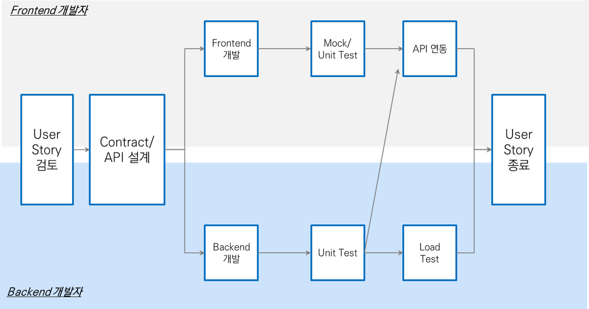

# 마이크로서비스 아키텍처 개요

마이크로서비스 앱은 기존의 모놀리식 앱과 다른 개발 방식으로 비지니스 관점으로 보면 독깁적인 서비스 변경과 확장이 유용하고 의존성이 감소된다. 단점은 아키텍처 설곙와 비지니스 분석이 선행되어야 하며 설계의 난이도가 증가한다. 레거시 시스템과 연계에 어려움이 있을 수 있다. 

기술적 관점에서는 신속하고 독립적인 변경, 배포 및 확장에 효율적이며 Polyglot(다양한 언어) 개발이 가능하다. 단점으로는 분산시스템 인프라 구성, 확장 및 운영에 어려움이 따른다.  실제로 마이크로서비스 구성 및 개발 도구가 부재하고 수 많은 앱의 연결되기 때문에 복잡한 네트워크 및 환경 설정을 위해 자동화는 필수이다. 

기존의 모놀리식 앱을 마이크로서비스 단위로 전환 개발하는 프로젝트도 수행하지만 신규 개발에 적용하는 것이 더 적합하다. 

## 마이크로서비스 특징 이해하기

- [모놀리식 아키텍처](#모놀리식-아키텍처)
- [마이크로서비스 아키텍처](#마이크로서비스-아키텍처)
- [스프링클라우드의 마이크로서비스 패턴](#Spring-Cloud의-마이크로서비스-패턴)
- [API 정의](#Application-Programming-Interface-정의)
- [마이크로서비스 아키텍처와 PaaS](#마이크로서비스-아키텍처와-PaaS)

### 모놀리식 아키텍처

- 하나의 애플리케이션 내에 모든 로직들이 모두 들어 가 있는 “통짜 구조” : 도메인 로직은 Class, Function, Package 등으로 구분 
- 모든 요청은 하나의 프로세스에서 처리 
- 개발이 완료되면 전체 로직들에 대한 테스트가 진행되고 전체 프로그램이 빌드되어서 서버에 배포 
- 각 컴포넌트들은 상호 호출을 함수를 이용한 Call-by-Reference 구조 → 성능 제약이 덜함 
- 물리적인 서버 또는 가상화 서버에 동일한 인스턴스 전체가 배포되는 것으로 수평 확장되며, 확장된 
- 인스턴스들은 Loadbalancer 뒤에서 동작

#### 모놀리식 아키텍처 특징

- 코드가 방대함
- 컴포넌트들의 관리자가 명백하지 않다.
- 배포 주기가 길다.

#### 모놀리식 아키텍처  장점

- 단일 코드 기반으로 개발, 디버깅 및 배포가 쉽다
- IDE 지원
- 수평적 확장이 쉽다

#### 모놀리식 아키텍처 단점

- 규모가 큰 애플리케이션에서는 빌드, 배포, 서버 기동 시 시간이 오래 걸림 
- 프로젝트가 커질수록 협업하기 어려워짐
- 컴포넌트들이 서로 로컬 콜 기반으로 단단하게 결합되어 있어 특정 컴포넌느나 모듈에서의 성능 문제나 장애가 다른 컴포넌트에 까지 영향을 기침
- 코드가 너무 커져서 유지보수에 어려움이 있음

### 마이크로서비스 아키텍처 

- 컴포넌트화되어 오직 한 가지 기능만 수행
- 비지니스 기능/역할에 따라서 분할
- 프로젝트가 아니라 개별 제품 관점으로 접근
- 단순한 애플리케이션간 연동과 파이프라인 처리
- 거버넌스 통제 분산
- 데이터 관리 분산
- 자동화 환경 구축(DevOps)
- 장애에 대비한 설계
- 변화에 대응하는 설계

#### 마이크로서비스 아키텍처 특징

- 클라우드 환경에 적합 새로운 웹 개발 아키텍처로 오로지 한가지의 역할만 수행하는 서비스들이 서로 독립적으로 분할되어 있음
- 독립적인 서비스들은 표준화된 API를 통해서 서로 통신/결합
- 구축 시 중점을 두는 부분은 확장성, 코드의 분리, 업그레이드와 변경이 쉽고 유연성을 보장
- 자동화
- 데이터베이스 정규화

#### 마이크로서비스에서 서비스란 무엇인가?

"마이크로서비스는 한가지 기능(비지니스 관련 기능/역할)을 수행하는 초점을 맞춘 서비스를 독립적이고 배포 가능한 가장 작은 단위의 서비스(=atom)로 분리하고 API를 통해 다른 서비스와 연계하며 각각 자율적으로 개발, 운영 즉, 독립적인 팀이 각 서비스의 개발과 운영을 담당하는 것이다"

\-   업무상의 기능 또는 역할을 하나의 기능 묶음으로 개발된 컴포넌트 → 한 가지의 역할만 수행  

\-   REST API 등을 통하여 서비스들의 기능을 제공하고 사용 

\-   데이터를 공유하지 않고 서비스 별로 독립적으로 가공하고 저장함

\-   서비스간의 인터페이스 규약 사용 - REST, Thrift, Protocolbuffer, AMQ

#### 마이크로서비스 아키텍처 구성 요소

마이크로서비스 아키텍처를 구성하는 핵심 요소는 크게 4가지로 구성된다. 서비스, DevOps, 데이터 분리, API Gateway 로 구성할 수 있다. 

1. **서비스**

   - 각 컴포넌트는 서비스라는 형태로 구현되고API를 이용하여 타 서비스와 통신 

   - 서비스 경계는 구문 또는 도메인(업무)의 경계를 따름 

     예) 사용자 관리, 상품 관리, 주문 관리와 같은 각 업무 별로 서비스를 나눠서 정의 

   - REST API에서 /users, /products와 같이 주요 URI도 하나의 서비스

2. **DevOps**
   
   - DevOps는 CI에서 좀더 진화된 형태 
   - 개발, 테스트, 배포를 모두 자동화 시켜 개발 사이클이 끊임없이 순환되도록 함으로서 개발의 속도를 최대화 시키는 개발 유형
   - 배포가 서비스의 수 만큼 이루어지게 될 뿐만 아니라 테스트 또한 각각의 서비스가 연동되어 발생하는 집합체 Aggregate의 수 만큼 필요하게 되므로 필연적으로 DevOps 필요
3. **데이터 분리**
   
   - 서비스 별로 필요에 따라 별도의 데이타 베이스를 사용
   - 서비스가 API에서부터 데이터베이스까지 분리되는 수직 분할 원칙 (Vertical Slicing)에 따름
   - 데이터베이스의 종류 자체를 다르게 하거나, 같은 데이터 베이스를 사용하더라도 스키마를 나누는 방법 사용 
4. **API Gateway**
   
   - 모든 api에 대한 end point를 통합하고, 몇가지 추가적인 기능을 제공하는 미들웨어 
   - EndPoint 통합과 토폴로지 정리
   - Orchestration : 여러 개의 서비스를 묶어서 하나의 서비스 생성
   - 공통 기능 처리(Cross cutting function handling) : API 인증 (Authentication), Logging 등 
   - Mediation : 메시지 포맷 변환, 프로토콜 변환, 메시지 라우팅 등 

#### 마이크로서비스 아키텍처 장점

**Technology Heterogeneity** 

요구사항을 구현하기 위해 최적화된 언어와 아키텍처의 선택 : 다른 프로그래밍언어, 다른 도구를 사용하여 개발 가능 

**Resilience** 

오류 발생 시 복구될 때까지 요청 가능 서비스에서 제외 (Circuit Breaker와 로드밸런서가 담당) 

**Scaling** 

- 서비스들은 서로 독립적이므로 타 서비스에 영향을 주지 않고 서비스 단위로 확장 가능 →API(특히 REST API)를 통해 서비스 간 통신 

- X축 확장으로 불리는 멀티 애플리케이션(또는 서버)의 확장과 Z축 확장(Partitioning 또는 Sharding)으로 불리는 확장을 독립적으로 수행  

**Ease of Deployment** 

- DevOps와 결합된 각각의 마이크로서비스는 단순한 구조 → 개발속도와 개선에 높은 효용성 

- 자동화된 단위 테스트와 시나리오 테스트는 빠른 배포주기에도 불구하고 뛰어난 품질을 유지할 수 있도록 함 

**Organizational Alignment** 

- 각각의 마이크로서비스는 개별 팀에서 독립적으로 개발/배포가 가능. 

- 시스템의 규모가 커짐에 따라 추가로 발생하게 되는 오버헤드가 일정수준으로 관리가 가능 

**Composability** 

- 개별 비즈니스 요구사항에 특화된 단순한 서비스 → 개발자의 관리 범위 명확 → 소프트웨어의 복잡성을 제어(UI와 컨트롤, 도메인 로직이 별도의 마이크로서비스로 구성되어 완전히 독립적으로 개발) 

- 각 서비스는 다른 데이터 저장소를 사용할 수 있으며 서로 느슨하게 연결 

**Replaceability** 

서비스를 나누는 규칙, 즉 서비스를 모듈화하는 규칙으로 동일한 기능을 하는 서비스는 하나의 서비스로 대체 가능 

#### 마이크로서비스 참조 사이트

- <http://microservices.io>

### Spring Cloud의 마이크로서비스 패턴

마이크로서비스 구성을 위해서는 다양한 패턴들을 적용해야 하는데 창업 플랫폼에서는 기본적으로 Spring cloud, Spring boot 기반의 마이크로서비스 패턴이 적용되어 있다.

|    Micorservices Concern     |    Spring Cloud & Netflix OSS     |
| :--------------------------: | :-------------------------------: |
|   Configuration Management   |           Config Server           |
|      Service Discovery       |          Netflix Eureka           |
|        Load Balancing        |          Netflix Ribbon           |
|         API Gateway          |           Netflix Zuul            |
|       Service Security       |       Spring Cloud Security       |
| Resilience & Fault Tolerance | Netflix Hystrix, Turbine & Ribbon |

1. **Configuration Management**

   Spring Cloud Config Server

   

2. **Service Discovery**

   클라이언트나 API 게이트웨이가 호출할 서비스를 찾는 매커니즘이 필요하고 이를 서비스 디스커버리(*Service Discovery*)라고 한다.

   

   

3. **Load Balancing**

   Spring cloud의 ribbon은 Client에 탑재되어 있는 로드밸런서로 서버 사이드에서 필요했던 H/W 부담이 사라지고, 서버 목록 변경이 쉽고, 로드밸런싱 방식도 다양하게 설정하는 기능을 제공한다.

   

   

4. **API Gateway**

   - 마이크로서비스 앱 간의 중복적으로 발생하는 인증이나 로그와 같은 공통 기능을 API Gateway를 도입하면 하나의 단일 기능을 구성할 수 있다. Spring Cloud zuul은 외부 API 연동 시 기존 마이크로서비스의 수정을 하지 않고도 API만 공개할 수 있어 보안 안정성을 향상시킬 수 있다. 

   

   

5. **Circuit Breaker**

   원격 접속의 성공/실패를 카운트하여 에러율(failure rate)이 임계치를 넘어섰을 때 자동적으로 접속을 차단하는 시스템이다. 

   Circuit Breaker는 상태 머신(State Machine)으로 나타낼 수 있다. 접속 성공과 실패 이벤트가 발생할 때마다 내부 상태를 업데이트하여 자동적으로 장애를 검출하고 복구 여부를 판단한다.

- Hystrix

  Hystrix는 대기 시간 허용 오차 및 결함 허용 논리를 추가하여 이러한 분산 서비스 간의 상호 작용을 제어하는 데 도움이되는 라이브러리이다. Hystrix는 서비스 간 액세스 지점을 격리하고 이를 통해 계단식 오류를 중지하고 대체 옵션을 제공함으로써 시스템의 전반적인 복원력을 향상시킨다.

  

## Application Programming Interface 정의

마이크로서비스 아키텍처에서 가장 많이 등장하는 API는 애플리케이션 간의 표준화된 통신 방식 중의 하나이다. REST API는 다음과 같이 정의할 수 있다.

- 소프트웨어가 서로 의사소통하는 규약
- 특정 태스크가 수행되는 방법을 표현
- 일반적 의미로는 운영체제, 애플리케이션, 라이브러리 등 다양한 수준의 인터페이스를 총칭
- REST-API와 같은 표준화된 방식의 API를 사용하여 각 서비스/애플리케이션 간의 통신
- 표준화된 통신 방식을 사용하기 때문에 각 서비스의 구현은 Polyglot Proramming과 같이 다양한 방향으로 구현 가능

### 마이크로서비스 API 설계 관점

마이크로서비스 아키텍처 기반 개발은 상세한 유저스토리를 바탕으로 프론트엔드와 백엔드를 각각 개발하여 검증한다. 프론트엔드 개발자는 프론트엔드 개발 --> Mock Test --> API 연동 과 같은 순서로 진행하고 백엔드 개발자는 개발 이후에 단위테스트 단계에서 프론트엔드의 API 연동 테스트를 수행한다. 

### 마이크로서비스 간의 API 호출

마이크로서비스 애플리케이션 강의 API 호출 처리는 API를 통해 호출한다.

## 마이크로서비스 아키텍처와 PaaS

PaaS에서 마이크로서비스 실행 시 솔루션 취약성, 운영 부담을 줄이고 개발자의 생산성 향상을 기대할 수 있다. 마이크로서비스 아키텍처는 기존 모놀리식 아키텍처 개발 대비 수많은 애플리케이션이 조합되어 실행되기 때문에 빈번한 배포가 발생하고 주기가 굉장히 짧아진다. PaaS를 활용하면 개발환경 구성부터 운영 시 서비스 상태 관리 인스턴스 관리가 매우 쉬워진다. 

- 복잡한 분산 시스템 배포 : 보안, 복원력, 이중화, 로드밸런스를 제공하여 분산된 문제를 해결하는데 알려진 패턴을 갖고 있다.
- 마이크로서비스 시스템 배치 : 마이크로서비스 기반에 적합한 시스템을 구성할 수 있다.
- 애플리케이션 단위 배포 : 애플리키에션 인스턴스 단위 배포가 쉬워진다.
- 독립적 시작/중지/재시작 : 독립적으로 애플리케이션 시작과 중지, 재시작이 용이하고 애플리케이션 운영 관리를 지원한다.
- 동적 로드 밸런싱 기능 제공한다.
- 오토스캐일링을 자유롭게 설정하고 관리할 수 있으며 라우팅 기능을 제공한다.

### PaaS 특징

클라우드 컴퓨팅은 자신이 소유해던 방식에서 공유 개념으로 전환한 형태로 자동차를 예를들면, 일반 자가용에서 리스 및 공유차와 같은 형태와 유사하다. 특히, PaaS는 IaaS(Infrastruture as a Service) 환경에서 실행되는 클라우드 플랫폼으로 택시처럼 비용지불만으로 운전도 대신해주는 서비스로 이해할 수 있다. 

 

<출처 : https://rubygarage.org/blog/iaas-vs-paas-vs-saas >

### PaaS 주요 기능

PaaS 에서 일반적으로 제공하는 주요 기능 및 서비스는 다음과 같다.

- 형상관리 서비스
- 빌드 서비스
- WEB/WAS 서비스
- 프레임워크 서비스
- CaaS(Contaniner as a Service)
- 데이터베이스 서비스
- 통합 플랫폼 서비스
- 테스트 자동화 도구
- 모니터링과 알람

### 연관 문서

- 마이크로비스 스튜디오 사용자 가이드
- PaaS-TA 활용

