## 마이크로서비스 API 활용사례 2. 공동주택공시가격 제공


이 장에서는 마이크로서비스 아키텍처 기반 공동주택 공시가격 제공 API 개발 사례를 소개한다. 공동주택 공시가격의 기본 정보는 국토부에서 공동주택 정보 및 공시가격 정보를 API를 통해 얻을 수 있다. 이 정보를 기본으로 API를 실제 활용하여 서비스를 제공하고자 하는 경우에 보다 유용한 정보를 제공하는 API를 제공한다.  일반적인 개발의 경우 API를 공공데이터포털이나 국토부 제공 API를 호출하여 서비스를 개발할 수도 있지만 클라우드 기반 개발지원 플랫폼을 활용하여 개발하는 방법과 실제 개발 결과를 소개한다.


### 공동주택 공시가격 제공 서비스 API 란 ?

#### 1. 기본 기능

| 주요 기능        | 기능 설명                                                    | 기타(비고)                                                   |
| ---------------- | ------------------------------------------------------------ | ------------------------------------------------------------ |
| 지도서비스       | 국토부 지도 좌표값을 네이버 및 다음 지도와 같은 범용적인 지도에서 활용할 수 있는 좌표로 변환할 수 있는 좌표 정보를 기반으로 지도 서비스를 제공 | 국토부 지도좌표 -> 특정 좌표 값으로 변환(위경도 등)          |
| 공동주택위치정보 | 공동주택 주소 기반의 위치정보 제공                           | 국토부 제공 공동주택 공시가격의 PNU값 기준                   |
| 평당공시가격     | 공동주택 단지 또는 대단지의 경우 하나의 동에 대한 평당 공시가격 제공 | 주택단지별 공시지가 정보를 기반으로 평당 공시가격 정보로 환산 |


#### 2. 상세 기능 설명

1) 위치 검색 : 현재 위치에서 빠른 이동을 위한 단어 검색(건물, 주소 및 도로 등)

2) 영역 선택 : 지도상에서 시작점, 끝점 지정하고 범위 표시하기, 현재 위치로 이동하기

3) 공동주택 목록 : 지정 범위내에 공동 주택 목록 조회

4) 평당 공시가격 조회 : 선택한 공동 주택이 공시가격 조회

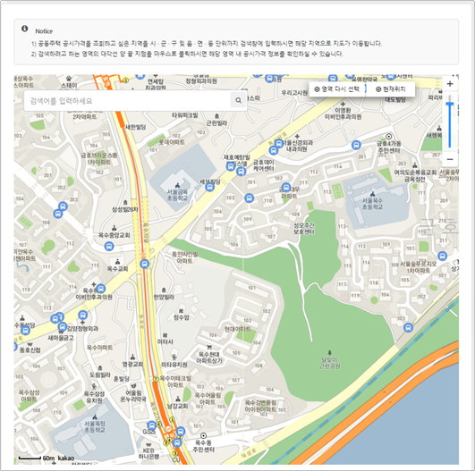


#### 3. 마이크로서비스 아키텍처 애플리케이션 분할 방법

지도상에서 선택한 영역(범위)내에 포함된 공동주택 평당 공시가격을 제공하기 위한 최소 기능단위별로 분할을 먼저 진행해본다. 마이크로서비스 아키텍처 기반 개발은 아주 작은 단위로 분할하여 다른 서비스에 전혀 영향을 받지 않도록 개발하는 방법으로 데이터 종속성이 배제되어야 하고 여러개의 서비스를 포함하고 있으면 기준에 맞지 않는다. 분할 기준의 정확한 답은 없지만 데이터가 다른 서비스의 데이터와 종속되면 안된다. 

아래 그림과 같은 기준으로 분할될 수 있다. 하지만 너무 작게 분할되었을 경우의 퍼포먼스를 고려하여 동일 데이터를 사용하는 서비스는 하나로 묶어도 무방한다.

|                     서비스 단위 분할                      |                   데이터 종속에 따른 분할                    |
| :-------------------------------------------------------: | :----------------------------------------------------------: |
| 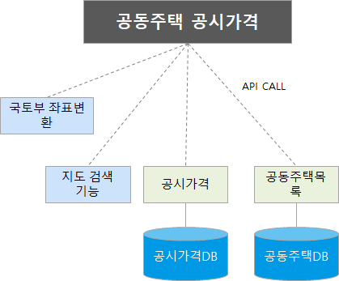 |  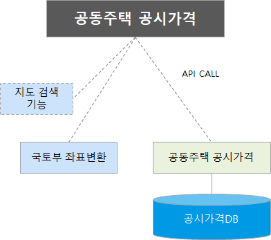   |
|                                                           | 하나의 기능을 구현하는데 여러 개의 서비스를 조합하여 기능을 제공함. |


### 마이크로서비스 아키텍처 애플리케이션 설계

#### 1. 서비스 정의

마이크로서비스 단위의 분할이 확정되면, 서비스와 서비스간의 통신 방법(규약)을 정하고 FRONTEND와 BACKEND로 구분한다. 서비스간의 통신 규약은 여러가지가 있으나 여기에서는 REST API 방식을 사용한다. 

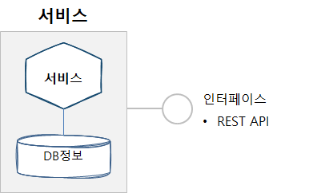


최종으로 확정된 마이크로서비스 구성은 아래 그림과 같다.

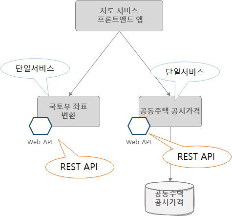


#### 2. API 설계

1) 두점을 이용한 PNU 조회 API

|                             URL                              | Method |                       Parameters                       |                                                        | Return | Status  |
| :----------------------------------------------------------: | ------ | :----------------------------------------------------: | ------------------------------------------------------ | ------ | ------- |
| /api/public/pnu/building?inputEllipsoid=&lat1=&lng1=&lat2= &lng2= | GET    | inputEllipsoid<br />lat1<br />lng1<br />lat2<br />lng2 | String<br />Double<br />Double<br />Double<br />Double | LIST   | 300(OK) |

2) PNU에 따른 공동주택 정보 조회 API

| URL                             | Method | Parameters |        | Return | Status  |
| ------------------------------- | ------ | ---------- | ------ | ------ | ------- |
| /api/public/value/building?pnu= | GET    | pnu        | String | LIST   | 200(oK) |

3) PNU에 따른 평방미터 공시가격 조회 API

| URL                                  | Method | Parametes | Return |      | Status  |
| ------------------------------------ | ------ | --------- | ------ | ---- | ------- |
| /api/public/value/building/unit?pnu= | GET    | pnu       | String | LIST | 200(OK) |


#### 3. API 호출 방법

BACKEND에 정의한 API를 FRONTEND에서 호출하여 결과값을 보여준다.

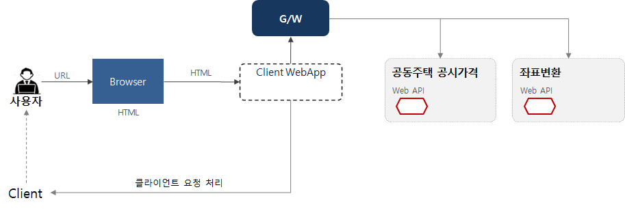

- API 예시

  ```
  @GetMapping(“/api/search/all")
  ~
  …..
  URI uri = URI.create("http://apigateway/backend/api/search/all");
  ~
  @GetMapping(“/api/facilities/list")
  ~
  ….
  URI uri = URI.create(" http://apigateway/backend/api/facilities/list ");
  ```

  

### 마이크로서비스 아키텍처 개발하기

마이크로서비스 아키텍처 기반 애플리케이션 개발은 단일 서비스로 개발하고 REST API를 이용하여 다른 서비스를 호출하는 방식으로 아주 많은 서비스와 통신할 수 있다. 프론트엔드는 모바일, 웹과 같이 하나의 앱으로 개발하고 백엔드 영역은 서비스 단위로 분할하여 서비스를 제공하도록 개발해야 한다. 마이크로서비스 아키텍처의 장점인 폴리그랏을 적용하는 경우 여러 언어로 각각 개발했더라고 각 서비스 호출 시 사용하는 규약을 정하게 되면 얼마든지 확장이 가능하다. 

마이크로서비스 아키텍처 개발을 위해 애플리케이션을 분할과 더불어 여러 서비스로 구성되어 있기 때문에 Service Discovery와 Gateway(네트워크) 정보를 관리할 수 있는 서버도 구성해야 한다. 개별적으로 이를 구성하려면 Spring Cloud와 같은 프레임워크를 구성하거나 유사한 프레임워크와 아키텍처를 구성해야 하지만, 마이크로서비스 스튜디오를 사용하면 필요한 모든 서비스를 제공하고 있어 개발에만 집중할 수 있다.

- *참고사항 : 클라우드 기반 개발지원 플랫폼은 현재는 자바 언어만 제공하고 있다.*

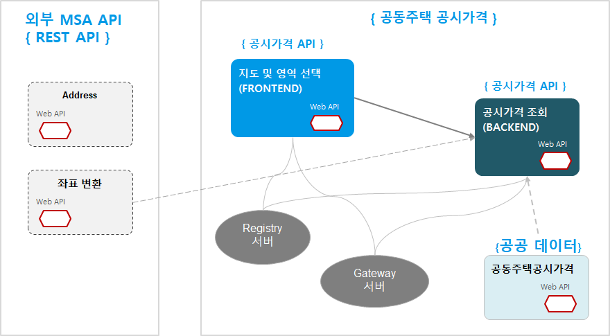


#### 1. 구현 준비

eclipse 또는 IntelliJ와 같은 IDE 환경을 구성한다. 기본 준비사항은 아래와 같다.

| 개발 언어 및 프레임워크 | 버전  |
| ----------------------- | ----- |
| java                    | 1.8   |
| Spring boot             | 1.5.9 |
| Spring Cloud            | 1.6.1 |
| swagger APi             | 2.0.0 |

- MSXpert(마이크로서비스 스튜디오)와 PaaS(Cloud Foundry 4.0 또는 PaaS-TA 3.5)는 '클라우드 기반 개발지원 플랫폼에서 제공함'


#### PaaS-TA 활용 시

여기에서는 PaaS-TA를 활용하여 개발된 애플리케이션을 클라우드 상에 배포하는 경우를 가정하고 설명한다. 현재는 '클라우드혁신센터' 에서 운영하는 PaaS-TA 서버를 활용할 수 있다.

PaaS-TA를 활용하려면 접속 계정이 있어야 한다. 접속 계정이 없다면, cloud4de.kr 홈페이지에 접속하여 공지사항에 안내된 **PaaS-TA 계정 신청하기**를 이용한다.

아래 링크 이동 시 PaaS-TA 활용 방법이 소개되어 있으니 참고바랍니다.

##### [PaaS-TA 활용 방법](paasta.md) 


#### 오픈데이터API 게이트웨이 시스템 활용 시

자신이 제공하고자 하는 서비스에 따라 달라질 수 있는 부분으로 '클라우드 기반 개발지원 플랫폼'에서 제공하는 오픈데이터API 게이트웨이 시스템에서 제공하는 정보라면 오픈데이터API 게이트웨이 포털에 가입하면 쉽게 OPEN API를 사용할 수 있다. 원하는 정보가 없다면, 공공데이터 포털, 각 부처 OPEN API 제공 사이트 및 기타 민간 사이트를 통해 API 정보를 얻을 수 있다. 

여기에서는 오픈데이터API 게이트웨이 시스템을 활용한 개발 방법을 소개한다.

1) 오픈데이터API 게이트웨어 포털 사이트 접속 : http://203.245.104:3000

2) 회원 가입

3) OPEN DATA 활용 신청 : 통합 검색 및 분야별 검색 기능을 활용하여 신청할 수 있다.

4) 마이 페이지의 나의 OPEN API : 신청한 모든 OPE API 목록 조회와 CODE, 인증키 확인이 가능하다.

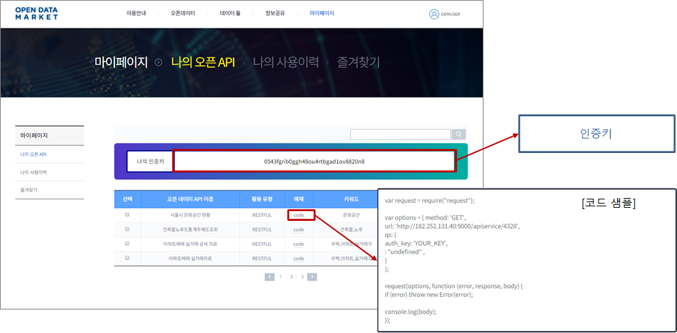

5) 오픈데이터 API 호출 테스트

Postman과 같은 api 호출 테스트 도구를 활용하여 OPEN DATA API 테스트를 실행해본다.  OPEN DATA API 포털에서 제공하는 샘플코드를 복사하여 테스트 도구에 붙여넣기하여 테스트 수행하는데 OPEN DATA API 호출을 위한 필수값 인증키를 확인한다.

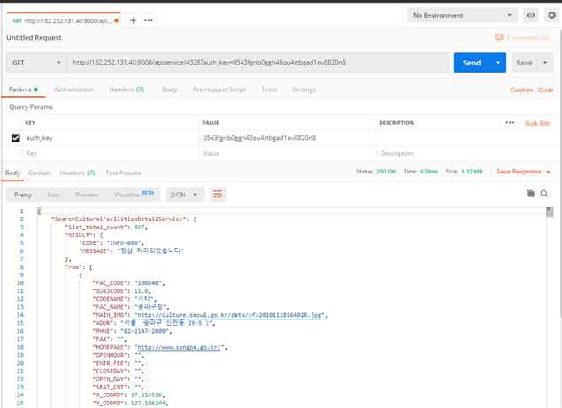


#### 2. 코딩 하기

자신이 이용하는 IDE 도구를 이용하여 코딩을 진행한다. 앞에서 제시한 기본 언어 및 버전을 필수로 맞추고 해당되는 내용은 코딩 시에 적용한다. 마이크로서비스 스튜디오를 이용하여 개발 시 반드시 지켜야 할 필수 항목이 존재한다. 다음에 제시하는 가이드를 따르도록 한다. 본 내용은 MSXpert의 메인메뉴 DOCS에 자세히 기술되어 있다. 

##### 필수 정의 항목

JAVA 버전 정의 - pom.xml

```
<parent>
        <groupId>org.springframework.boot</groupId>
        <artifactId>spring-boot-starter-parent</artifactId>
        <version>1.5.9.RELEASE</version>
        <relativePath/> <!-- lookup parent from repository -->
   </parent>
   
   <properties>
        <project.build.sourceEncoding>UTF-8</project.build.sourceEncoding>
        <project.reporting.outputEncoding>UTF-8</project.reporting.outputEncoding>
        <java.version>1.8</java.version>
        <spring-cloud.version>Edgware.RELEASE</spring-cloud.version>
   </properties>
```


bootstrap.properties

```
spring.application.name=영문앱이름
```


application.properties

```
server.port: ${PORT:8081}
eureka.instance.hostname=${CF_INSTANCE_INTERNAL_IP:localhost}
eureka.instance.nonSecurePort=${PORT:8091}
```


##### Annotation 정의

마이크로서비스 스튜디오를 활용하는 경우 필수 annotation을 정의해야 한다. annotation정의는 다음과 같다.

```
@EnableDiscoveryClient      //Eureka client
```

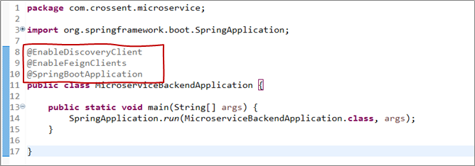

```
@EnableSwagger2             //swagger
```

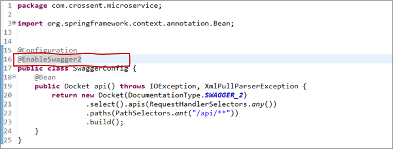


### 공동주택 공시가격 제공 개발 결과 확인

현재 샘플로 만들어진 사이트가 공개되어 있습니다.

- 접속 사이트 URL : http://plv-front-publicLandValue.k-cloud.org

본 개발 결과는 Github에 소스코드가 공개되어 있습니다.

- Github 공개 소스코드 : https://github.com/startupcloudplatform/public-land-value

