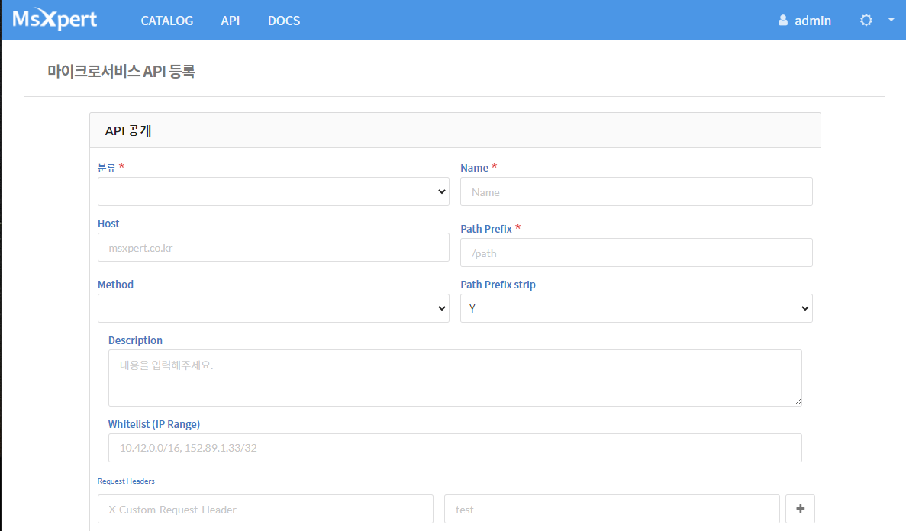
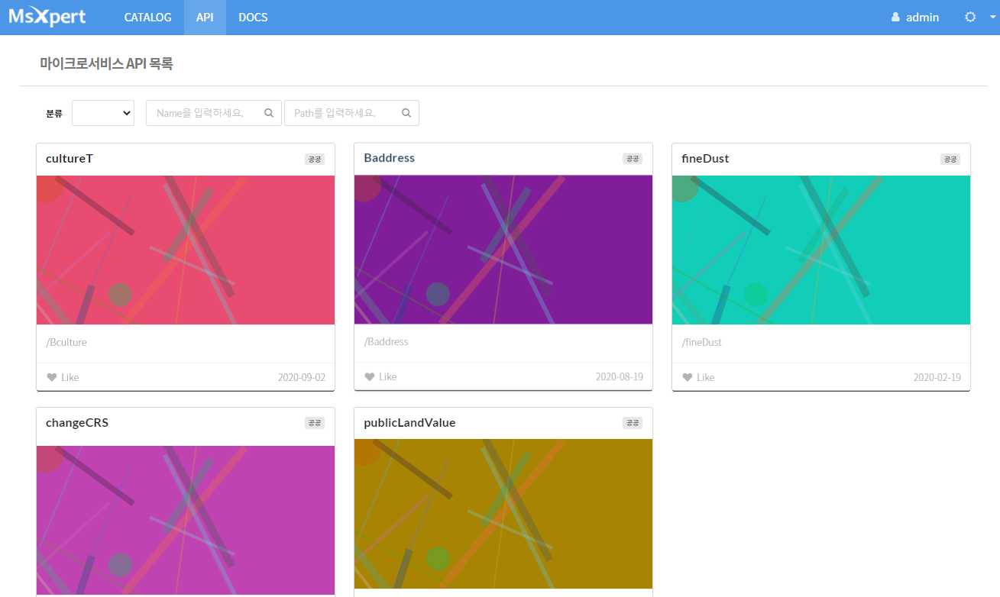
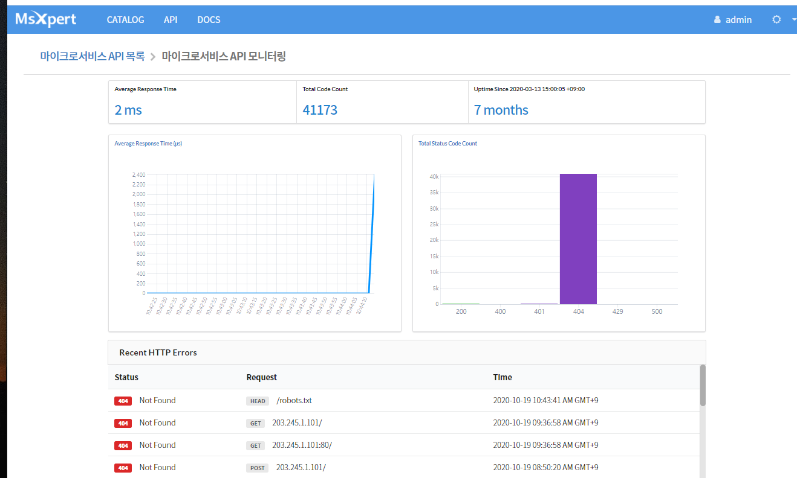

## 마이크로서비스 API 활용사례 4. 좌표변환기


국토부에서 제공하는 OPEN API 지도좌표를 다음지도 또는 네이버 지도로 쉽게 변환할 수 있는 좌표변환알고리즘을 적용한 API를 소개한다. 좌표계 종류 중에서 3차원 및 2차원 좌표계를 이용하여 위경도 좌표로 변환해주는 부분이 핵심이다. 


### 좌표변환 API ?

#### 1. 기본 기능

| 주요 기능         | 기능 설명                                                    | 기타(비고) |
| ----------------- | ------------------------------------------------------------ | ---------- |
| 2차원, 3차원 좌표 | - 좌표계는 기하학에서 숫자나 기호를 써서 위치를 표기하는 방식을 뜻함 |            |
| 좌표변환          | 선택한 지도 유형에 맞는 위경도 좌표계 값으로 변환            |            |


#### 2. 상세 기능 설명

| 지리좌표계(3차원)                                            | 2차원 좌표계-투영볍                                          |      |
| :----------------------------------------------------------- | ------------------------------------------------------------ | ---- |
| 타원체(장,단반경, 편평률)에 집중<br /> 해당 타원체 기준 위경도 좌표 | bessel타원체에서 wgs84 타원체로 변경해서 좌표를 계산하려면, 7개에서 10개의 parameter값이 필요함 |      |
|                                                              |                                                              |      |

- 지리 좌표계(3차원) 예시

  


- 2차원 좌표계(투영법)


### 


### 마이크로서비스 애플리케이션 설계

#### 1. 서비스 정의

마이크로서비스 단위의 분할이 확정되면, 서비스와 서비스간의 통신 방법(규약)을 정하고 FRONTEND와 BACKEND로 구분한다. 서비스간의 통신 규약은 여러가지가 있으나 여기에서는 REST API 방식을 사용한다. 


#### 2. API 설계

좌표변환 API 전체 목록

| URL                                                          | Method | Parameters      |        | Return      | Status  |
| ------------------------------------------------------------ | ------ | --------------- | ------ | ----------- | ------- |
| /api/crs/epsg/list/all                                       | GET    | none            | -      | LIST        | 200(OK) |
| /api/crs/ellipsoid/list/all                                  | GET    | none            | -      | LIST        | 200(OK) |
| /api/crs/epsg/spec?code=                                     | GET    | code            | string | LIST        | 200(OK) |
| /api/crs/ellipsoid/spec?name=                                | GET    | name            | String | LIST        | 200(OK) |
| /api/crs/transform/xy?inputEllipsoid= &outputEpsg= &lat= &lng= | GET    | input Ellipsoid | String | TwoDimCrs   | 200(OK) |
|                                                              |        | outputEpsg      | String |             |         |
|                                                              |        | lat             | Double |             |         |
|                                                              |        | lng             | Double |             |         |
| /api/crs/transform/latlng?inputEpsg= &outputEllipsoid= &x= &y= | GET    | inputEpsg       | String | ThreeDimCrs | 200(OK) |
|                                                              |        | outputEllipsoid | String |             |         |
|                                                              |        | x               | Double |             |         |
|                                                              |        | y               | Double |             |         |

**입력 Parameters 정보**

| 입력변수명      | Type   | 예제               | 설명                                        |
| --------------- | ------ | ------------------ | ------------------------------------------- |
| code            | String | epsg5174           | 좌표계 코드명{epsg5174, epsg5179, epsg5181} |
| name            | String | wgs84              | 타원체 이름 {wgs84, grs80, bessel}          |
| inputEllipsoid  | String | wgs84              | 입력 좌표 타원체 이름                       |
| outputEpsg      | String | epsg5174           | 출력 좌표 좌표계 코드명                     |
| lat             | Double | 37.538831          | 위도(latitude)                              |
| lng             | Double | 126.891382         | 경도(longitude)                             |
| inputEpsg       | String | epsg5174           | 입력 좌표 좌표계 코드명                     |
| outputEllipsoid | String | wgs84              | 출력 좌표 타원체 이름                       |
| x               | Double | 190330.62812120165 | 2차원 좌표계의 x값                          |
| y               | Double | 448514.24844640953 | 2차원 좌표계의 y값                          |


**출력 변수 정보**

| 출력 변수명 | Type   | 설명                    |
| :---------: | ------ | ----------------------- |
|    epsg     | String | 측정장소 이름           |
|      x      | Double | 시군구 이름             |
|      y      | Double | 날짜                    |
|  ellipsoid  | String | 아황산가스 측정 농도    |
|     lat     | Double | 일산화탄소 측정 농도    |
|     lng     | Double | 오존 측정 농도          |
|      a      | Double | 이산화질소 측정 농도    |
|      f      | Double | 미세먼지(pm10) 측정농도 |
|             | String | 아황산가스 지수값       |


#### 3. API 호출 방법

BACKEND에 정의한 API에서 호출하여 결과값을 보여줌


##### API 호출 

```
@RestController@RefreshScope@RequestMapping(value="/api/dust")public class TransformController {
    @Autowired
    private TransformService transformService;

    @ApiOperation("제공하는 좌표계 목록 반환")
    @GetMapping("/epsg/list/all")
    @ResponseStatus(HttpStatus.OK)
    public List<String> epsgListAll() {
        System.out.println("request /api/crs/epsg/list/all -- Controller --");
        return transformService.epsgListAll();
 }
```


### 마이크로서비스 아키텍처 개발하기

마이크로서비스 아키텍처 기반 애플리케이션 개발은 단일 서비스로 개발하고 REST API를 이용하여 다른 서비스를 호출하는 방식으로 아주 많은 서비스와 통신할 수 있다. 프론트엔드는 모바일, 웹과 같이 하나의 앱으로 개발하고 백엔드 영역은 서비스 단위로 분할하여 서비스를 제공하도록 개발해야 한다. 마이크로서비스 아키텍처의 장점인 폴리그랏을 적용하는 경우 여러 언어로 각각 개발했더라고 각 서비스 호출 시 사용하는 규약을 정하게 되면 얼마든지 확장이 가능하다. 

마이크로서비스 아키텍처 개발을 위해 애플리케이션을 분할과 더불어 여러 서비스로 구성되어 있기 때문에 Service Discovery와 Gateway(네트워크) 정보를 관리할 수 있는 서버도 구성해야 한다. 개별적으로 이를 구성하려면 Spring Cloud와 같은 프레임워크를 구성하거나 유사한 프레임워크와 아키텍처를 구성해야 하지만, 마이크로서비스 스튜디오를 사용하면 필요한 모든 서비스를 제공하고 있어 개발에만 집중할 수 있다.

각각 단일 서비스로 개발하고 REST API를 이용하여 다른 서비스 적용


#### 1. 구현 준비

eclipse 또는 IntelliJ와 같은 IDE 환경을 구성한다. 기본 준비사항은 아래와 같다.

| 개발 언어 및 프레임워크 | 버전  |
| ----------------------- | ----- |
| java                    | 1.8   |
| Spring boot             | 1.5.9 |
| Spring Cloud            | 1.6.1 |
| swagger APi             | 2.0.0 |

- MSXpert(마이크로서비스 스튜디오)와 PaaS(Cloud Foundry 4.0 또는 PaaS-TA 3.5)는 '클라우드 기반 개발지원 플랫폼에서 제공함'


#### PaaS-TA 활용 시

여기에서는 PaaS-TA를 활용하여 개발된 애플리케이션을 클라우드 상에 배포하는 경우를 가정하고 설명한다. 현재는 '클라우드혁신센터' 에서 운영하는 PaaS-TA 서버를 활용할 수 있다.

PaaS-TA를 활용하려면 접속 계정이 있어야 한다. 접속 계정이 없다면, cloud4de.kr 홈페이지에 접속하여 공지사항에 안내된 **PaaS-TA 계정 신청하기**를 이용한다.

아래 링크 이동 시 PaaS-TA 활용 방법이 소개되어 있으니 참고바랍니다.

##### [파스타 활용 방법](paasta.md)


### 마이크로서비스 API 등록

실시간 통합대기환경정보 제공 API를 외부에 다른 사용자에게 공개할 수 있는 기능을 제공하고 있습니다. 마이크로서비스 스튜디오에 API 등록/수정/삭제 및 모니터링이 가능하도록 구현되어 있어 자신이 개발한 API를 등록하여 API서버로 활용할 수 있습니다. 

1) 개발한 API는 PaaS-TA에 앱이 등록되고 서비스가 되어야 합니다.

2) 마이크로서비스 스튜디오의 메인 메뉴에 API 메뉴가 있습니다. 이 메뉴는 등록된 API 목록을 조회할 수 있습니다.

3) 자신이 만든 API를 등록하려면 오른쪽 상단의 환경설정 아이콘 선택 시 서브 메뉴 중에서 ''마이크로서비스 API 관리'' 메뉴를 선택합니다.


4) 자신이 이전에 등록한 API가 있다면 이 정보가 조회되고 신규 등록 시 등록 버튼을 선택합니다.


5) API 등록 화면에 *표시는 필수값으로 반드시 입력해야 합니다. 모든 정보를 등록한 후 등록 버튼을 누릅니다.




6) 등록이 완료되면 Top 메뉴에서 API 메뉴를 선택하면 등록된 API 목록이 조회됩니다.



7) API 목록의 각 이름을 클릭하면 API 조회 페이지가 호출됩니다. swagger API 양식으로 상세 조회할 수 있습니다.


### 마이크로서비스 API 관리

등록된 마이크로서비스 API 관리를 위해 마이크로서비스 스튜디오에서 모니터링 기능을 제공합니다. 정상적인 경로로 접근하지 않았거나 트래픽 현황을 조회할 수 있습니다.

1) 마이크로서비스 스튜디오 메인 메뉴의 오른쪽 상단의 환경설정 아이콘을 선택합니다.

2) 마이크로서비스 API 모니터링 메뉴을 선택합니다.




### 좌표변환API 제공 개발 결과 확인

국토부 좌표 OPEN API를 활용하여 다음, 네이버 지도에서 활용 가능한 API를 이용하여 샘플로 만들어진 사이트가 공개되어 있습니다.

- 접속 사이트 URL : http://transform-crs-front-CRSchange.k-cloud.org

본 개발 결과는 Github에 소스코드가 공개되어 있습니다.

- Github 공개 소스코드 : https://github.com/startupcloudplatform/transform-crs

