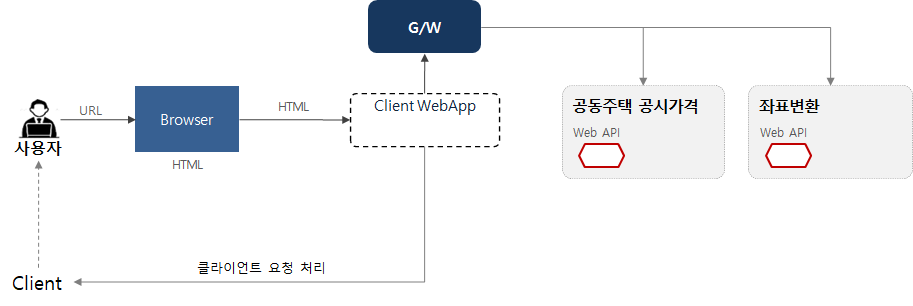
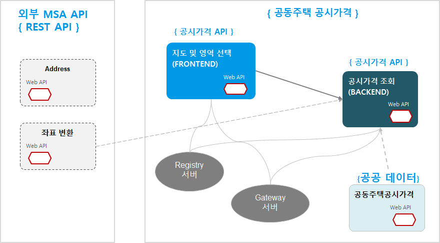

### 마이크로서비스 스튜디오 활용 가이드


본 가이드는 PaaS-TA와 마이크로서비스 스튜디오를 활용한 마이크로서비스 애플리케이션 개발 방법을 소개하는 가이드 문서이다. 개발에 대한 기초를 이해하고 있다면 더 많은 도움이 될 것이다. 가이드 구성은 다음과 같다.

### 가이드 구성

- 공동 주택 공시가격 애플리케이션 개요
  - 마이크로서비스 아키텍처 개념을 적용한 공동줕개 공시가격 애플리케이션 개발
  - 마이크로서비스 애플리케이션 분할 방법 소개
  - API 설계 방법
  - 공공데이터 포털 및 국토부에서 제공하는 OPEN API 활용 - [오픈데이터 API 활용 가이드 참조]
- JAVA 환경 구성 및 필수 체크 항목
  - 개발된 소스코드를 활용한 방법 소개
  - eclipse 활용적용
  - PaaS-TA 및 마이크로서비스 스튜디오 활용 시 반드시 적용해야 할 필수 체크 항목 설명
- PaaS-TA 활용 방법
  - 개발 소스코드를 이용한 PaaS-TA 환경 설정
  - PaaS-TA를 통한 애플리케이션 푸시 방법
  - 마이크로서비스 스튜디오 활용을 위한 환경 설정 방법
  - PaaS-TA 상에서 애플리케이션 실행 방법


### 공동주택 공시가격 애플리케이션

#### 기본 기능

| 주요 기능        | 기능 설명                                                    | 기타(비고)                                                   |
| ---------------- | ------------------------------------------------------------ | ------------------------------------------------------------ |
| 지도서비스       | 국토부 지도 좌표값을 네이버 및 다음 지도와 같은 범용적인 지도에서 활용할 수 있는 좌표로 변환할 수 있는 좌표 정보를 기반으로 지도 서비스를 제공 | 국토부 지도좌표 -> 특정 좌표 값으로 변환(위경도 등)          |
| 공동주택위치정보 | 공동주택 주소 기반의 위치정보 제공                           | 국토부 제공 공동주택 공시가격의 PNU값 기준                   |
| 평당공시가격     | 공동주택 단지 또는 대단지의 경우 하나의 동에 대한 평당 공시가격 제공 | 주택단지별 공시지가 정보를 기반으로 평당 공시가격 정보로 환산 |


#### 상세 기능 설명

1) 위치 검색 : 현재 위치에서 빠른 이동을 위한 단어 검색(건물, 주소 및 도로 등)

2) 영역 선택 : 지도상에서 시작점, 끝점 지정하고 범위 표시하기, 현재 위치로 이동하기

3) 공동주택 목록 : 지정 범위내에 공동 주택 목록 조회

4) 평당 공시가격 조회 : 선택한 공동 주택이 공시가격 조회


#### 마이크로서비스 아키텍처 애플리케이션 분할 방법

지도상에서 선택한 영역(범위)내에 포함된 공동주택 평당 공시가격을 제공하기 위한 최소 기능단위별로 분할을 먼저 진행해본다. 마이크로서비스 아키텍처 기반 개발은 아주 작은 단위로 분할하여 다른 서비스에 전혀 영향을 받지 않도록 개발하는 방법으로 데이터 종속성이 배제되어야 하고 여러개의 서비스를 포함하고 있으면 기준에 맞지 않는다. 분할 기준의 정확한 답은 없지만 데이터가 다른 서비스의 데이터와 종속되면 안된다. 

아래 그림과 같은 기준으로 분할될 수 있다. 하지만 너무 작게 분할되었을 경우의 퍼포먼스를 고려하여 동일 데이터를 사용하는 서비스는 하나로 묶어도 무방한다.

|                     서비스 단위 분할                      |                   데이터 종속에 따른 분할                    |
| :-------------------------------------------------------: | :----------------------------------------------------------: |
|  |     |
|                                                           | 하나의 기능을 구현하는데 여러 개의 서비스를 조합하여 기능을 제공함. |


### 마이크로서비스 아키텍처 애플리케이션 설계

#### 서비스 정의

마이크로서비스 단위의 분할이 확정되면, 서비스와 서비스간의 통신 방법(규약)을 정하고 FRONTEND와 BACKEND로 구분한다. 서비스간의 통신 규약은 여러가지가 있으나 여기에서는 REST API 방식을 사용한다. 


최종으로 확정된 마이크로서비스 구성은 아래 그림과 같다.


#### API 설계

1) 두점을 이용한 PNU 조회 API

|                             URL                              | Method |                       Parameters                       |                                                        | Return | Status  |
| :----------------------------------------------------------: | ------ | :----------------------------------------------------: | ------------------------------------------------------ | ------ | ------- |
| /api/public/pnu/building?inputEllipsoid=&lat1=&lng1=&lat2= &lng2= | GET    | inputEllipsoid<br />lat1<br />lng1<br />lat2<br />lng2 | String<br />Double<br />Double<br />Double<br />Double | LIST   | 300(OK) |

2) PNU에 따른 공동주택 정보 조회 API

| URL                             | Method | Parameters |        | Return | Status  |
| ------------------------------- | ------ | ---------- | ------ | ------ | ------- |
| /api/public/value/building?pnu= | GET    | pnu        | String | LIST   | 200(oK) |

3) PNU에 따른 평방미터 공시가격 조회 API

| URL                                  | Method | Parametes | Return |      | Status  |
| ------------------------------------ | ------ | --------- | ------ | ---- | ------- |
| /api/public/value/building/unit?pnu= | GET    | pnu       | String | LIST | 200(OK) |


#### API 호출 방법

BACKEND에 정의한 API를 FRONTEND에서 호출하여 결과값을 보여준다.



- API 예시

  ```
  @GetMapping(“/api/search/all")
  ~
  …..
  URI uri = URI.create("http://apigateway/backend/api/search/all");
  ~
  @GetMapping(“/api/facilities/list")
  ~
  ….
  URI uri = URI.create(" http://apigateway/backend/api/facilities/list ");
  ```

  

### 마이크로서비스 아키텍처 기반 애플리케이션 구성

마이크로서비스 아키텍처 기반 애플리케이션 개발은 단일 서비스로 개발하고 REST API를 이용하여 다른 서비스를 호출하는 방식으로 아주 많은 서비스와 통신할 수 있다. 프론트엔드는 모바일, 웹과 같이 하나의 앱으로 개발하고 백엔드 영역은 서비스 단위로 분할하여 서비스를 제공하도록 개발해야 한다. 마이크로서비스 아키텍처의 장점인 폴리그랏을 적용하는 경우 여러 언어로 각각 개발했더라고 각 서비스 호출 시 사용하는 규약을 정하게 되면 얼마든지 확장이 가능하다. 

마이크로서비스 아키텍처 개발을 위해 애플리케이션을 분할과 더불어 여러 서비스로 구성되어 있기 때문에 Service Discovery와 Gateway(네트워크) 정보를 관리할 수 있는 서버도 구성해야 한다. 개별적으로 이를 구성하려면 Spring Cloud와 같은 프레임워크를 구성하거나 유사한 프레임워크와 아키텍처를 구성해야 하지만, 마이크로서비스 스튜디오를 사용하면 필요한 모든 서비스를 제공하고 있어 개발에만 집중할 수 있다.

- *참고사항 : 클라우드 기반 개발지원 플랫폼은 현재는 자바 언어만 제공하고 있다.*




### 마이크로서비스 개발 가이드

#### 개발 준비

eclipse 또는 IntelliJ와 같은 IDE 환경을 구성한다. 기본 준비사항은 아래와 같다.

- 사용자 준비 사항

| 개발 언어 및 프레임워크 | 버전  |
| ----------------------- | ----- |
| java                    | 1.8   |
| Spring boot             | 1.5.9 |
| Spring Cloud            | 1.6.1 |
| swagger APi             | 2.0.0 |

- 개발지원 플랫폼 지원 사항
  - MSXpert(마이크로서비스 스튜디오)와 PaaS(Cloud Foundry 4.0 또는 PaaS-TA 3.5)는 '클라우드 기반 개발지원 플랫폼에서 제공함'


#### PaaS-TA 활용 시

여기에서는 PaaS-TA를 활용하여 개발된 애플리케이션을 클라우드 상에 배포하는 경우를 가정하고 설명한다. 현재는 '클라우드혁신센터' 에서 운영하는 PaaS-TA 서버를 활용할 수 있다.

PaaS-TA를 활용하려면 접속 계정이 있어야 한다. 접속 계정이 없다면, cloud4de.kr 홈페이지에 접속하여 공지사항에 안내된 **PaaS-TA 계정 신청하기**를 이용한다.

아래 링크 이동 시 PaaS-TA 활용 방법이 소개되어 있으니 참고바랍니다.

##### [파스타 활용 방법](paasta.md)


#### Github 소스 코드 이용

마이크로서비스 애플리케이션 개발 시 활용 가능한 샘플 애플리케이션을 Github을 통해 공개하고 있다. 애플리케이션은 프론트엔드와 백엔드로 분류하여 폴더로 구성되어 있다.

- Github 주소 : https://github.com/startupcloudplatform
- Repository 구성
  - Open-Data-API : 오픈데이터API 사용자 및 제공처 포털 소스 
  - Microservices : 마이크로서비스 스튜디오
  - Big-Data-Service-Borker : 빅데이터 서비스 브로커(PaaS-TA 3.0 버전용)
  - Sample-App-Tutorial
  - 그밖에 마이크로서비스로 개발된 API 6종

- 본 가이드에서는 공동주택 공시가격 제공 API 개발 소스코드 활용을 위해 Repository 에서 public-land-value 저장소를 로컬에 클론으로 다운받는다. 

  - git clone : git clone https://github.com/startupcloudplatform/public-land-value.git

  - 윈도우 PowerShell - C:\>git clone https://github.com/startupcloudplatform/public-land-value.git

  - 현재 경로에 Git Repository 경로와 동일한 경로가 생성된다.

    


#### 4. 프로젝트 환경 설정

본 개발 가이드는 eclipse 를 이용한 화면으로 설명한다. 익숙한 어떤 IDE를 사용해도 무방하고 여기에서 가이드하는 환경설정에 필요한 프레임워크 및 기타 설정은 반드시 적용한다.

git clone을 통해 경로를 로컬에 생성했기 때문에 eclipse을 통해서 바로 기존 파일 시스템을 로드할 수 있다. 개발에 익숙한 경우는 새로 생성해도 된다.


1) 기존 프로젝트 폴더를 로드하면 소스 구조가 보일 것이다.

2) PaaS-TA와 마이크로서비스 스튜디오를 활용해서 개발 시 필수로 체크하는 파일은 아래와 같다. 

**※ JAVA 개발 가이드는 마이크로서비스 스튜디오 메인 메뉴 > DOCS 메뉴를 참고한다.** 

- [마이크로서비스 스튜디오 > DOCS](#http://203.245.1.101:8080/guide)

- pom.xml
- annotation 정의
- application.properties
- bootstrap.properties
- manifest.yml


#### JAVA 필수 체크 항목

- **pom.xml**

  생성한 프로젝트에 pom.xml 에 JAVA 버전 및 프레임워크 등 정의할 내용을 반드시 정의한다.

  JAVA : 1.8이상, Spring Boot: 1.5.13, Spring Cloud: Edgware.RELEASE

  ```
  <parent>
          <groupId>org.springframework.boot</groupId>
          <artifactId>spring-boot-starter-parent</artifactId>
          <version>1.5.13.RELEASE</version>
          <relativePath/> <!-- lookup parent from repository -->
     </parent>
     
     <properties>
          <project.build.sourceEncoding>UTF-8</project.build.sourceEncoding>
          <project.reporting.outputEncoding>UTF-8</project.reporting.outputEncoding>
          <java.version>1.8</java.version>
          <spring-cloud.version>Edgware.RELEASE</spring-cloud.version>
     </properties>
  
  ```

  <eclipse 프로젝트의 pom.xml 화면>

  


- **annotation 정의**

  마이크로서비스 스튜디오를 활용한 애플리케이션 개발은 필수 annonation이 정의되어야 한다. 필수 annotation 은 다음과 같다.

  ```
  package com.crossent.microservice;
  
  import org.springframework.boot.SpringApplication;
  import org.springframework.boot.autoconfigure.SpringBootApplication;
  import org.springframework.cloud.client.circuitbreaker.EnableCircuitBreaker;
  import org.springframework.cloud.client.discovery.EnableDiscoveryClient;
  import org.springframework.context.annotation.Bean;
  import org.springframework.context.annotation.Configuration;
  import springfox.documentation.builders.PathSelectors;
  import springfox.documentation.builders.RequestHandlerSelectors;
  import springfox.documentation.spi.DocumentationType;
  import springfox.documentation.spring.web.plugins.Docket;
  import springfox.documentation.swagger2.annotations.EnableSwagger2;
  
  @EnableDiscoveryClient
  @EnableCircuitBreaker
  @SpringBootApplication
  public class FrontApplication {
  
  	public static void main(String[] args) {
  		SpringApplication.run(FrontApplication.class, args);
  	}
  
  }
    
  @Configuration
  @EnableSwagger2
  class SwaggerConfig {
      @Bean
      public Docket api() {
          return new Docket(DocumentationType.SWAGGER_2)
                  .select().apis(RequestHandlerSelectors.any())
                  .paths(PathSelectors.ant("/api/**"))
                  .build();
      }
  }  
    
  ```

  <eclipse 프로젝트에서 annotation 정의 화면>

  


- properties 정의

  java의 properties는 애플리케이션의 구성 가능한 파라미터들을 저장하기 위해 자바 관련 기술을 사용하는 파일들을 위한 파일 확장자로 마이크로서비스 애플리케이션 개발을 위해 두개의 properties 파일을 사용한다.

  - application.properties

  ```
  server.port: ${PORT:8081}
  eureka.instance.hostname=${CF_INSTANCE_INTERNAL_IP:localhost}
  eureka.instance.nonSecurePort=${PORT:8091}
  ```

  

  

  - bootstrap.properties

    ```
    spring.application.name=영문앱이름 
    ```

    


마이크로서비스 스튜디오를 활용한 개발을 위한 필수 항목은 모두 정의가 완료되었다. 그 밖에 코드는 자신의 코드로 정의하면 된다. 


#### manifest.yml 정의

github에서 다운받은 소스폴더 안에 manifest.yml 파일이 있다. 이 파일에서 마이크로서비스 애플리케이션을 위한 사용자 환경 변수를 정의해야 한다.

<manifest.yml>

\---

applications:

-name: {앱이름}

memory: {사용 메모리 크기}

path: {파일경로+ 파일명}.jar

buildpack: java_buildpack

```
---
applications:
  - name: plv-back
    memory: 1G
    path: target/plv-back-0.0.1-SNAPSHOT.jar
    env:
      msa: yes
      private: 

```


### PaaS-TA 활용 방법


#### PaaS-TA 활용 환경 준비

paas-ta는 [Cloud Foundry](#https://www.cloudfoundry.org/)을 기반으로 개발된 개방형 클라우드 플랫폼이다. 마이크로서비스 스튜디오는 PaaS-TA 3.0, 3.5 기반에서 실행되고 Cloud Foundry 4.0과 호환이 되기 때문에 PaaS-TA가 없다면 CloudFoundry 를 사용해도 된다. 

본 가이드는 NIPA의 클라우드 혁신센터에서 운영중인 PaaS-TA를 기반으로 설명하고 있다. 

*※ 현재 제공하고 있는 PaaS-TA '2020년 클라우드 기반 개발지원 플랫폼 운영사업' 기간 동안은 무료로 제공하고 있다. (무료 사용기간 : ~2020년 11월 30일, 그 이후에도 연장될 수 있음)*


#### CF CLI 설치

CF CLI를 제공하는 사이트를 접속한다. https://github.com/cloudfoundry/cli/releases/tag/v6.46.1  자신의 운영체제에 맞춰 다운로드 한다. 

- Windows : installert 다운 추천
- Linux : Binaries 다운 추천


- CF CLI 설치 확인

  

  

#### PaaS-TA(CloudFoundry) 계정 신청

PaaS-TA 의 API 서버를 접속하기 위해서는 서버 접속 정보와 PaaS-TA 계정이 있어야 한다. PaaS-TA 계정은 관리자에 의해서만 생성할 수 있어 아래 경로를 통해 계정을 신청하고 승인받아야 한다. 

- 계정신청 : https://forms.gle/HRvpfco7oZaWKcjE7
- 서버 정보 : http://api.k-cloud.org


#### CF 조직 및 영역 생성

CF에서 사용할 조직과 영역 생성

```
cf orgs
cf create-org { 조직명 }
cf create-space -o { 조직명 } { 영역명 }
cf target -o { 조직명 }  -s { 영역명 }
```


#### CF Application 배포

빌드한 .jar 파일 및 manifest.yml 파일을 가지고 애플리케이션을 배포한다. 마이크로서비스 스튜디오에서 push한 애플리케이션을 사용하기 위해서는 사용자 환경 변수를 정의해야 한다. 

##### manifest.yml파일 작성
applications:
name: {앱이름}
memory: {사용 메모리 크기}
path: {파일경로+ 파일명}.jar
buildpack: java_buildpack

```
---
applications:
  - name: plv-back
    memory: 1G
    path: target/plv-back-0.0.1-SNAPSHOT.jar
    env:
      msa: yes
      private: 
```


CF에 애플리케이션 push 명령어

```
cf push
```


#### 마이크로서비스 스튜디오 적용 환경변수 확인

애플리케이션을 CF에 push 할 때 또는 push한 후에 마이크로서비스 앱을 인식하도록 msa=yes 변수를 정의한다.

```
cf env public-back
```


#### 애플리케이션 PUSH 결과

PaaS-TA에 앱 push 완료 후 cf apps 명령어를 이용하여 app이 정상적으로 시작되어 있는지 확인한다. Frontend 앱도 git에서 다운로드 한 소스코드를 이용하여 동일한 방법으로 PaaS-TA을 통해 앱 push를 실행한다. 자신이 만든 애플리케이션은 2개가 되고 다른 사람이 공유했거나 만들어진 애플리케이션의 API를 이용하여 마이크로서비스 애플리케이션을 완성할 수 있다.

```
cf apps
```


### 마이크로서비스 API 등록

공동주택 공시가격 제공 API를 외부에 다른 사용자에게 공개할 수 있는 기능을 제공하고 있습니다. 마이크로서비스 스튜디오에 API 등록/수정/삭제 및 모니터링이 가능하도록 구현되어 있어 자신이 개발한 API를 등록하여 API서버로 활용할 수 있습니다. 

1) 개발한 API는 PaaS-TA에 앱이 등록되고 서비스가 되어야 합니다.

2) 마이크로서비스 스튜디오의 메인 메뉴에 API 메뉴가 있습니다. 이 메뉴는 등록된 API 목록을 조회할 수 있습니다.

3) 자신이 만든 API를 등록하려면 오른쪽 상단의 환경설정 아이콘 선택 시 서브 메뉴 중에서 ''마이크로서비스 API 관리'' 메뉴를 선택합니다.


4) 자신이 이전에 등록한 API가 있다면 이 정보가 조회되고 신규 등록 시 등록 버튼을 선택합니다.


5) API 등록 화면에 *표시는 필수값으로 반드시 입력해야 합니다. 모든 정보를 등록한 후 등록 버튼을 누릅니다.


6) 등록이 완료되면 Top 메뉴에서 API 메뉴를 선택하면 등록된 API 목록이 조회됩니다.


7) API 목록의 각 이름을 클릭하면 API 조회 페이지가 호출됩니다. swagger API 양식으로 상세 조회할 수 있습니다.


### 마이크로서비스 API 관리

등록된 마이크로서비스 API 관리를 위해 마이크로서비스 스튜디오에서 모니터링 기능을 제공합니다. 정상적인 경로로 접근하지 않았거나 트래픽 현황을 조회할 수 있습니다.

1) 마이크로서비스 스튜디오 메인 메뉴의 오른쪽 상단의 환경설정 아이콘을 선택합니다.

2) 마이크로서비스 API 모니터링 메뉴을 선택합니다.


### 공동주택 공시가격 API 샘플 웹사이트

공동주택 공시가격 제공 API를 개발하면서 사례로 참고할 수 있도록 샘플 사이트가 공개되어 있습니다.

- 접속 사이트 URL : http://plv-front-publicLandValue.k-cloud.org

본 개발 결과는 Github에 소스코드가 공개되어 있습니다.

- Github 공개 소스코드 : https://github.com/startupcloudplatform/public-land-value

