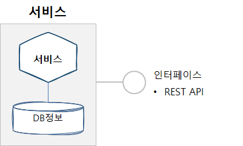

## 마이크로서비스 API 활용사례 3. 통합대기환경정보 제공


이 장에서는 마이크로서비스 아키텍처 기반 통합대기환경정보 개발 사례를 소개한다. 통합대기환경 정보는 초미세먼지 현황 및 대기환경 정보를 한국환경공단에서 제공하는 OPEN API를 기반으로 개발한 사례이다. 일반적인 개발의 경우 API를 공공데이터포털이나 한국환경공단 제공 API를 호출하여 서비스를 개발할 수도 있지만 마이크로서비스 스튜디오를 활용하여 개발하는 방법과 실제 개발한 사례를 소개한다.


### 통합대기환경정보 API ?

#### 1. 기본 기능

| 주요 기능      | 기능 설명                                                    | 기타(비고)                                                   |
| -------------- | ------------------------------------------------------------ | ------------------------------------------------------------ |
| 행정구역지도   | 국토지리정보에서 제공하는 행정구역이 표시된 지도 파일을 이용하여 행정구역별 정보 제공 | 행정구역 지도 제공처 : GIS개발자 사이트, 주소정보제공 시스템 등<br />- SHP 파일로 제공됨 |
| 실시간미세먼지 | 실시간 초미세먼지 및 미세먼지 등 대기환경 정보 제공          | 한국환경공단 정보 이용<br />실시간 초미세먼지 정보 API 호출  |
| 대기환경정보   | 실시간 통합대기환경 정보 제공                                | - 한국환경공단 정보 이용<br />- 실시간 통합대기환경정보 API 호출 |


#### 2. 상세 기능 설명

1) 행정구역 지도 : 행정구역 표시 지도를 웹사이트에서 제공함. SHP 최신화

2) 실시간 초미세먼지 및 미세먼지 정보 : 행정구역별 초미세먼지 현황을 환경오염 농도별 색상으로 표시해줌

3) 실시간 통합대기환경 : 행정구역별 상세 지역별 통합 대기환경정보 제공, 일산화탄소 등 그래프로 농도 표시

4) 대기환경 점수를 지소로 환산한 정보 제공, 지수값을 그래프로 제공


### 단위 애플리케이션 분할 방법

행정구역별 실시간 통합대기환경 정보 제공을 위한 초미세먼지와 통합대기환경 정보를 나눌 수 있다.

|                    서비스 단위별 분할                    |                       기능별 분할                        |
| :------------------------------------------------------: | :------------------------------------------------------: |
|  |  |


### 마이크로서비스 애플리케이션 설계

#### 1. 서비스 정의

마이크로서비스 단위의 분할이 확정되면, 서비스와 서비스간의 통신 방법(규약)을 정하고 FRONTEND와 BACKEND로 구분한다. 서비스간의 통신 규약은 여러가지가 있으나 여기에서는 REST API 방식을 사용한다. 




#### 2. API 설계

초미세먼지 및 통합대기환경 정보를 이용하여 유용한 API를 도출하여 아래와 같이 정의한다.

| URL                                                 | Method | Parameters  |        | Return | Status  |
| --------------------------------------------------- | ------ | ----------- | ------ | ------ | ------- |
| /api/dust/measure/list?sidoName=&pageNo=&numOfRows= | GET    | sidoName    | String | LIST   | 200(OK) |
|                                                     |        | pageNo      | long   | LIST   | 200(OK) |
|                                                     |        | numOfRows   | long   | LIST   | 200(OK) |
| /api/dust/measure/list/all?sidoName=                | GET    | sidoName    | String | LIST   | 200(OK) |
| /api/dust/cai/list?sidoName=&pageNo=&numOfRows=     | GET    | sidoName    | String | LIST   | 200(OK) |
|                                                     |        | pageNo      | long   | LIST   | 200(OK) |
|                                                     |        | numOfRows   | long   | LIST   | 200(OK) |
| /api/dust/cai/list/all?sidoName=                    | GET    | sidoName    | String | LIST   | 200(OK) |
| /api/dust/cai?pollutant=&stationName=               | GET    | pollutant   | String | Object | 200(OK) |
|                                                     | GET    | stationName | String | Object | 200(OK) |
| /api/dust/measure/avg/sido?pollutant=               | GET    | pollutant   | String | Object | 200(OK) |
| /api/dust/measure/avg/time/sigungu?sidoName=&hour=  | GET    | sidoName    | String | LIST   | 200(OK) |
|                                                     | GET    | hour        | String | LIST   | 200(OK) |
| /api/dust/measure/avg/sigungu?sidoName=             | GET    | sidoName    | String | LIST   | 200(OK) |

**Parameters 정보**

| 출력변수명  | Type   | 예제   | 설명               |
| ----------- | ------ | ------ | ------------------ |
| sidoName    | String | 서울   | 조회할 도 이름     |
| stationName | String | 강남구 | 조회할 측정소명    |
| pageNo      | Long   | 2      | 조회할 페이지 번호 |
| numOfRows   | Long   | 20     | 조회할 데이터의 양 |
| hour        | String | 15:00  | 조회할 시간        |
| pollutant   | String | pm10   | 오염물질 명        |


**미세먼지 API 조회 출력 결과**

| 출력 변수명 | Type   | 설명                                   |
| :---------: | ------ | -------------------------------------- |
| stationName | String | 측정장소 이름                          |
|  cityName   | String | 시군구 이름                            |
|  dataTime   | String | 날짜                                   |
|  so2Value   | String | 아황산가스 측정 농도                   |
|   coValue   | String | 일산화탄소 측정 농도                   |
|  no2Value   | String | 오존 측정 농도                         |
|   o3Value   | String | 이산화질소 측정 농도                   |
|  pm10Value  | String | 미세먼지(pm10) 측정농도                |
|  pm25Value  | String | 초미세먼지(pm25) 측정농도              |
| pm10Value24 | String | 미세먼지(pm10) 24시간 예측 평균 농도   |
| pm25Value24 | String | 초미세먼지(pm26) 24시간 예측 평균 농도 |
|    ovSo2    | String | 아황산가스 지수값                      |
|    cvCo     | String | 일산화탄소 지수값                      |
|    cvNo2    | String | 오존 지수값                            |
|    cvO3     | String | 이산화질소 지수값                      |
|   cvPm10    | String | 미세먼지(pm10) 지수값                  |
|   cvPm25    | String | 초미세먼지(pm25) 지수값                |
|  khaiValue  | String | 통합대기환경지수                       |
|   grades    | List   | 오염물질 별 등급 리스트                |
|    name     | String | 오염물질 명                            |

| 출력변수명 | Type   | 설명                  |
| ---------- | ------ | --------------------- |
| value      | String | 통합대기환경지수      |
| grade      | String | 통합대기환경지수 등급 |
| seoul      | String | 오염물질 서울 평균    |
| busan      | String | 오염물질 부산 평균    |
| daegu      | String | 오염물질 대구 평균    |
| incheon    | String | 오염물질 인천 평균    |
| gwangju    | String | 오염물질 광주 평균    |
| daejeon    | String | 오염물질 대전 평균    |
| ulsan      | String | 오염물질 울산 평균    |
| gyeonggi   | String | 오염물질 경기 평균    |
| gangwon    | String | 오염물질 강원 평균    |
| chungbuk   | String | 오염물질 충북 평균    |
| chungnam   | String | 오염물질 충남 평균    |
| jeonbuk    | String | 오염물질 전북 평균    |
| jeonnam    | String | 오염물질 전남 평균    |
| gyeongbuk  | String | 오염물질 경북 평균    |
| gyeongnam  | String | 오염물질 경남 평균    |
| jeju       | String | 오염물질 제주 평균    |
| sejong     | String | 오염물질 세종 평균    |


#### 3. API 호출 방법

BACKEND에 정의한 API에서 호출하여 결과값을 보여줌


##### API 호출 

```
@RestController
@RefreshScope
@RequestMapping(value="/api/dust")
public class DustMeasureController 
{
	@Autowired
	DustMeasureService dustMeasureService;
	@ApiOperation("해당 도의 미세먼지 실시간 측정 데이터 조회 API - 페이징")
    @RequestMapping(value="/measure/list", method = RequestMethod.GET)
    @ResponseStatus(HttpStatus.OK)
 }

```


### 마이크로서비스 아키텍처 개발하기

마이크로서비스 아키텍처 기반 애플리케이션 개발은 단일 서비스로 개발하고 REST API를 이용하여 다른 서비스를 호출하는 방식으로 아주 많은 서비스와 통신할 수 있다. 프론트엔드는 모바일, 웹과 같이 하나의 앱으로 개발하고 백엔드 영역은 서비스 단위로 분할하여 서비스를 제공하도록 개발해야 한다. 마이크로서비스 아키텍처의 장점인 폴리그랏을 적용하는 경우 여러 언어로 각각 개발했더라고 각 서비스 호출 시 사용하는 규약을 정하게 되면 얼마든지 확장이 가능하다. 

마이크로서비스 아키텍처 개발을 위해 애플리케이션을 분할과 더불어 여러 서비스로 구성되어 있기 때문에 Service Discovery와 Gateway(네트워크) 정보를 관리할 수 있는 서버도 구성해야 한다. 개별적으로 이를 구성하려면 Spring Cloud와 같은 프레임워크를 구성하거나 유사한 프레임워크와 아키텍처를 구성해야 하지만, 마이크로서비스 스튜디오를 사용하면 필요한 모든 서비스를 제공하고 있어 개발에만 집중할 수 있다.

각각 단일 서비스로 개발하고 REST API를 이용하여 다른 서비스 적용


#### 1. 구현 준비

eclipse 또는 IntelliJ와 같은 IDE 환경을 구성한다. 기본 준비사항은 아래와 같다.

| 개발 언어 및 프레임워크 | 버전  |
| ----------------------- | ----- |
| java                    | 1.8   |
| Spring boot             | 1.5.9 |
| Spring Cloud            | 1.6.1 |
| swagger APi             | 2.0.0 |

- MSXpert(마이크로서비스 스튜디오)와 PaaS(Cloud Foundry 4.0 또는 PaaS-TA 3.5)는 '클라우드 기반 개발지원 플랫폼에서 제공함'


#### PaaS-TA 활용 시

여기에서는 PaaS-TA를 활용하여 개발된 애플리케이션을 클라우드 상에 배포하는 경우를 가정하고 설명한다. 현재는 '클라우드혁신센터' 에서 운영하는 PaaS-TA 서버를 활용할 수 있다.

PaaS-TA를 활용하려면 접속 계정이 있어야 한다. 접속 계정이 없다면, cloud4de.kr 홈페이지에 접속하여 공지사항에 안내된 **PaaS-TA 계정 신청하기**를 이용한다.

아래 링크 이동 시 PaaS-TA 활용 방법이 소개되어 있으니 참고바랍니다.

##### [파스타 활용 방법](paasta.md)


### 마이크로서비스 API 등록

실시간 통합대기환경정보 제공 API를 외부에 다른 사용자에게 공개할 수 있는 기능을 제공하고 있습니다. 마이크로서비스 스튜디오에 API 등록/수정/삭제 및 모니터링이 가능하도록 구현되어 있어 자신이 개발한 API를 등록하여 API서버로 활용할 수 있습니다. 

1) 개발한 API는 PaaS-TA에 앱이 등록되고 서비스가 되어야 합니다.

2) 마이크로서비스 스튜디오의 메인 메뉴에 API 메뉴가 있습니다. 이 메뉴는 등록된 API 목록을 조회할 수 있습니다.

3) 자신이 만든 API를 등록하려면 오른쪽 상단의 환경설정 아이콘 선택 시 서브 메뉴 중에서 ''마이크로서비스 API 관리'' 메뉴를 선택합니다.


4) 자신이 이전에 등록한 API가 있다면 이 정보가 조회되고 신규 등록 시 등록 버튼을 선택합니다.


5) API 등록 화면에 *표시는 필수값으로 반드시 입력해야 합니다. 모든 정보를 등록한 후 등록 버튼을 누릅니다.


6) 등록이 완료되면 Top 메뉴에서 API 메뉴를 선택하면 등록된 API 목록이 조회됩니다.


7) API 목록의 각 이름을 클릭하면 API 조회 페이지가 호출됩니다. swagger API 양식으로 상세 조회할 수 있습니다.


### 마이크로서비스 API 관리

등록된 마이크로서비스 API 관리를 위해 마이크로서비스 스튜디오에서 모니터링 기능을 제공합니다. 정상적인 경로로 접근하지 않았거나 트래픽 현황을 조회할 수 있습니다.

1) 마이크로서비스 스튜디오 메인 메뉴의 오른쪽 상단의 환경설정 아이콘을 선택합니다.

2) 마이크로서비스 API 모니터링 메뉴을 선택합니다.


### 통합대기환경 정보 제공 개발 결과 확인

실시간 통합대기환경정보 API를 활용할 수 있도록 샘플로 만들어진 사이트가 공개되어 있습니다.

- 접속 사이트 URL : http://fine-dust-map-fd-service.k-cloud.org

본 개발 결과는 Github에 소스코드가 공개되어 있습니다.

- Github 공개 소스코드 : https://github.com/startupcloudplatform/fine-dust

