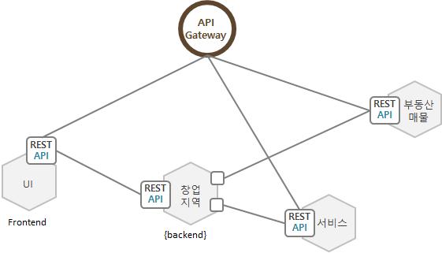
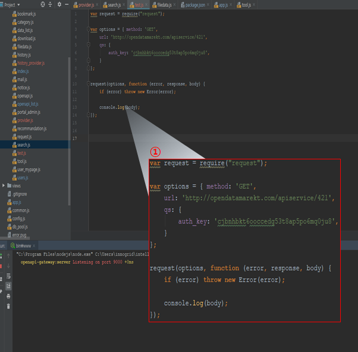
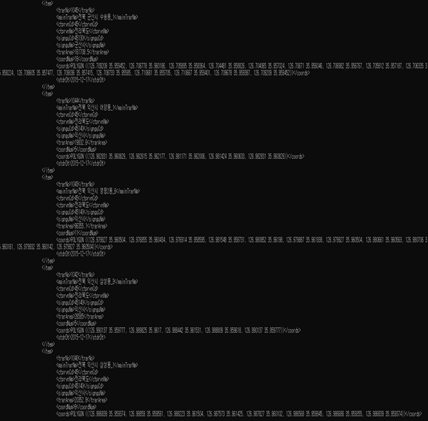

# MSA.통합대기환경정보 제공 

 

## 개발 개요

마이크로서비스 스튜디오와 오픈데이터API 포털을 활용하여 실시간 대기환경정보 API를 이용하여 행정구역별로 통합대기환경정보를 제공하는 웹사이트를 개발하여 활용 방법을 설명한다.

국토교통부에서 제공하는 최신의 행정구역이 표시된 SHP 파일을 이용하여 행정구역 지도를 웹사이트에서 제공한다. 행정구역별 대기환경정보는 초미세먼지 상태를 범례 기준의 색깔로 표시한다. 

또한, 선택한 행정구역에 대한 통합대기환경 정보를 표와 그래프로 표시한다.

 *[애플리케이션 개발 프로젝트는 마이크로서비스 기반 개발을 위해 주요 기능을 분할하여 각각의 앱으로  개발을 수행한다.  여기에서는 프론트엔드앱과 백엔드앱 각각 1개씩 개별 개발하여 구축하는 순서로 설명한다.]*


공동주택 공시가격 제공 사이트 애플리케이션에서 제공하는 주요 기능은 아래와 같다.

### 주요 기능 단위로 마이크로서비스 분할하기

- **FRONTEND** : 최신 행정구역 지도 파일 이용한 미세먼지 상태를 색깔로 표시한다.
- **초미세먼지** : 국토교통부에서 제공하는 공동주택 단지 목록 정보에 대한 위치정보와 가격정보를 검색할 수 있는 기능을 개발하고 API를 정의한다.
- **대기환경정보** : 국토교통부에서 제공하는 지도상의 좌표는 민간 기업 또는 위경도 정보 표기가 달라 그대로 적용할 수 없는 단점이 있다. 국토부 지도좌표를 일반 지도의 좌표로 쉽게 변환해주는 API 

공동주택의 공시가격 정보를 지도상에서 쉽게 찾을 수 있도록 프론트엔드와 백엔드 앱을 분할하고 또한 다음지도와 같은 민간에서 제공하는 지도에서 위치를 쉽게 선택할 수 있도록 좌표 변환은 별도의 API로 개발하여 필요시 반복적으로 개발하지 않고도 활용할 수 있도록 구성한다.


### 주요 사용 API 목록

공공데이터포털을 통해 제공하는 실시간대기환경정보를 이용하여 행정구역별 실시간 미세먼지현황 및 대기환경정보를 알려준다.

- 시도별 실시간 측정정보 조회, 대기오염정보조회, 시군구 실시간평균정보조회

- 대한민국 행정구역 지도 SHP 파일 최신화


### 마이크로서비스 스튜디오 활용 절차

마이크로서비스 기반 개발을 위한 다양한 방법이 존재하지만 마이크로서비스 스튜디오를 활용하여 개발하려면 적용 프로세스을 이해하고 적용해야 한다. 

1. 마이크로서비스 단위로 앱 분할. 기본적인 마이크로서비스 단위 분할 패턴을 적용하여 분할한다. 본 튜토리얼의 연관 문서로 제공하는 '마이크로서비스 개요' 부분을 참조한다. [마이크로서비스 개요](https://github.com/startupcloudplatform/Sample-App-Tutorial/blob/master/microservice.md)]
2. 서비스 브로커 활용 개발인 경우 PaaS-TA 로그인 후 서비스 인스턴스를 생성한 후 서비스 인스턴스 접속정보를 확인한다. [[서비스 인스턴스 생성](#빅데이터-서비스-인스턴스-생성)]
3. 자체 IDE 활용하거나 eclipse 을 이용하는 경우 PaaS-TA에서 plugin을 제공하고 있으니 환경을 설정하여 준비한다. eclipse plugin 설치 방법은 PaaS-TA 3.5 가이드를 참조한다. [[Open PaaS 개발환경 사용가이드](https://guide.paas-ta.kr/guide-1.0-spaghetti/use-guide/open-paas)]
4. 코딩
   - 마이크로서비스 개발 가이드(Microservice Studio 페이지의 DocS 메뉴 참조)를 참조하여 필수 체크 항목 및  추가되는 내용을 적용한다. 만약 가이드를 따르지 않으면 마이크로서비스 앱 간의 연동된 부분(API 등)의 정보를 정확하게 가져오지 못한다. 
   - 마이크로서비스 앱 간의 API 연동이 필수이므로 각 각 앱에 적용할 API를 위한 필수 체크 항목을 반드시 적용한다.
5. PaaS-TA에 개발된 앱을 마이크로서비스 단위별로 각각 PUSH한다.  PUSH 과정에서 msa 환경변수를 정의하거나 PUSH완료 후에도 환경변수 변경은 가능하다. 앱 PUSH 방법은 아래 세가지를 제공한다.
   1. PaaS-TA 포털을 통한 앱 PUSH
   2. CF CLI을 통한 앱 PUSH --> 재배포 시에는 반드시 CF CLI을 이용해야 한다.
   3. eclipse Plugin을 통한 eclipse에서 Open PaaS 서버를 연동한 push --> 재배포 가능
6. 환경변수 msa = yes 를 추가한다. (yaml 파일에 정의하거나 또는 PUSH 후)
7. 마이크로서비스 스튜디오 페이지 접속 --> PaaS-TA 로그인 계정과 동일
8. 마이크로서비스 스튜디오를 통해 마이크로서비스를 추가한다. 
9. PaaS-TA에 PUSH된 앱 목록과 PaaS-TA에 등록된 서비스를 활용하여 마이크로서비스를 구성한다.
10. API 공개는 선택적 기능으로 개발이 완료된 마이크로서비스를 다른 사용자에게 공개하고자 하는 경우에 사용한다.[마이크로서비스 사용자 가이드](https://github.com/startupcloudplatform/Sample-App-Tutorial/blob/master/microserviceuser.md]


### 마이크로서비스 기반 개발

마이크로서비스 기반으로 개발을 위해 제공하는 서비스를 비지니스 영역, 데이터베이스 종속성 등을 고려하여 분할한다. 여기에서는 향후 확장할 서비스를 포함하여 총 3개의 앱으로 분할하여 개발한다고 간주한다.

사용자 UI제공을 위한 프론트앤드 앱과 창업지역 찾기 정보를 제공하는 백엔드 앱을 우선 개발영역으로 본다.




## 백엔드앱 개발

 

### 대기환경정보 제공 API

1)   시도별 실시간 측정정보 조회, 군구 실시간 평균정보 조회 



\-       1. 예제로 제공된 코드를 개발자가 필요한 부분에 입력 및 파싱한 화면

 

2)     API 실행 결과 화면




   \-       1. 개발자가 입력 및 파싱 수행 한 결과 화면

 

### 대기환경정보 API 상세 

#### API 목록

| **URL**                            | **파라미터**                 | **설명**                                                  |
| :--------------------------------- | ---------------------------- | --------------------------------------------------------- |
| /api/dust/cai                      | pollutant, stationName       | 특정 오염물질의 통합대기환경지수값 조회 API               |
| /api/dust/cai/list                 | sidoName, pageNo, numOfRows  | 해당 도의 오염물질별 통합대기환경지수값 조회 API          |
| /api/dust/cai/list/all             | sidoName                     | 해당 도의 오염물질별 통합대기환경지수값 조회 API          |
| /api/dust/measure/avg/sido         | pollutant                    | 시도별 미세먼지 평균 데이터 조회 API                      |
| /api/dust/measure/avg/sigungu      | sidoName, hour               | 해당도의 시군구별 미세먼지 평균 데이터 조회 API           |
| /api/dust/measure/avg/time/sigungu | sidoName                     | 해당도, 해당시간의 시군구별 미세먼지 평균 데이터 조회 API |
| /api/dust/measure/list             | sidnoName, pageNo, numOfRows | 해당도의 미세먼지 실시간 측정 데이터 조회 API             |
| /api/dust/measure/list/all         | sidnoName                    | 해당도의 미세먼지 실시간 측정 데이터 조회 API             |


## 프론트엔드 앱 개발

본 튜토리얼은 eclipse 4.10.0을 기준으로 작성되었으며 PaaS-TA 에서도 WEB IDE를 제공하고 있으며 활용이 가능하다. 다른 익숙한 IDE를 활용해도 무방하다.


### 개발 환경 요구사항

| 요구사항     | 버전  |
| ------------ | ----- |
| AngularJS    |       |
| Java         | 1.8   |
| Spring Boot  | 1.5.9 |
| Spring Cloud | 1.6.1 |
| swagger API  | 2.0.0 |

- ###### Open API 게이트웨이 시스템

​       통합대기환경정보 조회( http://203.245.1.104:3000/ )

- ###### Open PaaS 

​      PaaS-TA 3.1, 3.5(Penne)

​       https://guide.paas-ta.kr/guide-3.5-penne

 

### eclipse IDE 환경 구성

여기에서는 eclipse 4.10 버전을 이용하여 프로젝트 생성하는 방법을 설명한다. Eclipse에서 Maven project를 생성하고 JAVA 1.8을 적용한다.  

eclipse IDE에서 프로젝트를 직접 생성하려면 Project Explorer에서 마우스 우클릭 후 New > Project.. 을 선택한다. Maven Project을 선택하면 기본 Maven 환경이 구성된다. (사전에 Maven 설치가 완료되어 있어야 한다.)

Maven Project 생성 시 

- GroupId : com.example.sample 로 등록한다.
- ArtifactId : frontend
- Package : com.example.sample 로 등록한다. 


### Java 필수 항목 코딩

마이크로서비스 앱 개발은 여러 개의 앱을 구성하여 구동하는 방식으로 개발 환경 설정 시 여러 필수 체크 부분이 존재한다. 특히, JAVA Spring cloud 기반 코딩을 위한 dependency를 정의한다. 기본으로 pom.xml 파일이 생성되었을 것이다. 이 파일을 오픈하고 아래 내용을 붙여넣기 한다.

##### pom.xml 파일 수정

초기 환경 구축 시 pom.xml에 마이크로서비스 앱 개발을 위한 <parent></parent>와 <properties></properties> 를 아래의 내용을 복사하여 pom.xml에 붙여넣기 한다.  JAVA: 1.8이상, Spring Boot: 1.5.13, Spring Cloud: Edgware.RELEASE 는 필수 체크 항목이다. 

```
   <parent>
        <groupId>org.springframework.boot</groupId>
        <artifactId>spring-boot-starter-parent</artifactId>
        <version>1.5.9.RELEASE</version>
        <relativePath/> <!-- lookup parent from repository -->
   </parent>
   
   <properties>
        <project.build.sourceEncoding>UTF-8</project.build.sourceEncoding>
        <project.reporting.outputEncoding>UTF-8</project.reporting.outputEncoding>
        <java.version>1.8</java.version>
        <spring-cloud.version>Edgware.RELEASE</spring-cloud.version>
   </properties>
```


java spring cloud 기반 코딩을 위한 필수 dependency 정의를 위해 아래 내용을 복사하여 pom.xml에 붙여넣기 한다. 

```
<dependencies>
  <!-- required start -->
  <dependency>
    <groupId>org.springframework.cloud</groupId>
    <artifactId>spring-cloud-starter-config</artifactId>
  </dependency>
  <dependency>
    <groupId>org.springframework.cloud</groupId>
    <artifactId>spring-cloud-starter-eureka</artifactId>
  </dependency>
  <dependency>
    <groupId>org.springframework.boot</groupId>
    <artifactId>spring-boot-starter-actuator</artifactId>
  </dependency>
  <dependency>
    <groupId>org.springframework.cloud</groupId>
    <artifactId>spring-cloud-starter-hystrix</artifactId>
  </dependency>
  <dependency>
    <groupId>io.springfox</groupId>
    <artifactId>springfox-swagger2</artifactId>
    <version>2.3.1</version>
  </dependency>
  <dependency>
    <groupId>org.springframework.boot</groupId>
    <artifactId>spring-boot-starter-test</artifactId>
    <scope>test</scope>
  </dependency>
  <dependency>
    <groupId>io.pivotal.spring.cloud</groupId>
    <artifactId>spring-cloud-services-cloudfoundry-connector</artifactId>
    <version>1.6.1.RELEASE</version>
  </dependency>
  <dependency>
    <groupId>io.pivotal.spring.cloud</groupId>
    <artifactId>spring-cloud-services-spring-connector</artifactId>
    <version>1.6.1.RELEASE</version>
  </dependency>  
  <!-- required end -->
</dependencies>
```


#####  annotation 정의를 위한 Java 클래스 생성

java 프로젝트 생성 후 디폴트로 생성된 App.java 파일에 annotation을 정의한다. annotation은 java spring cloud 의 eureka 기능 사용과 rest api 명세를 위한 swagger 필수 annotation 이다. App.java의 기존 내용을 모두 삭제하고 아래 내용을 복사하여 붙여넣기 한다. (소스코드로 배포한 파일에는 클래스이름이 SampleApplication.java로 되어 있음.)

@EnableDiscoveryClient, @EnableCircuitBreaker, @EnableSwagger2

```
package com.example.sample.front;

import org.springframework.boot.SpringApplication;
import org.springframework.boot.autoconfigure.SpringBootApplication;
import org.springframework.cloud.client.circuitbreaker.EnableCircuitBreaker;
import org.springframework.cloud.client.discovery.EnableDiscoveryClient;
import org.springframework.cloud.client.loadbalancer.LoadBalanced;
import org.springframework.context.annotation.Bean;
import org.springframework.context.annotation.Configuration;
import org.springframework.web.client.RestTemplate;
import springfox.documentation.builders.PathSelectors;
import springfox.documentation.builders.RequestHandlerSelectors;
import springfox.documentation.spi.DocumentationType;
import springfox.documentation.spring.web.plugins.Docket;
import springfox.documentation.swagger2.annotations.EnableSwagger2;

@EnableDiscoveryClient
@SpringBootApplication
public class App {

    @LoadBalanced
    @Bean
    RestTemplate restTemplate() {
        return new RestTemplate();
    }

    public static void main(String[] args) {
        SpringApplication.run(App.class, args);
    }
}

@Configuration
@EnableSwagger2
class SwaggerConfig {
    @Bean
    public Docket api() {
        return new Docket(DocumentationType.SWAGGER_2)
                .select().apis(RequestHandlerSelectors.any())
                .paths(PathSelectors.ant("/api/**"))
                .build();
    }
}
```

**@EnableDiscoveryClient**    // Service Discovery 정의   

Eureka 서버가 서비스를 탐색할 때 사용한다. 서비스 검색(Service Discovery)은 마이크로서비스 기반 아키텍처의 핵심 기술요소로  각 클라이언트 또는 일부 형식을 수동으로 구성하는 것은 매우 어려울 수 있다. Eureka는 Netflix 서비스 검색 서버 및 클라이언트로 서버는 등록된 서비스에 대한 상태를 다른 서버로 복제하여 각 서버가 HA(고가용성) 구성 및 배치를 할 수 있다
Eureka client설정: Eureka Server가 작동하고 있는 상태에서 Eureka client를 시작하면 Eureka Server의 Registry에 등록된다.  @EnableDiscoveryClient을 활성화시킨 상태에서서 RestTemplate Bean 에 @LoadBalanced만 달아주면 모든 설정을 Spring Boot에서  자동으로 해준다.

**@LoadBalanced**       // Netflix Ribbon을 자동 적용, 

Service Discovery을 IP대신 찾아서 서비스이름으로 사용할 수 있다.  마이크로서비스 환경에서 효과적으로 사용하기 위해서는, @LoadBalanced 어노테이션을 사용해야 한다. 이 annotation으로 인하여, Netflix Ribbon을 자동적으로 사용할 수 있게 되고, 서비스 발견을 IP대신 서비스 이름으로 할 수 있게 된다.

**@EnableSwagger2**    // swagger API 정의

Swagger2는 RESTful 웹 서비스 용 REST API 문서를 생성하기 위해 사용되는 오픈 소스 프로젝트이다. 웹 브라우저를 통해 RESTful 웹 서비스에 액세스 할 수 있는 사용자 인터페이스를 제공한다. Spring Boot 애플리케이션에서 Swagger2를 사용하려면 dependency을 추가해야 한다. 앞에서 설명한 pom.xml 에 추가한다. 

```
 <dependency>
    <groupId>io.springfox</groupId>
    <artifactId>springfox-swagger2</artifactId>
    <version>2.3.1</version>
 </dependency>
```


##### manifest.yml 생성하기

PaaS-TA에 앱을 푸시할때 사용하는 환경설정 파일이며 manifest.yml 이름으로 생성한 후 아래 내용을 복사한 후 붙여넣기 한다.

**필수 환경설정변수 : msa**

```
---
applications:
  - name: front
    memory: 1G
    path: target/front-0.0.1-SNAPSHOT.jar
    env:
      msa: yes
```


##### application.properties 생성하기

마이크로서비스 앱 이름 정의하는 파일로 application.properties 이름으로 생성한다. 

소스코드 경로 : src/main/resources/application.properties

```
spring.application.name=front
```


#### RestController 정의

마이크로서비스는 여러 앱을 API로 연동되어 있기 때문에 controller를 정의해야 한다. 

```
package com.example.sample;

import org.json.simple.parser.ParseException;
import org.springframework.beans.factory.annotation.Autowired;
import org.springframework.beans.factory.annotation.Value;
import org.springframework.cloud.context.config.annotation.RefreshScope;
import org.springframework.http.*;
import org.springframework.util.Base64Utils;
import org.springframework.web.bind.annotation.GetMapping;
import org.springframework.web.bind.annotation.RequestParam;
import org.springframework.web.bind.annotation.ResponseBody;
import org.springframework.web.bind.annotation.RestController;
import org.springframework.web.client.RestTemplate;
import org.springframework.web.util.UriComponents;
import org.springframework.web.util.UriComponentsBuilder;
```

**@RestController**

REST API는 외부에서 정해진 호출 방식으로 특정 URI를 통해서 사용자가 원하는 정보를 제공하는 방식이다.  REST 방식의 서비스 제공이 가능한 것을 Restful이라고 한다. 

```
@RestController
@RefreshScope
public class TestCntroller {
	
	@Autowired
    private RestTemplate searchClient;
	//마이크로서비스 config쪽에서 basic auth정보 가져오는 부분
    //spring apllication property 문법 참조
    @Value("${gateway.basic.user: }")
    String user;

    @Value("${gateway.basic.password:}")
    String password;

    Object responseReturn = null;
    //HttpHeader를 BasicAuth추가하는 함수
    private HttpHeaders getHeaders(){
        String basicAuth = String.format("%s:%s", user, password);
        String base64Auth = Base64Utils.encodeToString(basicAuth.getBytes());

        HttpHeaders headers = new HttpHeaders();
        headers.setContentType(MediaType.APPLICATION_JSON);
        headers.add("Authorization", String.format("Basic %s", base64Auth));
        postConstruct();
        return headers;
    }
 }
```


마이크로서비스 기반 개발을 위한 해당되는 클래스, pom.xml, application.properties 등의 기본적인 정의가 완료되었다면 나머지 코딩은 개발자가 원하는 내용에 따라 달라질 수 있어 본 문서에서는 샘플앱에 포함된 다른 클래스에 대한 설명은 생략한다. 

필수 정의항목과 나머지 코딩이 완료되면 PaaS-TA 서버와 연동하여 앱을 배포하거나 개별로 빌드를 수행한 후 빌드된 파일을 이용하여 PaaS-TA 에 배포해도 된다. 


## PaaS-TA에 앱 배포하기

코딩이 완료된 소스를 Maven Build를 이용하여 *.jar를 생성한다. 생성된 *.jar 파일을 PaaS-TA에 push한다. PaaS-TA를 이용할 수 있는 환경에서는 포털사이트를 통해서도 앱 push가 가능하다. 여기에서는 Cloud Foundry Cli를 통해서 Push 하는 방법을 설명한다.

 *[PaaS-TA 사용자가이드 참조](https://guide.paas-ta.kr/guide-3.5-penne)*

#### PaaS-TA 포털 로그인

접속 가능한 PaaS-TA 사용자 포털을 이용하여 앱을 푸시할 수 있다. 계정을 갖고 있다면 포털 로그인이 가능하다. 


#### CF Login

PaaS-TA 계정을 갖고 있다면 Cloud-Foundry 접속 경로를 통해서 로그인한다. 

```
$ cf login -a 접속URI --skip-ssl-validation
API endpoint: 접속URI
Email>계정
Password>비밀번호
Authenticating...
OK

Targeted org system
Targeted space paas-ta

API endpoint:   https://api.k-cloud.org(API version: 2.116.0)
User:           admin
Org:            system
Space:          paas-ta
```


#### 앱 Push

소스코드 경로로 이동하고 앱 push 명령어를 입력하여 앱을 push한다. 이때, manifest.yml이 정의되어 있는지 확인한다. PaaS-TA 앱 push를 위해서는 이 파일이 필수이다.

```
$ cf push startup
```

buildpack호출 과정과 Configuration 설정과정을 거쳐 앱이 컨테이너에 push된다. 앱이 정상적으로 push되었는지 확인한다. 

```
$ cf app startup
Showing health and status for app startup in org Org1 / space DEV as admin...

name:              startup
requested state:   started
routes:            uvaj4b89pd.k-cloud.org
last uploaded:     Fri 26 Apr 16:36:37 KST 2019
stack:             cflinuxfs2
buildpacks:        java_buildpack-v4-15

type:           web
instances:      1/1
memory usage:   1024M
     state     since                  cpu    memory       disk           details
#0   running   2019-04-26T07:37:07Z   0.2%   217M of 1G   183M of 512M
```


#### 환경변수 정의

manifest.yml 파일에 정의된 사용자정의 환경변수가 정의되어 있는지 확인한다.

```
$ cf env startup
```

결과 예시

```
{
 "VCAP_APPLICATION": {
  "application_id": "13e72952-9128-4406-b5a1-a0927952512a",
  "application_name": "startup",
  "application_uris": [
   "uvaj4b89pd.msxpert.co.kr"
  ],
  "application_version": "e1b5522f-23df-48c0-8003-8e67867c31d7",
  "cf_api": "https://api.k-cloud.org",
  "limits": {
   "disk": 512,
   "fds": 16384,
   "mem": 1024
  },
  "name": "startup",
  "space_id": "46ad022f-bf06-43c9-b2f8-1d4809c96daf",
  "space_name": "DEV",
  "uris": [
   "uvaj4b89pd.k-cloud.org"
  ],
  "users": null,
  "version": "e1b5522f-23df-48c0-8003-8e67867c31d7"
 }
}

User-Provided:
msa: true
```


## 마이크로서비스 앱 구성

## API 관리 

## 마이크로서비스 운영
