# 마이크로서비스 아키텍처 개발 가이드

마이크로서비스 아키텍처 개발에는 다양한 방법이 있지만 마이크로서비스 스튜디오는 Spring Cloud을 PaaS-TA와 연동하여 실행하는 구조를 제공하고 있다. 본 가이드에서는 마이크로서비스 아키텍처 개발을 위해 Spring Cloud와 마이크로서비스 관계를 설명하고 각 지원 모듈에 대해서 설명한다.


[1. Microservice & Spring Cloud](#Spring-Cloud-개요)

[2. Spring Cloud Config Server](#Spring-Cloud-Config-Server)

- [마이크로서비스 스튜디오의 Config Server](#마이크로서비스-스튜디오의-Config-Server)

[3. Service Discovery and Registry](#Service-Discovery-and-Registry)

1. API Gateway
2. Hystrix
3. Open PaaS - Cloud Foundry


## Spring Cloud 개요

클라우드 환경에서 애플리케이션은 크게 세가지 유형으로 나눌 수 있다.  

- Native Application : 데스크탑 앱과 같이 응답속도가 빠르고 오프라인에서도 작업이 가능한 형태
- Web Application : 표준 웹 기술을 사용하여 Platform 이나 Device에 상관없이 사용하도록 개발된 애플리케이션
- Cloud native Application : Desktop Application과 Web Application과 결합된 형태로 클라우드 환경에서 실행되는 애플리케이션


### Cloud Native Application 출현 배경

클라우드 컴퓨팅은 인터넷상에서 모든 컴퓨팅 작업이 이루어지는 환경을 말하며 사용자 기기(모바일폰, 노트북, 태블릿 등)에서 네트워크를 통해 서비스에 접속하여 사용할 수 있는 것을 말한다. 이러한 환경의 변화로 클라우드 컴퓨팅은 아래와 같은 특징을 갖고 있다. 

- 오픈소스 기반의 클라우드 컴퓨팅 확산
- 클라우드 플랫폼 확대 --> 네트워크 기반의 플랫폼 비지니스 확대
- 대형 또는 복잡한 애플리케이션 들 간의 협업/통합 강화

클라우드 네이티브 애플리케이션은 비지니스 변화에 대한 신속한 대응력을 확보할 필요성이 더욱 강조되었으며 새로운 요구에 대한 빠른 대응, 유연하고 신속한 확장성, 장애에 대한 대응과 장애시 신속한 복구 및 지속적인 통합&지속적인배포(CI/CD)의 필요성으로 출현하게 되었다.

### Cloud Native Application 특징

클라우드 네이티브 애플리케이션은 클라우드 환경에 친화적인 애플리케이션, 아키텍처, 인프라 환경을 뜻한다. 비지니스 환경 변화에 빈첩하고 능동적으로 대응하기 위해 클라우드 네이티브 환경에서 SaaS나 FaaS(Function as a Service) 형태로 서비스되는 애플리케이션을 의미한다. 클라우드 환경에 최적화되어 서비스되도록 개발된 애플리케이션으로 핵심은 '서비스'이다. 이 서비스들을 어떻게 구성하고 어떻게 연결하고 관리하느냐가 관건이며 '서비스'를 묶어서 하나의 통합된 '비지니스 서비스'를 할 수 있도록 하기 위한 다양한 기능과 기술이 필요한다.

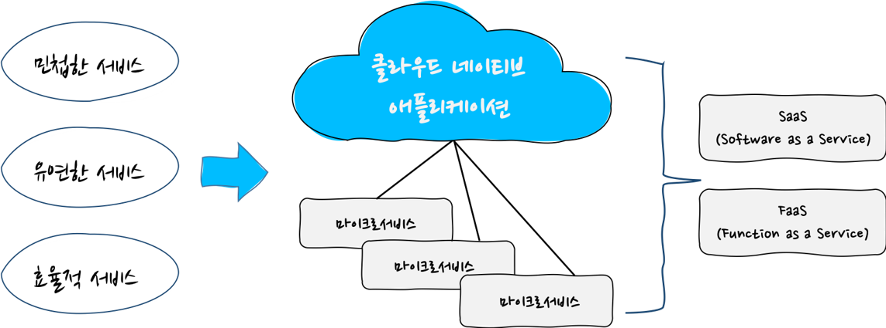


### 12 Factor app

12 factor App은 클라우드 네이티브 애플리케이션을 가능하게 하는 방법론으로 비지니스를 위한 기술에서 기술에 의한 비지니스로 패러다임이 바뀌면서 생겨났다.  확장이 가능하고 쉽게 클라우드 플랫폼에 배포할 수 있으며 지속 배포 프로세스에 따라 배포되는 SaaS를 개발하는 방법론이다. 

- 클라우드 애플리케이션을 생성하기 위해 12단계 앱 원칙 사용

- 클라우드 네이티브 소프트웨어 개발 및 배포를 위한 모범 사례

  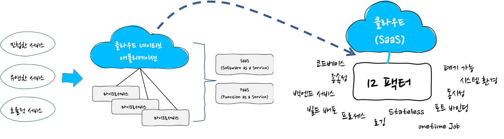

  

#### 클라우드 네이티브 애플리케이션 개발

클라우드 네이티브 개발로 이관하는 주요 동기는 품질을 유지하면서 애플리케이션의 구현 및 배포를 빠르게 하기 위함이다. 대부분의 경우 마이크로서비스가 이것을 달성하도록 도와준다.

이러한 마이크로서비스 아키텍처를 설계하려면 많은 것들을 고려해야 한다. 마이크로서비스는 분산시스템 기반의 애플리케이션을 위한 아키텍처지만, 서비스가 아닌 환경에 더 집중해야 하는 경우가 많다.


- 공통 패턴을 모아 Spring 프로젝트로 구성
- 12 Factor 준수
- 스프링 부트 기반으로 마이크로서비스 아키텍처 시스템 환경을 쉽게 구성
  - 분산/버전 Configuration
  - Service 등록 및 Discovery
  - Routing
  - 서비스 간의 호출
  - 부하 분산
  - Circuit Breaker
  - 분산 메시징


#### 마이크로서비스 아키텍처 요소와 Spring Cloud 기술

Spring Cloud는 Netflix의 유명한 오픈 소스 기능인 유레카(Eureka), 히스트릭스(Hystrix), 리본(Ribbon), 주울(Zuul)등과 통합

| Microservice Concern        | Spring Cloud&Neflix OSS           |
| --------------------------- | --------------------------------- |
| Configuration Management    | Spring Config Server              |
| Service Discovery           | Netflix Eureka                    |
| Load balancing              | Netflix Ribbon                    |
| API Gateway                 | Netflix Zuul                      |
| Service Security            | Spring Cloud Security             |
| Resilence & Fault Tolerance | Netflix Hystrix, Turbine & Ribbon |


## Spring Cloud Config Server

마이크로서비스 아키텍처는 아주 작고 수많은 서비스로 구성되어 있어 환경변수에 대한 관리가 매우 중요하다. 너무 많은 애플리케이션의 환경변수에 대해 수동 작업이 어렵기 때문에 이를 관리하는 서비스를 이용한다.  Spring Cloud에서는 환경변수를 관리하는 Config Server를 제공한다. 

**환경 변수 란 ?**

- 자주 변경되거나 확정되지 않는 동적인 데이터들의 모임
- 같은 용도이지만 개발, 테스트, 운영 등 다양한 조건 마다 다른 데이터
- 다양한 곳에서 사용하는 공통 데이터가 존재 안함

**기존 Java 환경 변수 설정**

클래스 상수를 이용한 환경 변수

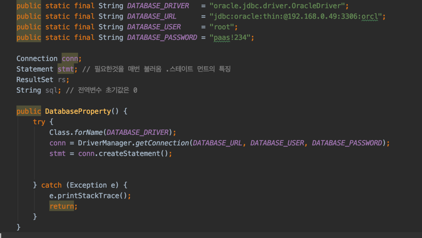

- java의 static final 키워드를 사용
- 변수 변경 때마다 참조하고 있는 클래스를 재 컴파일

**Properties의 Profile을 사용한 환경 변수**

- Key=Value 형태의 데이터
- 특정 Profile에 따라 환경변수 및 기능 등을 다르게 할 수 있도록 구성
- Properties 변경 시마다 재배포와 재시작


### 마이크로서비스 아키텍처 기반 애플리케이션의 환경 변수

스프링 클라우드를 사용하기 이전에는 로컬, 개발, 스텡징, 운영 마다 DB, 파일업로드 경로, 특정 URL 같은 Configuration 값이 다르므로 배포할 때마다 주석처리 혹은 파일 바꿔 치기 등으로 각 서버마다 별도로 packaging 하여 배포하였다. Spring profiles를 활용함으로써, 이러한 문제들을 많이 해결했지만 완벽하지 않은 문제가 있다. 바로 환경설정 값을 변경하려면 반드시 애플리케이션이 구동중인 서버를 재시작해야 한다는 점이다. 아무리 이중화가 되어 있어도 서버 재시작은 부담스러운 작업이 아닐 수 없다. 이런 문제를 해결해 주는 것이 Spring Cloud Config 이다.

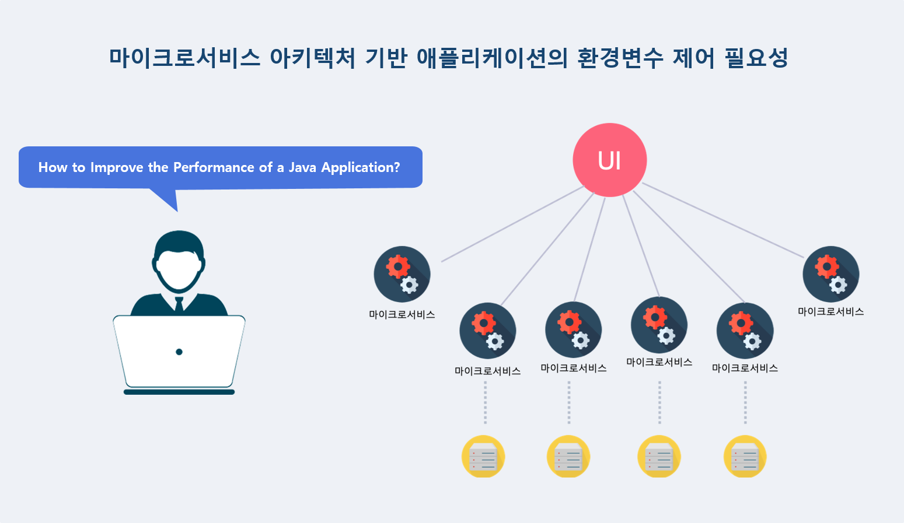


#### 기존 환경 변수의 구조

기존 환경변수는 Git, SVN과 같은 소스 버전관리 시스템에서 소스 배포로 인한 환경변수가 갱신하는 구조이다. 

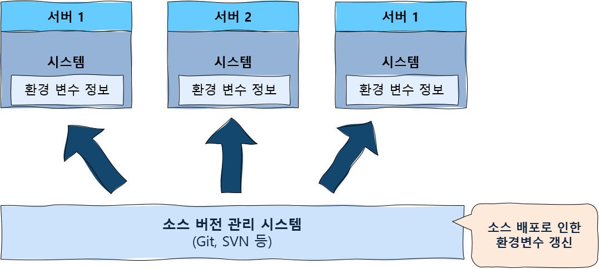


Spring Cloud Config Server는 소스코드 버전관리시스템의 상위에서 Spring Cloud Config Client로 JSON API 형태로 환경변수를 제공한다. 


**Config Server 개념**

- 분산 시스템에서 설정 파일을 외부로 분리하는 것을 지원
- Spring Cloud Config을 사용하면 외부 속성을 중앙에서 관리할 수 있음
- Spring 애플리케이션은 물론, 다양한 애플리케이션에서 동일하게 설정파일을 사용
- 설정 파일 구성의 기본은 Git을 사용
- 환경변수에 대한 암/복호화 기능 내장

1) Config Server 의존성 추가

​    Config Server 애플리케이션 pom.xml에 spring-cloud-config-server 의존성을 포함   

```
<dependency>
    <groupId>org.springframework.cloud</groupId>
    <artifactId>spring-cloud-config-server</artifactId>
</dependency>
```

2) Config 데이터 저장소

- Config Server는 다양한 방법으로 호출할 수 있는 저장소 제공
- Configuration 데이터는 외부 저장소에도 저장 가능 -> 기본 구현은 git 사용

```
#file server
spring.profiles.active=native
spring.cloud.config.server.native.searchLocations=classpath:/config-repo
spring.cloud.config.server.overrides.gateway.basic.user=${basic-user:gwuser}
spring.cloud.config.server.overrides.gateway.basic.password=${basic-secret;gwsecret}
```

3) 메인 클래스에 Config Server 활성화

  Config Server 애플리케이션 메인 클래스에 @EnableConfigServer 설정

```
@SpringBootApplication
@EnableConfigServer
```


### 마이크로서비스 스튜디오의 Config Server

마이크로서비스 스튜디오의 Config Server 애플리케이션 REST API 정보를 제공한다. 

| Method | API                 | 설명                                                         |
| ------ | ------------------- | ------------------------------------------------------------ |
| GET    | /config/read        | Config 애플리케이션의 /resource/config-repo/application.properties 읽어옴 |
| GET    | /config/read/{app}  | Config 애플리케이션의 Parameter로 받은 {app}의 properties 파일 읽어옴 |
| POST   | /config/write/{app} | Native 프로파일 방식으로 요청한 app의 properties 파일을 config-repo 위치에 생성 |

1) @RefreshScope를 사용해 Configuration(properties) 다시 읽기

@RefreshScope Annotation을 사용하여 클라이언트 측 애플리케이션 RESTful API을 HTTP POST 메서드로 호출하면 애플리케이션의 Configuration을 빌드없이 자동으로 변경

2) 클라이언트 측 애플리케이션-의존성 추가

```
<dependency>
    <groupId.org.springframework.cloud</groupId>
    <artifactId>spring-cloud-starter-config</artifactId>
</dependency>
```

3) 클라이언트 측 애플리케이션 - Config Server URI 설정

```
spring.cloud.config.uri=http://localhost:${PORT:8080}
```

4) 클라이언트 측 애플리케이션 - @RefreshScope Annotation 추가


## Service Discovery and Registry

서비스간 통신을 수행하려면 서비스 위치(포트, 호스트)를 알아야 하는데 전통적인 애플리케이션에서는 정적이고 알려진 위치에서 서비스가 실행되기 때문에 간단한 작업이었다. 

그러나, 수많은 마이크로서비스들은 각 마이크로서비스가 상대방의 네트워크 주소 정보를 유지해야 하고 애플리케이션이 재시작된 후에 주소가 동적으로 변경되면 관리자체가 어렵게 된다. 

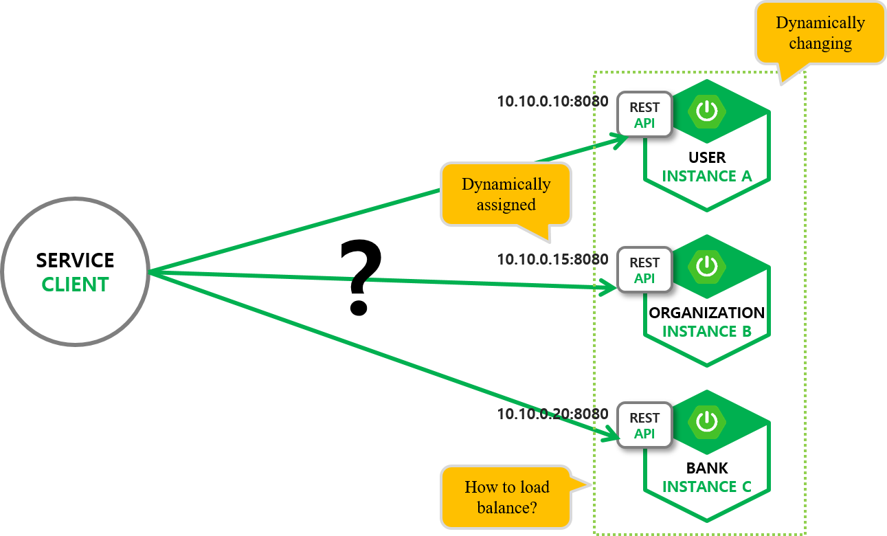


마이크로서비스가 시스템에 등록되는 것을 자동으로 감지하여 게이트웨이가 자동으로 인지할 수 있도록 지원해야 한다.

- 서버가 새롭게 등록되면 그것을 감지하여 서버 목록에 자동으로 추가
- 등록된 서버가 종료되면 자동으로 목록에서 삭제
- API를 호출하는 쪽에서 상대방 주소를 알 필요없이 이름만으로 호출

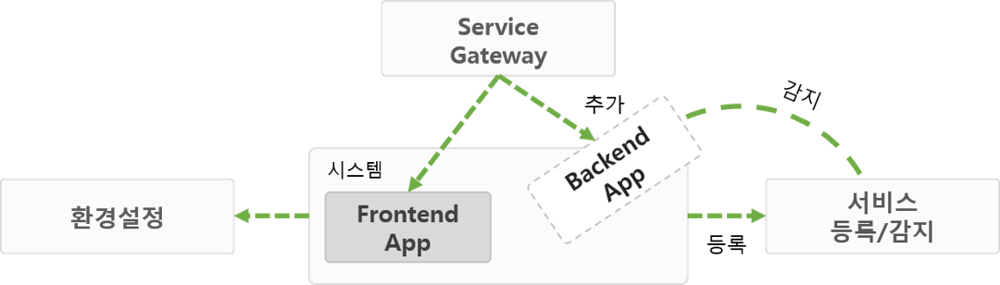


### Service Discovery - Eureka

Eureka 같은 서버를 사용하지 않는다면 개발자는 수동으로 전부 다 등록해야 하고 추가된 인스턴스만 배포하는 것이 아니라 관련된 다른 인스턴스까지 추가로 재배포가 필요할 수도 있을 것이다.

- Eureka를 사용할 모든 Server에 Eureka Client 탑재
- 서버 가동 시 자신의 정보(IP/Port/서비스명)을 Eureka Server에 등록(반대로 종료시 삭제)
- Eureka Client는 주기적으로 Service별 IP 목록을 Fetch 보관
- API 호출시 서비스 이름(api-service)를 사용하여 해당 서버 목록 획득 후 호출

#### Eureka 구성

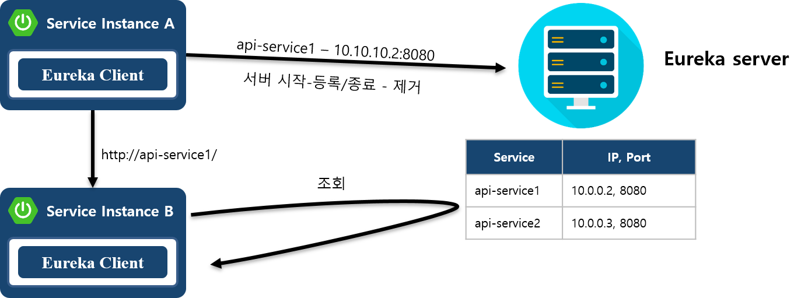


#### Eureka Server 특징

- 서버와 클라이언트로 구성

- RESTful API 기반이라 다양한 언어에서 사용이 가능

- 대중적인 JSON 포맷과 RESTful API를 지원한다는 점에서 Spring Cloud는 매우 유연한 플랫폼

- eureka-server는 eureka-client로 등록된 서버들의 정보를 가지고 있음

- 또 다른 eureka-client들에게 자신이 가지고 있는 다른 eureka-client 들의 공유. eureka-client들은 공유된 정보들을 이용. 예를 들어, zuul, ribbon, spring-boot-admin, zipkin 등에서 이정보를 활용한다.

  Eureka Server Processing

  1) Eureka Client의 서비스가 시작될 때 Eureka Server에 자신의 정보를 등록한다.

  2) 등록된 후에는 30초마다 레지스트리에 ping을 전송하여 자신이 가용상태임을 알리는데 일정 횟수 이상 ping이 확인되지 않으면 Eureka Server에서 해당 서비스를 레지스트리에서 제외시킨다.

  3) 레지스트리의 정보는 모든 Eureka Client에서 복제되어 있어 필요할때마다 가용 상태인 모든 서비스들의 목록을 확인할 수 있고 이 목록은 30초마다 갱신된다.

  4) 가용 상태의 서비스 목록을 확인할 경우에는 서비스의 이름을 기준으로 탐색하며 로드밸런싱을 위해 내부적으로 ribbon(클라이언트 측의 로드밸런서)을 사용한다.


#### Eureka Server 개발

1) Eureka Server의 의존성 추가

| Dependency                         | 목적                            |
| ---------------------------------- | ------------------------------- |
| spring-cloud-starter-config        | Spring cloud config client 서버 |
| spring-cloud-starter-eureka-server | Eureka Server                   |
| spring-boot-starter-actuator       | Spring Actuator                 |

```
<dependency>
	<groupId>org.springframework.cloud</groupId>
	<artifactId>spring-cloud-starter-eureka-server</artifactId>
</dependency>
```

2) bootstrap Context 설정

Eureka 서버에 등록하는 앱에서 클라이언트 측 애플리케이션 이름은 기본적으로 앱의 spring.application.name 속성 값

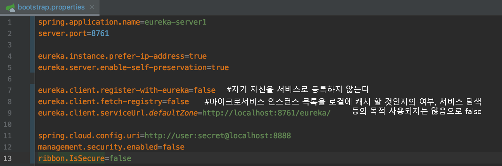

3) 메인 클래스에 Eureka Server 활성화

```
@EnableEurekaServer
@SpringBootApplication
```

4) Eureka Server 기본 Security 적용

```
#basic security
security.basic.enabled=true
security.user.name=user
security.password=secret
```

5) 애플리케이션 실행

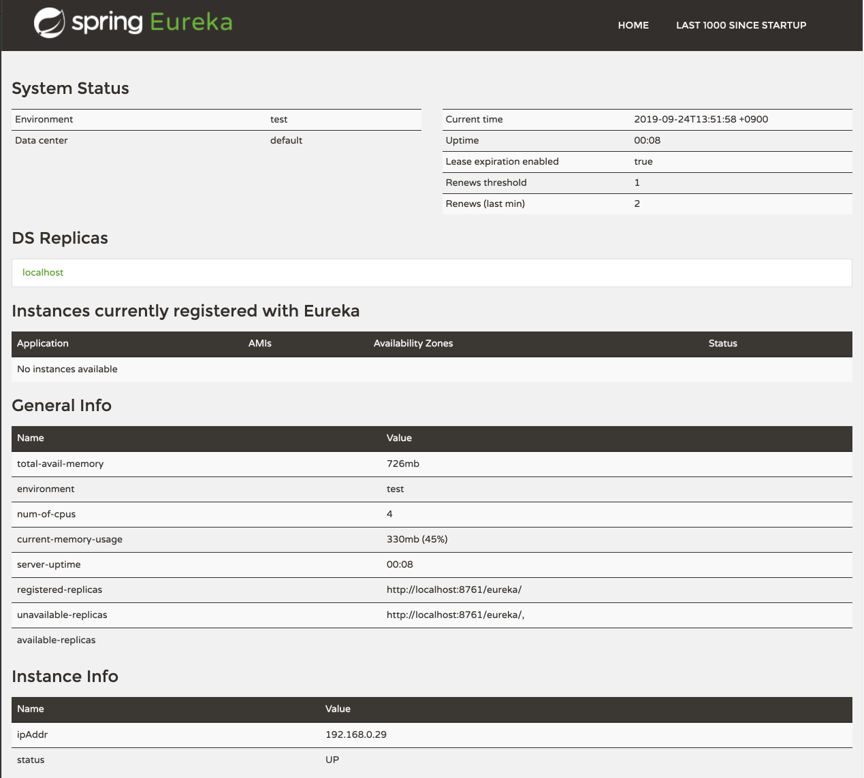


#### Eureka Client 개발

1) 클라이언트 측 애플리케이션 - 의존성 추가

{ gateway, frontend, backend}/pom.xml

```
<dependency>
	<groupId>org.springframework.cloud</groupId>
	<artifactId>spring-cloud-starter-eureka</artifactId>
</dependency>
```

2) 클라이언트 측 애플리케이션 - Registry Client 설정

{ gateway, frontend, backend}/pom.xml

```
import org.springframework.cloud.client.discovery.EnableDiscoveryClient;

@EnableDiscoveryClient
```

3) 클라이언트 측 애플리케이션 - Properties 설정

- Eureka 서버에 등록하는 클라이언트 측 애플리케이션 이름은 기본적으로 앱의 spring.application.name 속성값

4) Eureka 클라이언트 측 애플리케이션 실행

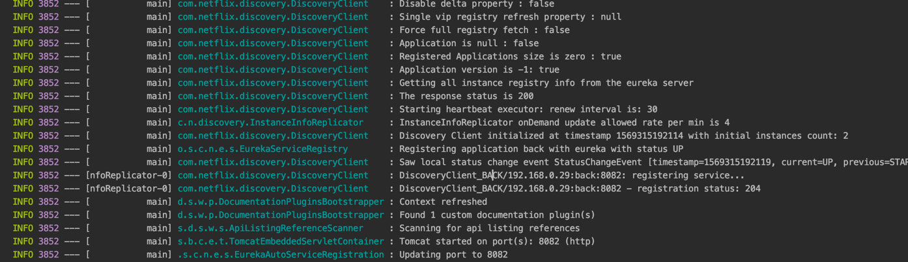