# 오픈 데이터 마켓 활용 가이드

### 개요

**Open Data Market**은 다양한 기관에서 독립적으로 제공하는 오픈데이터 정보를 통합 및 분류하여 서비스를 제공합니다. Open Data Market을 통해 오픈데이터를 찾으면 다수의 사이트를 방문해야 하는 번거로움이 줄어듭니다. 또한 S/W 개발자에 최적화된 분류체계를 제공하면서 오픈데이터 정보의 접근성을 높입니다.


 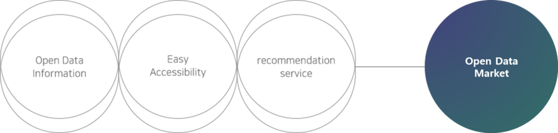 


### 오픈 API란 무엇인가?

**오픈 API(Open Application Programming Interface, Open API, 공개 API)**는 누구나 사용할 수 있도록 공개된 API를 말하며, 개발자에게 사유 응용 소프트웨어나 웹 서비스에 프로그래밍적인 권한을 제공합니다. 또한 정보공개를 공급자 위주에서 국민중심·수요자 중심으로 전환함에 따라, 공공기관이 이용자에게 정보를 재활용 할 수 있도록 제공하고, 제공받은 정보를 상업적·비영리적으로 이용할 권리를 부여함으로써 다양한 서비스와 데이터를 좀더 쉽게 이용할 수 있도록 공개한 개발자를 위한 인터페이스 입니다.


### 오픈 데이터 API 게이트웨이 아키텍처

총 3개의 포털 시스템으로 구성되어 있고 15개 기관 데이터가 포털에 연계되어 있으며 약 2,000개 이상의 파일 데이터 및 OPEN API를 포털에서 제공하고 있습니다.


 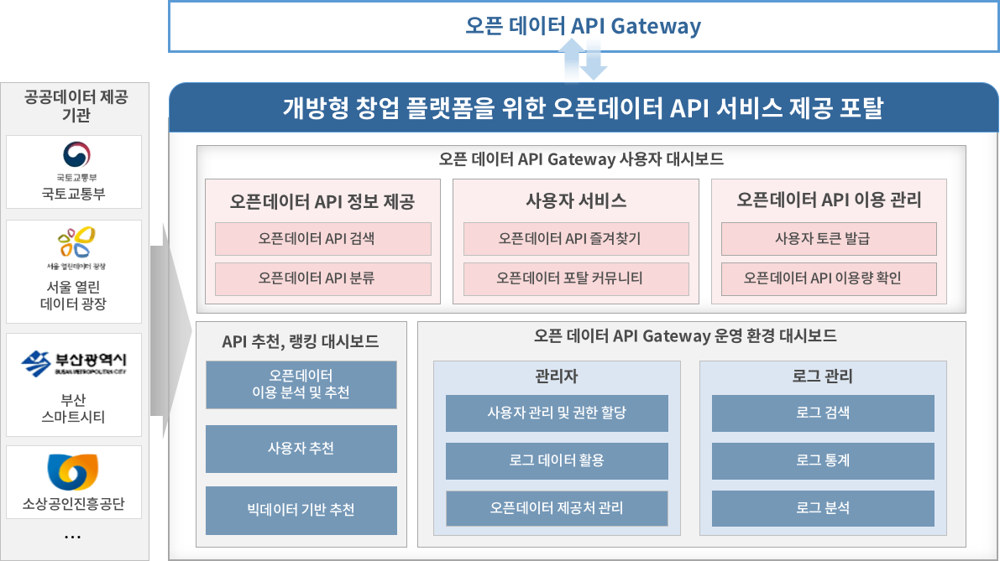 

---

### 오픈 데이터 마켓(OPEN DATA MARKET) 시작하기

오픈 데이터 마켓을 웹 기반으로 제공되며, 누구나 간단한 회원가입을 통해 쉽고 빠르게 이용이 가능합니다. 또한, 자신이 사용하고자 하는 API를 간단한 신청 절차를 통해 바로 이용이 가능하다는 장점이 있습니다.


#### 홈페이지 접속

오픈 데이터 마켓(OPEN DATA MARKET)은 http://203.245.1.104:3000/를 통해 접속이 가능합니다.

 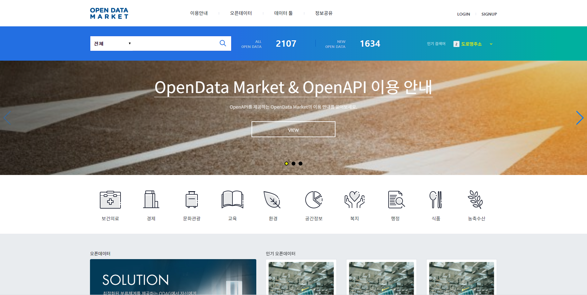 
<center>오픈 데이터 마켓 메인 화면</center>
#### 회원가입

오픈 데이터 마켓을 이용하시려면 간단한 회원가입 후, 모든 컨텐츠를 이용하실 수 있습니다.

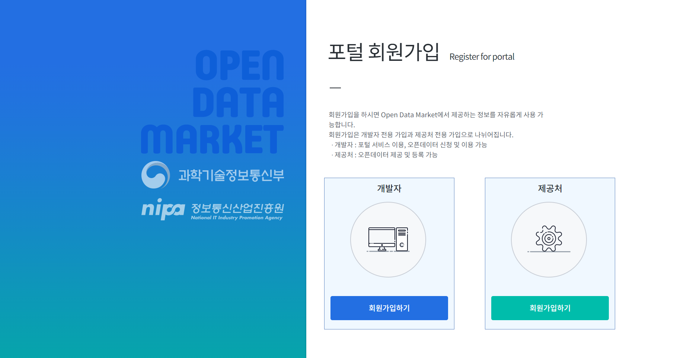 
<center>오픈 데이터 마켓 회원가입 화면</center>
#### 회원가입 (개발자 화면)

오픈 데이터 마켓의 오픈 데이터 API를 활용하고자 한다면 개발자 회원가입을 진행합니다.

회원가입 시, 다음과 같은 정보가 필요합니다.

> 1. 아이디
> 2. 비밀번호
> 3. 이름
> 4. 직업
> 5. 연락처
> 6. 메일주소
> 7. 성별
> 8. 재직중인 회사 종류
> 9. 재직중인 회사 이름
> 10. 관심 카테고리


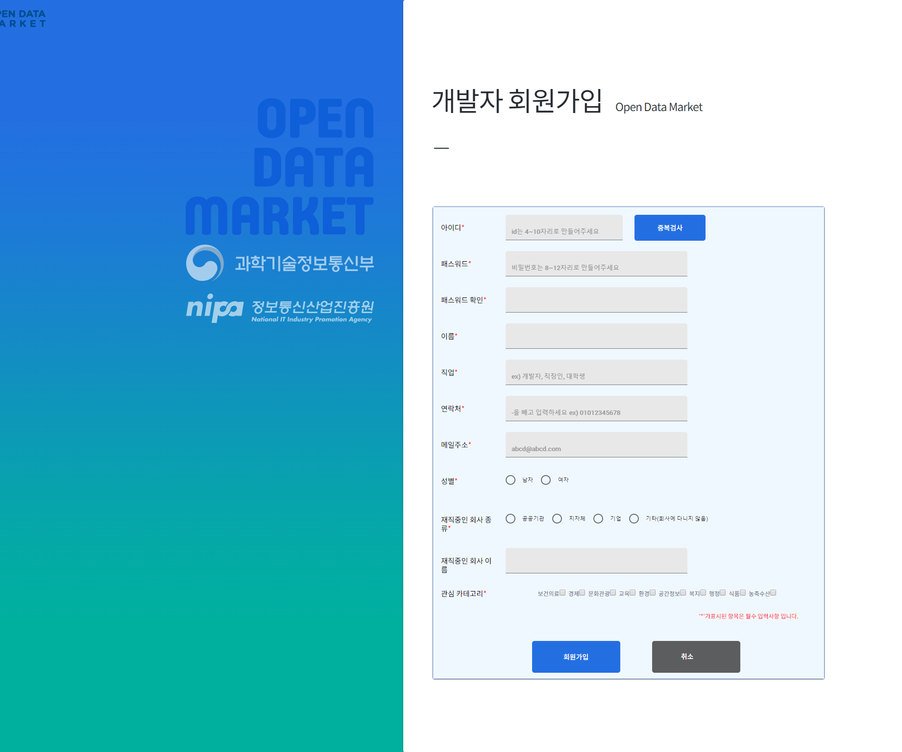 
<center>오픈 데이터 마켓 개발자 회원가입 화면</center>
#### 로그인

회원가입이 완료되었다면, 오픈 데이터 마켓의 로그인 화면을 통해 포털 로그인을 진행합니다.

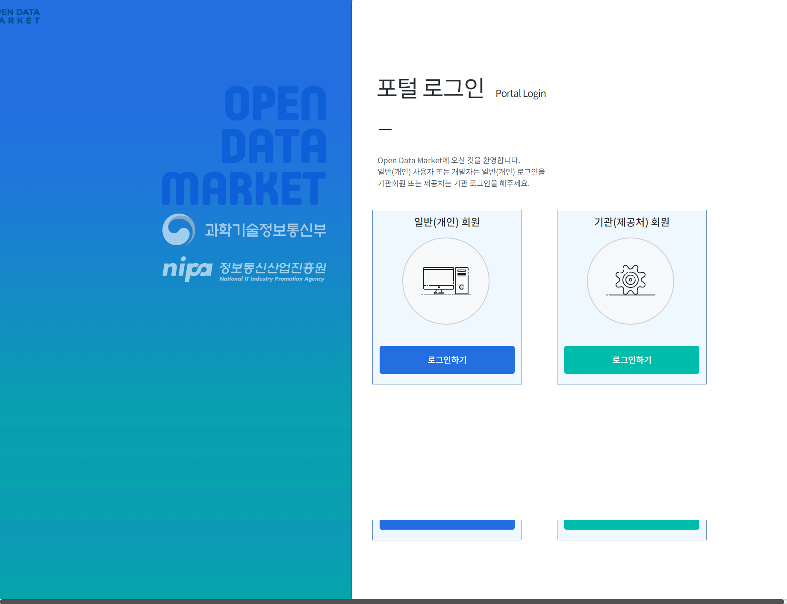
<center>오픈 데이터 마켓 개발자 로그인 화면</center>
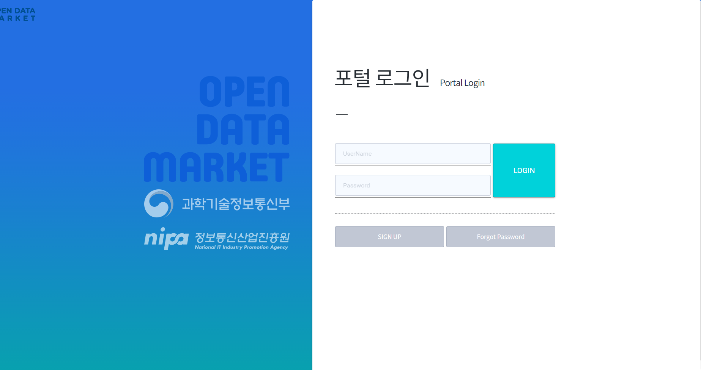
<center>오픈 데이터 마켓 개발자 로그인 화면 (2)</center>
---

### 오픈 데이터 마켓(OPEN DATA MARKET) 이용하기

오픈 데이터 마켓의 검색 및 카테고리 선택을 통해 자신이 활용하고자 하는 오픈데이터를 선택 및 신청 후 활용하는 과정을 안내합니다. 


#### 오픈데이터 API 이용 방법

활용할 데이터를 찾기 위해 오픈 데이터 마켓 상단 메뉴 '**오픈데이터**'를 클릭하여 이동합니다.

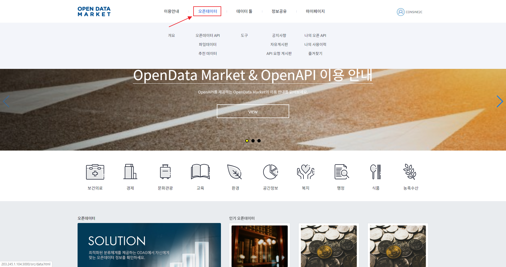
<center>오픈 데이터 마켓 메뉴 안내 화면</center>
#### 오픈데이터 API 찾기

① 검색 : 자신이 활용하고자 하는 API를 찾으려면 검색 창에 관련 단어를 기입 후 검색 버튼을 누르세요.

② 인기 검색어 : 현재 오픈 데이터 마켓에서 가장 인기 있는 메뉴를 보여줍니다.

③ 카테고리 : 오픈데이터 API, 파일데이터, 추천 데이터 등으로 분류가 나뉘어 있으며, 클릭 시 해당하는 데이터를 출력하여 보여줍니다.


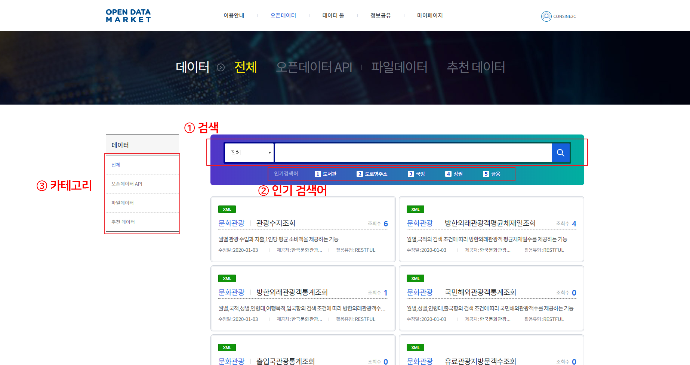
<center>오픈 데이터 마켓 데이터 화면</center>
활용하고자 하는 검색어를 입력한 후, 검색 결과에서 공간정보 '개별주택가격WFS조회' 데이터를 클릭합니다.

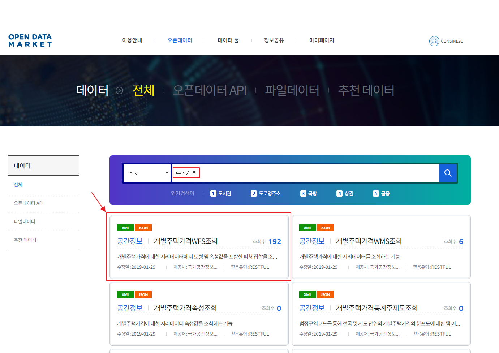
<center><오픈 데이터 마켓 데이터 검색 화면></center>
활용 정보(목적)을 클릭 후, 신청 버튼을 클릭하여 활용 신청을 진행합니다.

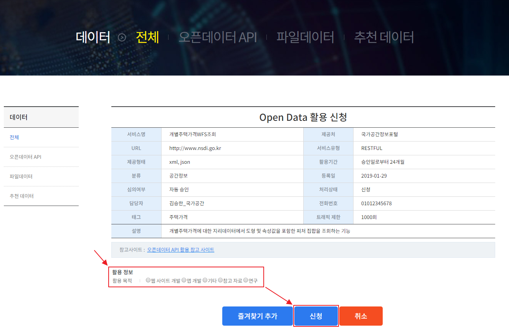

<center>오픈 데이터 마켓 데이터 활용 신청 화면</center>
정상적으로 신청이 완료되면, 자동으로 마이페이지의 '나의 오픈 API' 화면으로 이동이 되며,  신청한 오픈 데이터 API 목록과 인증키를 확인 할 수 있는 공간이 표시됩니다.


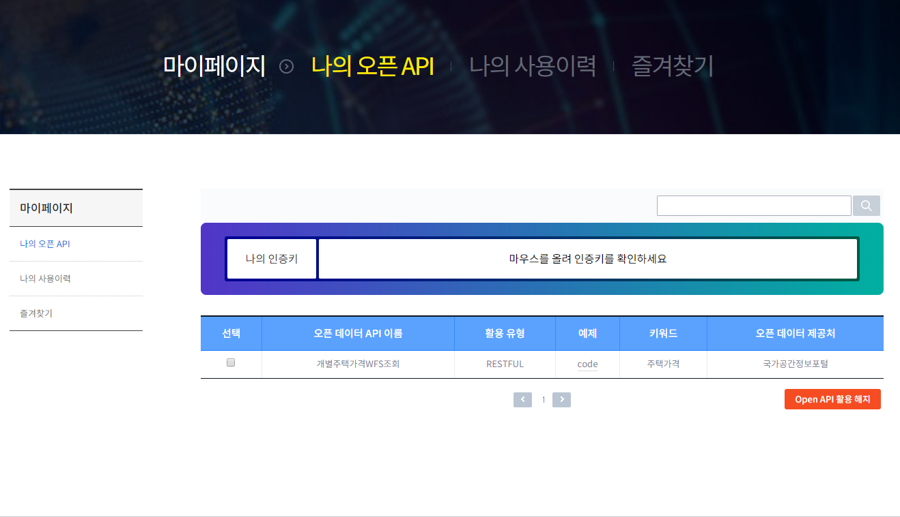
<center>오픈 데이터 마켓 마이페이지 → '나의 오픈 API' 화면</center>
#### 오픈데이터 API 모니터링

오픈 데이터 마켓의 모든 API 데이터는 자유롭게 사용이 가능합니다.

하지만, 무분별한 요청으로 인한 문제가 발생할 수 있기 때문에 API 요청 일일 사용량 제한이 설정되어 있습니다. 

오픈 데이터 마켓의 일일 사용량 제한은 다음과 같습니다. 

| API  |         일일 제한량          |
| :--: | :--------------------------: |
| 호출 | 1,000회(초당 10건 이내 허용) |

 

일일 사용량은 마이 페이지 > 나의 사용이력 화면에서 확인하실 수 있습니다. 

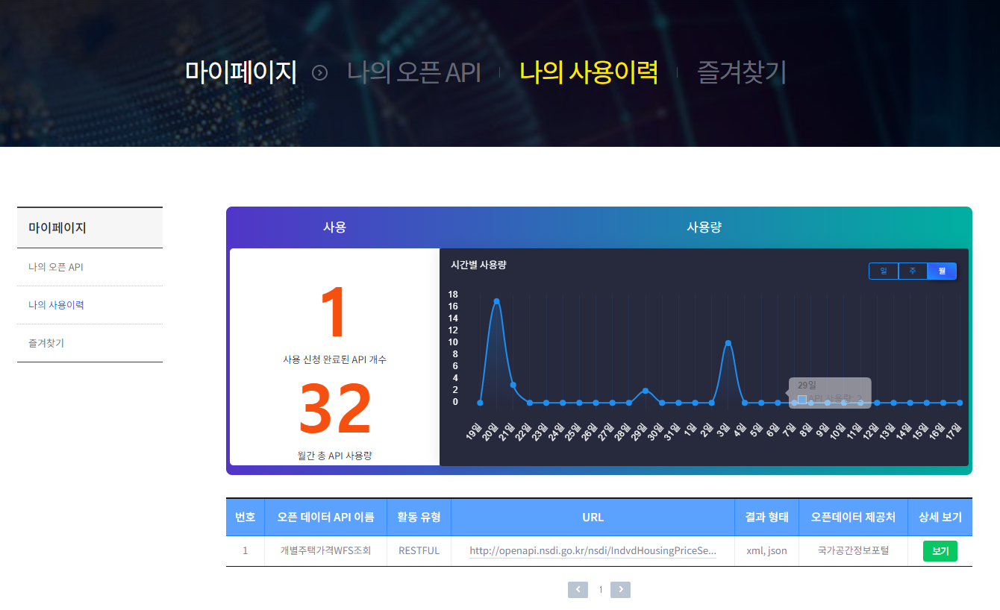
<center>오픈 데이터 마켓 마이페이지 → '나의 사용이력' 화면</center>
---

### 오픈데이터 API 사용해보기

오픈 데이터 API 는 정상적으로 이용 신청이 완료된 상태이며, 이 API 를 활용하는 방법에 대해 안내합니다.

마이페이지 > **나의 오픈 API** 화면에서 신청한 오픈 데이터 API를 확인합니다.


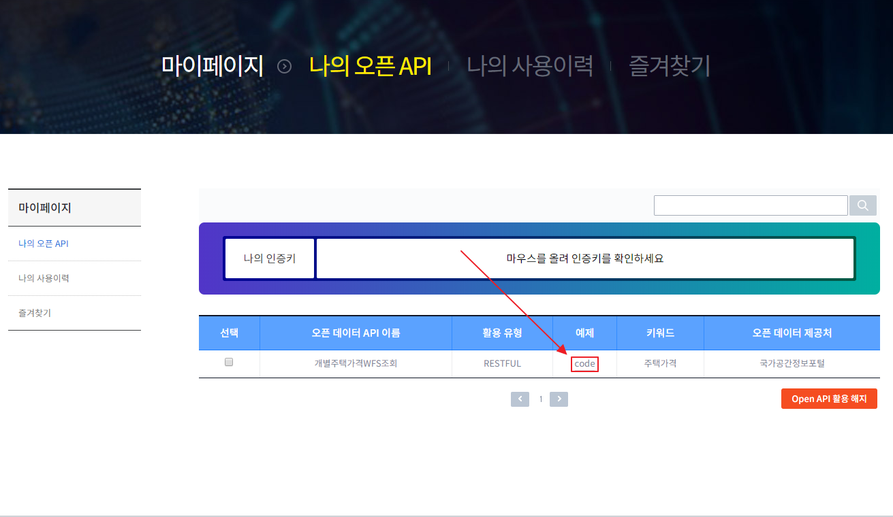
<center>오픈 데이터 API 예제 코드 화면 (1)</center>
신청한 오픈 데이터 API 를 확인 후, 사용하고자 하는 API 의 예제 code 에 마우스를 올리면 **예제 코드**가 레이어 팝업 형식으로 표시됩니다.


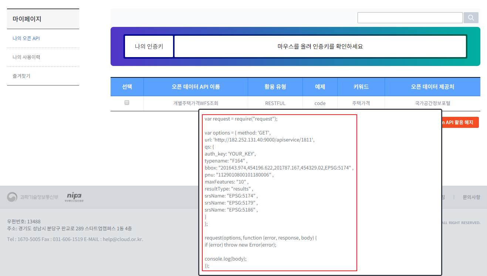
<center>오픈 데이터 API 예제 코드 화면 (2)</center>
예제 'code'를 클릭하면, 클립보드로 코드가 자동으로 복사됩니다.

```nodejs
var request = require("request");

var options = { method: 'GET',
  url: 'http://182.252.131.40:9000/apiservice/1811',
  qs: { 
     auth_key: 'YOUR_KEY', // 인증키 입력 부분 YOUR_KEY 를 교체합니다.
  typename: "F164" , 
     bbox: "201643.974,454196.622,201787.167,454329.02,EPSG:5174" , 
     pnu: "1129010800101180006" , 
     maxFeatures: "10" , 
     resultType: "results" , 
     srsName: "EPSG:5174" , 
     srsName: "EPSG:5179" , 
     srsName: "EPSG:5186" , 
     }
};

request(options, function (error, response, body) {
  if (error) throw new Error(error);

  console.log(body);
});
```


위 예제코드는 Javscript 기반 Node.js 프레임워크 코드로 이루어져있습니다.

API 는 간단하게 설명하자면, 요청에 대한 값을 리턴해주는 방식입니다.

A 가 B에게 특정 아이스크림의 정보를 알고 싶다면, qs(parammeter)를 통해 질의를 하고, B는 A가 보낸 qs(parammeter)를 확인 후, 해당 아이스크림의 정보를 A에게 전송해주는 것입니다.


위 소스를 간단하게 아래와 같이 설명할 수 있습니다.

```
  url: 'http://182.252.131.40:9000/apiservice/1811',
  // 오픈 데이커 마켓의 서비스를 통해 활용 신청한 API에 대해
    qs: { 
      auth_key: 'YOUR_KEY', // 인증키를 통해 데이터 주고 받는 것을 허가 받고
      typename: "F164" , 
      bbox: "201643.974,454196.622,201787.167,454329.02,EPSG:5174" , 
      pnu: "1129010800101180006" , 
      maxFeatures: "10" , 
      resultType: "results" , 
      srsName: "EPSG:5174" , 
      srsName: "EPSG:5179" , 
      srsName: "EPSG:5186" , 
     }     // typename, bbox, pnu... etc 등의 데이터 요청에 필요한 정보를 qs(parammeter)를 통해 API ENDPOINT로 보냅니다.
```


예제의 node.js 코드 뿐만 아니라, API ENDPOINT (URL), auth_key, qs 만 있으면 어떠한 언어에서도 사용이 가능합니다.


#### 오픈데이터 API 테스트

예제 코드를 테스트하기 위해선 javascript 기반 Node.js가 설치된 환경이 필요합니다.

하지만, 환경 구성부터 설명하기엔 글이 길어질 것 같아 온라인 IDE 를 통해 진행해보려고 합니다.


웹 기반 온라인 IDE 서비스인 repl.it 를 접속합니다.

접속 주소는 다음과 같습니다.

https://repl.it/languages/nodejs

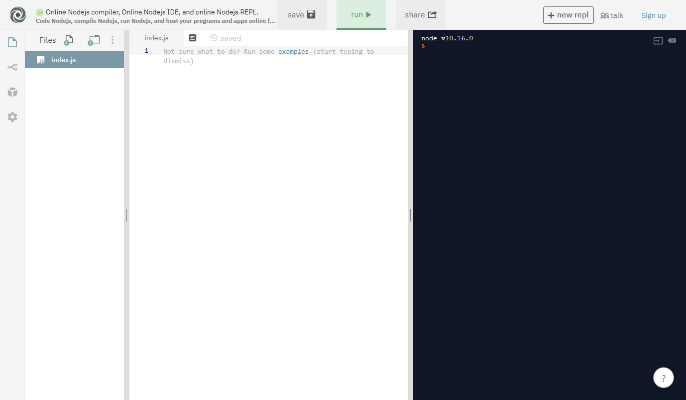
<center>온라인 IDE 서비스 repl.it 화면</center>
마이페이지 > 나의 오픈 API 에서 테스트 및 활용하고자 하는 오픈 데이터 API 의 예제 code를 복사합니다.


<center>오픈 데이터 API 예제 코드 화면</center>
repl.it 사이트에 예제 코드를 입력합니다.

그리고, 마이페이지 > 나의 오픈 API 에서 인증키를 복사하여 다음 auth_key 를 수정합니다. (API 사용을 위한 인증키 입력)

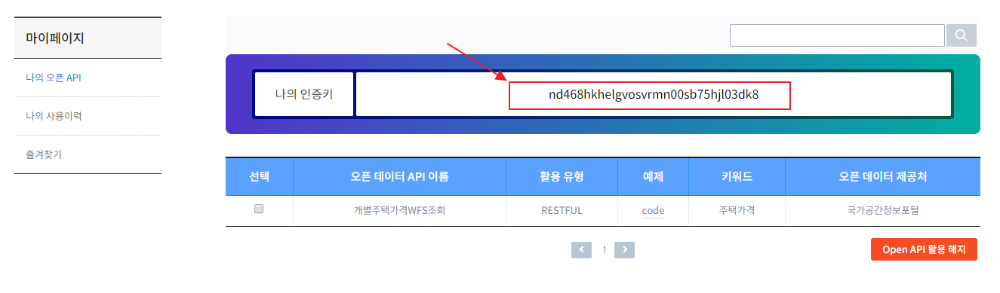

<center>오픈 데이터 마켓 마이페이지 → '나의 오픈 API 인증키' 화면</center>
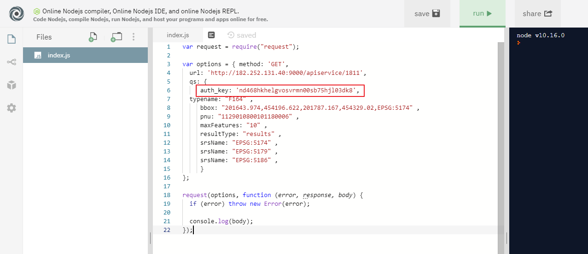

<center>온라인 IDE 서비스 repl.it 예제 코드 입력</center>
run 버튼을 눌러 예제를 실행합니다.

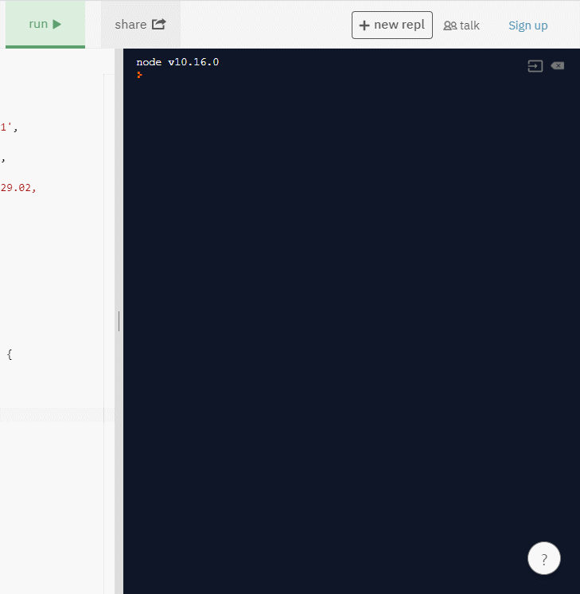
<center>온라인 IDE 서비스 repl.it 예제 실행 화면</center>
초기에는 node.js 의 실행에 필요한 파일을 다운로드를 받고, 예제 코드를 실행합니다.

예제 코드 실행 시, 다음과 같은 xml 데이터를 리턴 받은 것을 볼 수 있습니다. 

```xml
<?xml version="1.0" encoding="utf-8" ?>
<wfs:FeatureCollection xmlns:xs="http://www.w3.org/2001/XMLSchema"xmlns:wfs="http://www.opengis.net/wfs" xmlns:gml="http://www.opengis.net/gml" xmlns:NSDI="http://10.1.17.66:6080/arcgis/services/opendb/EiosSpceServiceWFS2/MapServer/WFSServer" xmlns:xlink="http://www.w3.org/1999/xlink" xmlns:xsi="http://www.w3.org/2001/XMLSchema-instance" timeStamp="2020-02-17T08:11:35Z" numberOfFeatures="unknown" xsi:schemaLocation="http://www.opengis.net/wfs http://schemas.opengis.net/wfs/1.1.0/wfs.xsd http://www.opengis.net/gml http://schemas.opengis.net/gml/3.1.1/base/gml.xsd http://10.1.17.66:6080/arcgis/services/opendb/EiosSpceServiceWFS2/MapServer/WFSServer http://10.1.17.66:6080/arcgis/services/opendb/EiosSpceServiceWFS2/MapServer/WFSServer?service=wfs%26version=1.1.0%26request=DescribeFeatureType">
<gml:boundedBy>
  <gml:Envelope srsName="urn:ogc:def:crs:EPSG::5186">
    <gml:lowerCorner>201658.5926857802 554274.420980108</gml:lowerCorner>
    <gml:upperCorner>201658.5926857802 554274.420980108</gml:upperCorner>
  </gml:Envelope>
</gml:boundedBy>
  <gml:featureMember>
    <NSDI:F164 gml:id="F164.16808723">
      <NSDI:SHAPE><gml:Point><gml:pos>201658.5926857802 554274.420980108</gml:pos></gml:Point></NSDI:SHAPE>
      <NSDI:X_CRDNT>201403.1509</NSDI:X_CRDNT>
      <NSDI:Y_CRDNT>454279.2736</NSDI:Y_CRDNT>
      <NSDI:PNU>1129010800101180006</NSDI:PNU>
      <NSDI:LD_CPSG_CODE>11290</NSDI:LD_CPSG_CODE>
      <NSDI:LD_EMD_LI_CODE>10800</NSDI:LD_EMD_LI_CODE>
      <NSDI:REGSTR_SE_CODE>1</NSDI:REGSTR_SE_CODE>
      <NSDI:MNNM>0118</NSDI:MNNM>
      <NSDI:SLNO>0006</NSDI:SLNO>
      <NSDI:STDR_YEAR>2019</NSDI:STDR_YEAR>
      <NSDI:STDR_MT>01</NSDI:STDR_MT>
      <NSDI:DONG_CODE>10001</NSDI:DONG_CODE>
      <NSDI:HOUSE_PC>338000000</NSDI:HOUSE_PC>
      <NSDI:BULD_CALC_TOTAR>146.88</NSDI:BULD_CALC_TOTAR>
      <NSDI:PSTYR_1_HOUSE_PC>314000000</NSDI:PSTYR_1_HOUSE_PC>
      <NSDI:PSTYR_2_HOUSE_PC>297000000</NSDI:PSTYR_2_HOUSE_PC>
      <NSDI:PSTYR_3_HOUSE_PC>286000000</NSDI:PSTYR_3_HOUSE_PC>
      <NSDI:PSTYR_4_HOUSE_PC>280000000</NSDI:PSTYR_4_HOUSE_PC>
      <NSDI:FRST_REGIST_DT>2019-08-22T10:15:24</NSDI:FRST_REGIST_DT>
    </NSDI:F164>
  </gml:featureMember>
</wfs:FeatureCollection>
```


리턴받은 XML 데이터를 정제하여 서비스에 활용하실 수 있습니다.

여기까지 오픈데이터 API 테스트 과정이였습니다.


---

### 오픈 데이터 마켓(OPEN DATA MARKET) API 활용 실습

위에서는 오픈 데이터 마켓(OPEN DATA MARKET)에서 제공해주는 예제 코드를 통해 진행을 했습니다.

본 글에서는 해당 API 정보를 통해 직접 구글 맵을 통해 API로 받아온 데이터를 출력해주는 실습을 진행합니다.


#### [실습1]예제를 통한 API 사용 방법

- [ ] 코드 에디터   `(없다면 메모장도 괜찮습니다)`
- [ ] 실습 자료 ([샘플-앱.zip 다운로드](http://cloud4dev.kr/자료실/?uid=134&mod=document))
- [ ] GoogleMap API 권한
- [ ] 활용할 오픈데이터 API 주소


##### 실습 자료

- #### 코드 에디터


> 별도의 코드 에디터가 없는 경우, 메모장을 사용하여 실습을 따라하셔도 좋습니다.
>

> 실습 자료는 개발지원플랫폼 Q&A 센터를 통해 다운로드 받으실 수 있습니다.
>


- #### 실습 자료


<center>개발지원플랫폼 홈페이지</center>
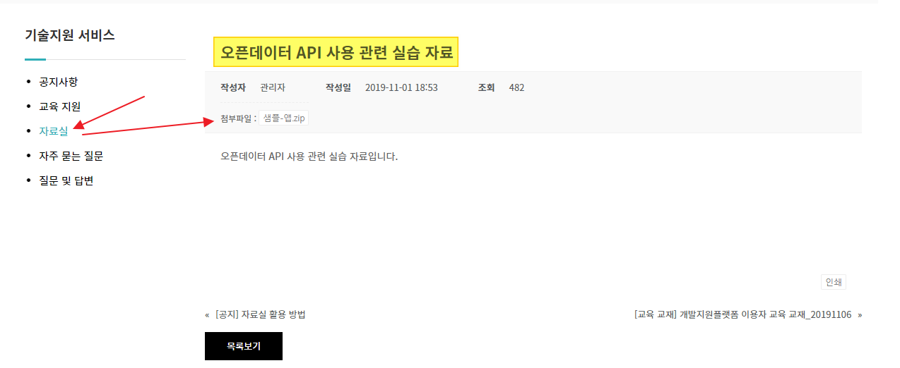

<center>Q&A 센터 - 기술지원 서비스 - 자료실 - 오픈데이터 API 사용 관련 실습 자료 > 샘플-앱.zip 다운받기</center>
다운받은 샘플-앱.zip 은 다음과 같이 2가지 파일로 구성되어있습니다.

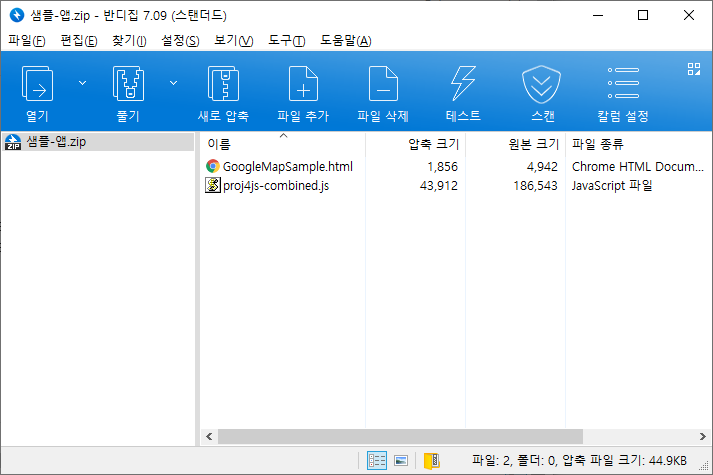


- GoogleMapSample.html
- proj4js-combined.js


**GoogleMapSample.html** 은 저희가 이번에 실습을 위해 준비한 파일이며, Google Map API 를 통해 구글 맵를 활용할 수 있으며, 오픈데이터 API 를 통해 받는 데이터를 구글 맵에 출력해줍니다.

**proj4js.combined.js** 는 오픈소스 자바스크립트 좌표계 변환 라이브러리로서, 한국형 좌표체계를 일반적인 WGS84(EPSG:4326) 방식으로 변환해주는 라이브러리입니다.


#### 실습 따라하기

##### GoogleMap API 권한

- 구글 맵을 활용하기 위해선 GoogleMap API 를 사용해야합니다.


- 그러기 위해 다음 과정을 통해 GoogleMap API 를 발급받고, 소스에 적용하는 과정을 진행합니다.


1. Google Cloud Platform API 및 서비스 페이지 접속 (https://console.cloud.google.com/apis)

   - API 및 서비스 사용 설정 클릭

   
   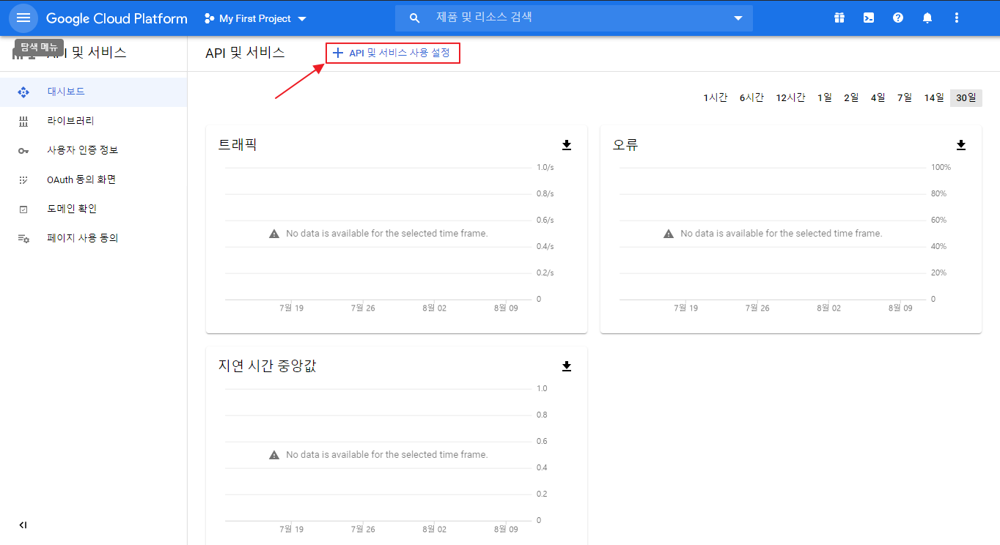

   

   - Maps JavaScript API 클릭

   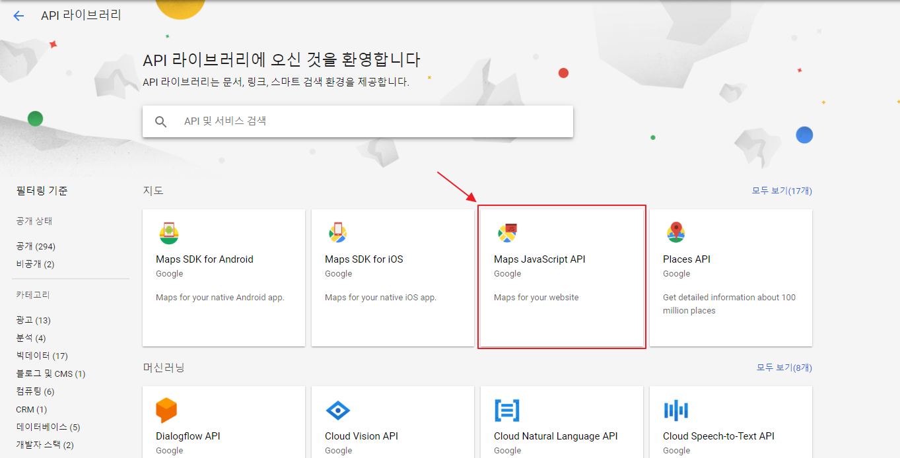
   

   - Maps JavaScript API > 사용 클릭
   
   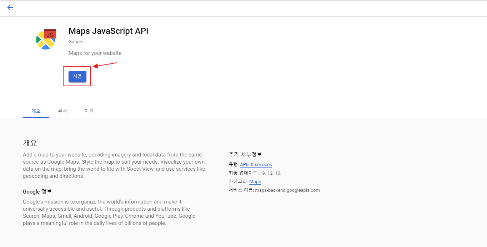

2. 사용자 인증 정보 생성

   - API를 사용하기 위해 사용자 인증 정보 생성을 위해 'API 및 서비스의 사용자 인증 정보' 클릭

   
   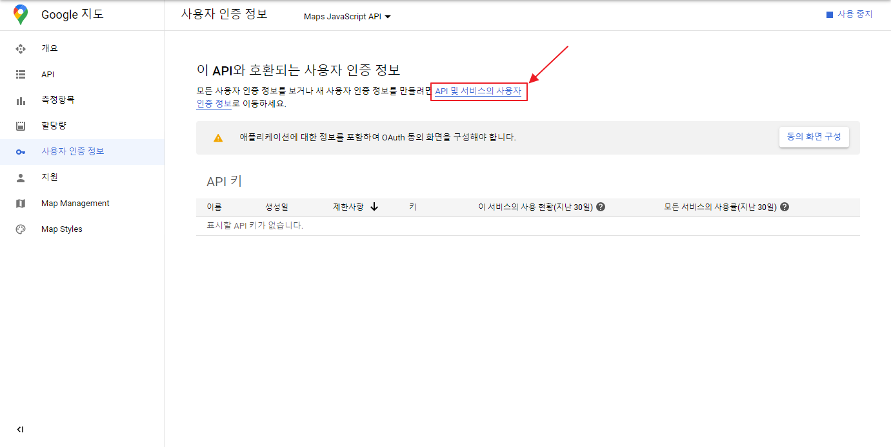

   - 사용자 인증 정보 만들기 클릭

   

  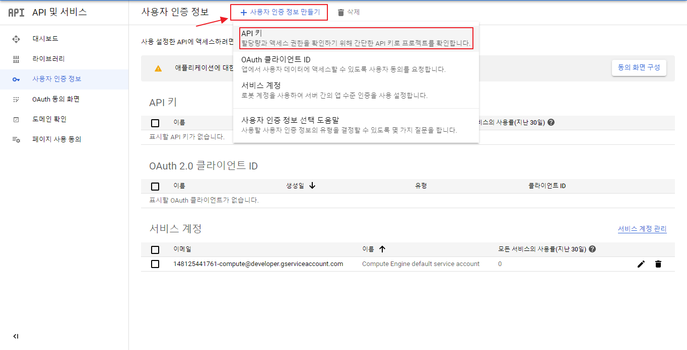


   - API 복사


  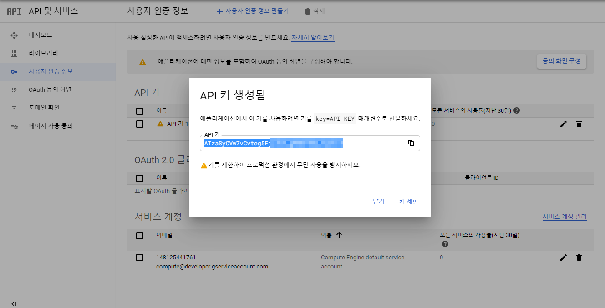


3. GoogleMapSample.html 수정

   - GOOGLE_MAP_API 텍스트 부분을 위에 복사한 API 로 교체

   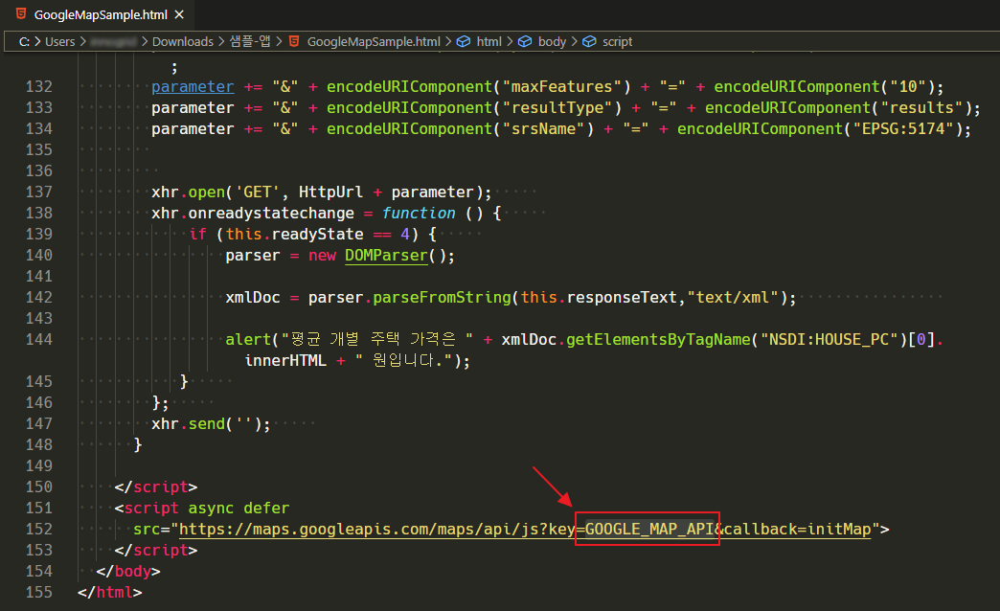
   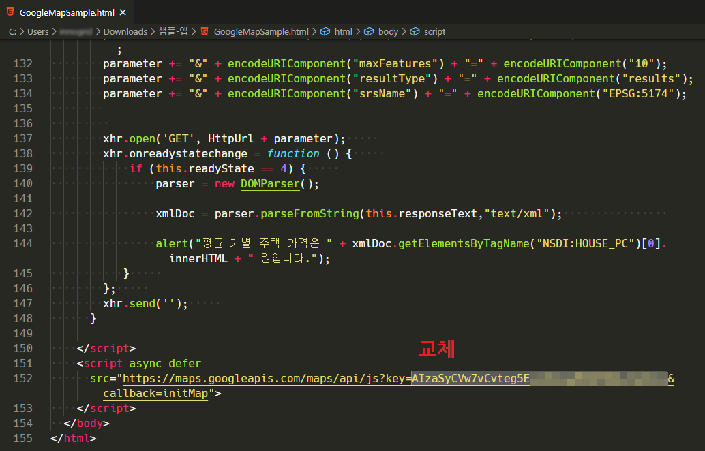

   
   
4. 확인
   

 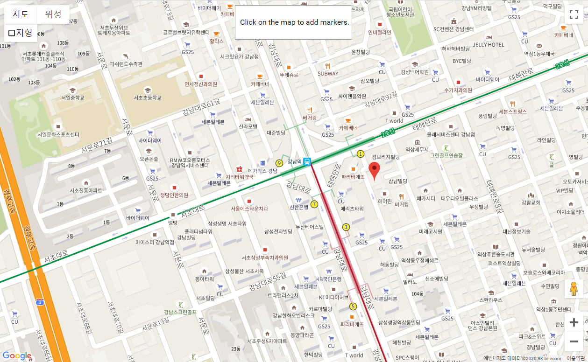


새로고침하시면, 정상적으로 GoogleMap API를 통해 맵을 불러오는 것을 볼 수 있습니다.


#### 오픈데이터 API 주소 얻기

위 GoogleMap에 찍어줄 데이터를 얻기 위해 오픈 데이터 마켓(OPEN DATA MARKET)에서 데이터를 활용하기 위해 다음 2가지의 준비물이 필요합니다.

- 개별주택가격WFS조회
- 활용 신청한 오픈 데이터 API 주소 얻기
- 인증키


1. 개별주택가격WFS조회

   - 실습에 사용할 [개별주택가격WFS조회] 

   [개별주택가격WFS조회]는 국토교통부의 국가공간정보포털에서 제공하는 API이며 이용자 편의를 위해 오픈데이터API포털을 통해 호출할 수 있도록 등록되어 있습니다. API에 대한 상세 정보는 나의오픈API 목록에서 상세 페이지로 이동하면 제공정보를 확인할 수 있습니다.

   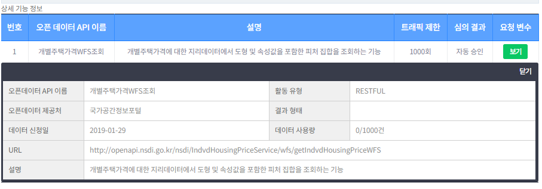

   ​	- 개별주택가격WFS조회 속성 정보

   WFS(Web Feature Service) 서비스는 (벡터 도형 및 속성을 지닌)지리 피처 데이터를 활용할 수 있도록 합니다.

    - 호출 시 아래 그림과 같이 항목명칭, 데이터타입을 맞춰서 데이터를 가져옵니다.

      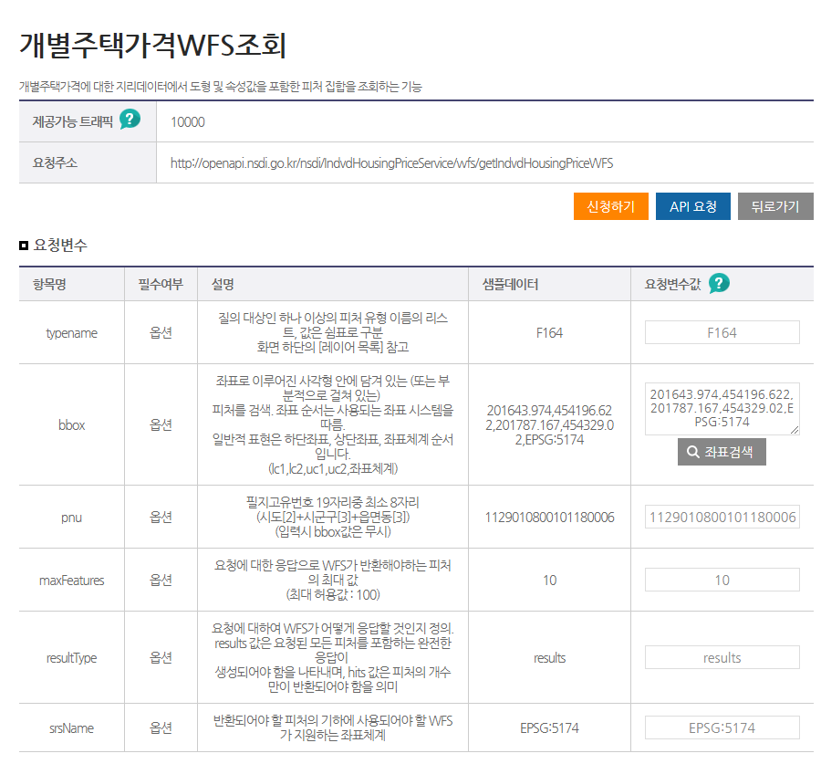

   	- 출력결과 항목은 다음과 같습니다.

   

   | 항목명           | 설명                   | 샘플데이터                         |
   | ---------------- | ---------------------- | ---------------------------------- |
   | SHAPE            | 공간자료               | (8, 10, 197106.421, 453037.543,,,) |
   | PNU              | 고유번호               | 1111011000101250000                |
   | LD_CPSG_CODE     | 법정동 시도시군구 코드 | 11545                              |
   | LD_EMD_LI_CODE   | 법정도 읍면동리 코드   | 10300                              |
   | REGSTR_SE_CODE   | 특수지구분코드         | 1                                  |
   | MNNM             | 본번                   | 0023                               |
   | SLNO             | 부번                   | 0015                               |
   | STDR_YEAR        | 기준연도               | 2016                               |
   | STDR_MT          | 기준월                 | 09                                 |
   | X_CRDNT          | X좌표                  | 197053.647                         |
   | Y_CRDNT          | Y좌표                  | 197053.647                         |
   | HOUSE_PC         | 주택가겨(원)           | 268000000                          |
   | BULD_CALC_TOTAR  | 건물산정연면적(㎡)     | 342.5                              |
   | PSTYR_1_HOUSE_PC | 과년도1주택가격(원)    | 924000000                          |
   | PSTYR_2_HOUSE_PC | 과년도2주택가격(원)    | 897000000                          |
   | PSTYR_3_HOUSE_PC | 과년도3주택가격(원)    | 828000000                          |
   | PSTYR_4_HOUSE_PC | 과년도4주택가격(원)    | 783000000                          |
   | FRST_REGIST_DT   | 데이터기준일자         | 2016-09-26                         |

   

2. 활용 신청한 오픈 데이터 API 주소 얻기

   - 로그인 후 마이페이지에서 신청한 API의 code에 마우스를 올리시면 다음과 같이 예제가 표시됩니다.

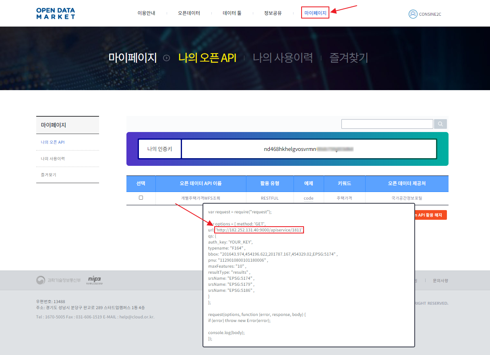


2. 인증키


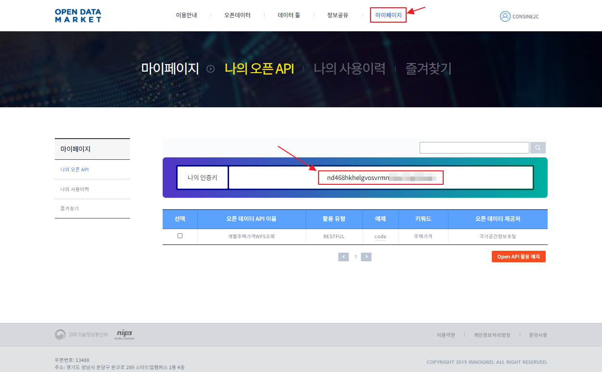


##### GoogleMapSample.html 수정

1. 주소 변경

   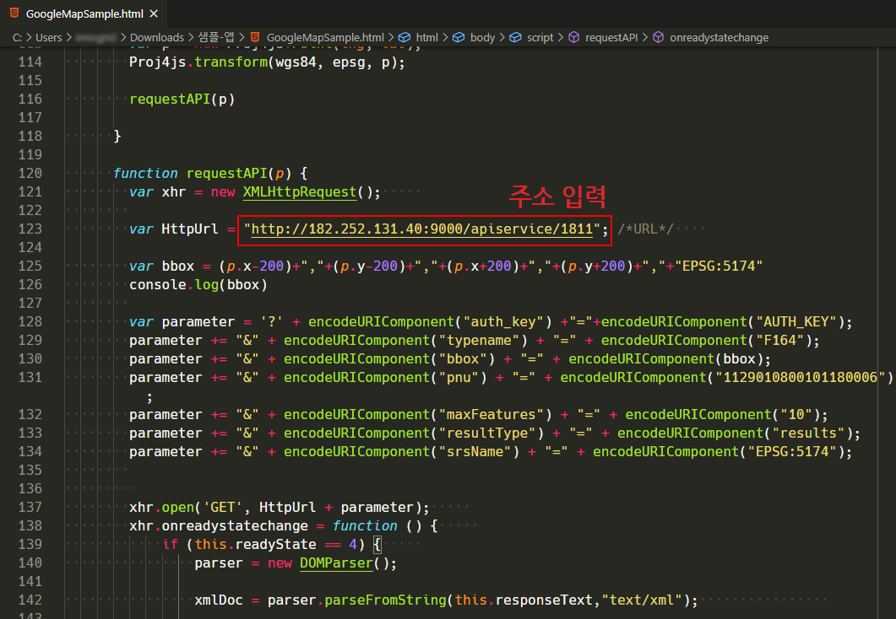
   
   
   
2. 인증키 변경

   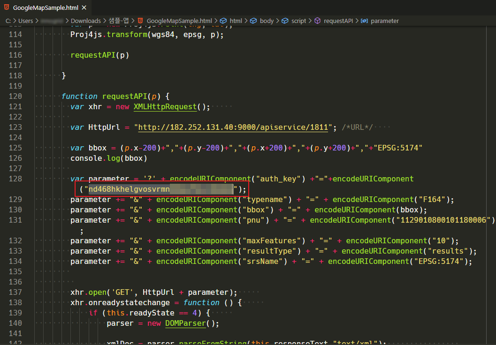
   
3. 수정사항

   - 131 라인을 삭제해주세요.

  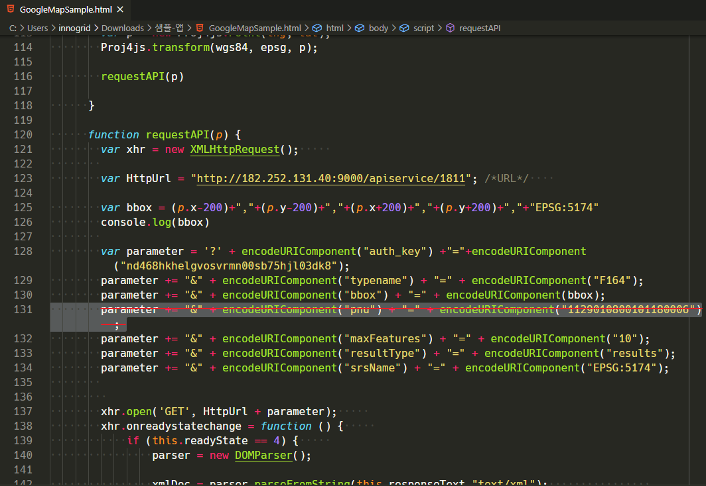


#### 실습 최종 결과물

  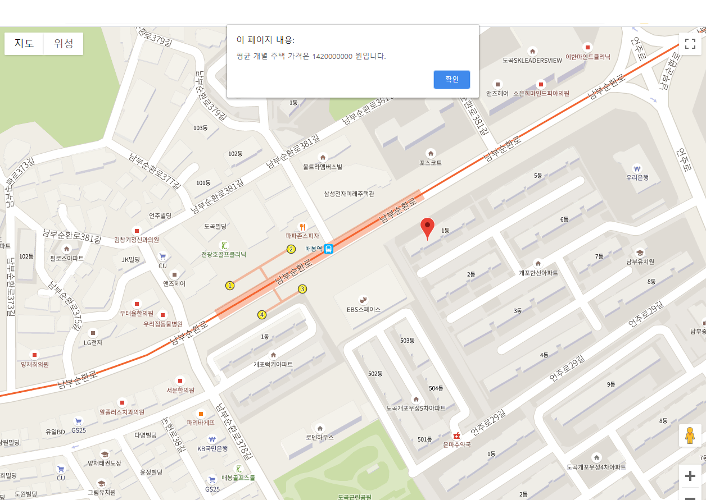


이번 실습은 개별 주택 가격 데이터를 불러와 구글 맵에 표시해주는 실습이였습니다.

여기까지 오픈 데이터 마켓(OPEN DATA MARKET) API 활용 실습이였습니다.


#### [실습2] 서울시 문화행사정보 API 호출 실습

Postman 프로그램


#### 두번째 실습 자료

- Postman 다운로드 사이트 - https:/www.postman.com/downloads


실습 따라하기

1. Postman 다운로드 
   - 윈도우, macOS, Linux를 모두 지원합니다.
   - Download the App을 눌러 다운로드 후 프로그램을 설치합니다.
   - 웹으로도 실습을 따라하실 수 있으나, 회원가입이 필요합니다.

2. Postman 실행

   - 프로그램 설치 후 진행합니다.

   - 실행하면 다음과 같은 화면이 표시됩니다.

     

   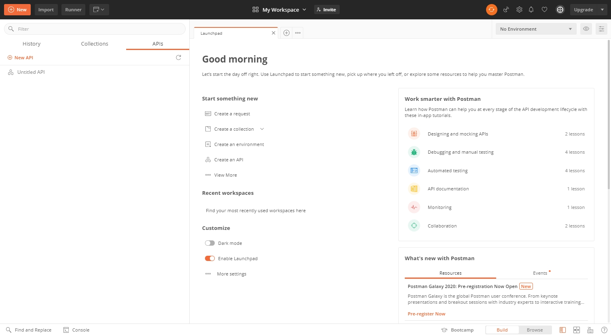

3. 요청 탭 생성

   - API 요청을 위해 화면에 표시된 버튼을 눌러 새로운 탭을 생성합니다.

     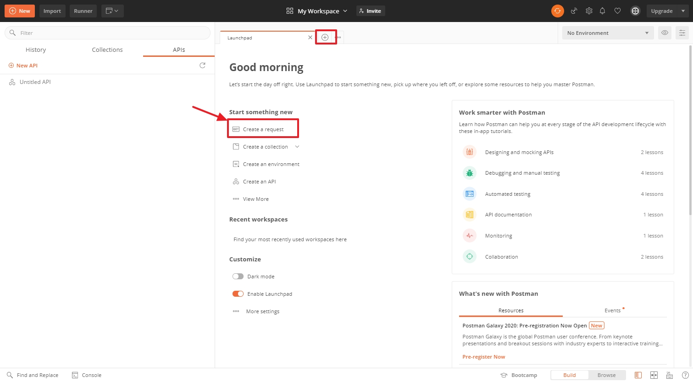


4. 간단 설명

   - API(Application Proframming Interface)는 응용 프로그램(또는 서비스)에서 제 3자에게 기능 또는 데이터를 사용할 수 있도록 제공해주는 인터페이스
   - 다음과 같은 HTTP Methods 를 통해 API와 통신을 합니다.
   - GET - 리소스 조회 / POST - 리소스 생성 / PUT - 리소스 수정 / DELETE - 리소스 삭제
   - 오픈 데이터 마켓에 올라온 Open Data를 활용 신청하여 데이터를 Get 메소를 사용하여 조회합니다.

   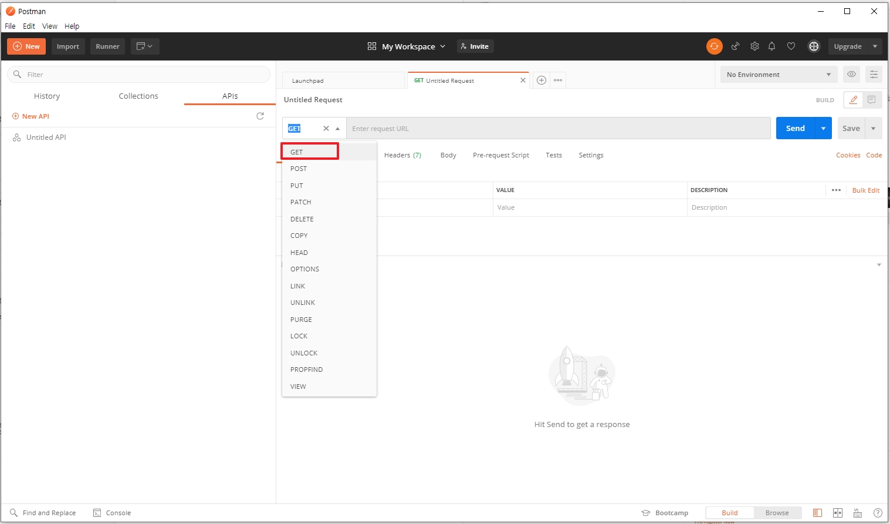

   

   

   #### 서울시 문화행사 정보 API 신청

   1. API 신청

   - ''서울시 문화행사 정보" 를 선택하여 요청합니다.

   - 서울시 문화행사 정보를 검색합니다.

   - 서울시 문화행사 정보 활용 신청 페이지에서 '활용 목적'을 선택 후 하단의 '신청' 버튼을 눌러 신청해줍니다.

     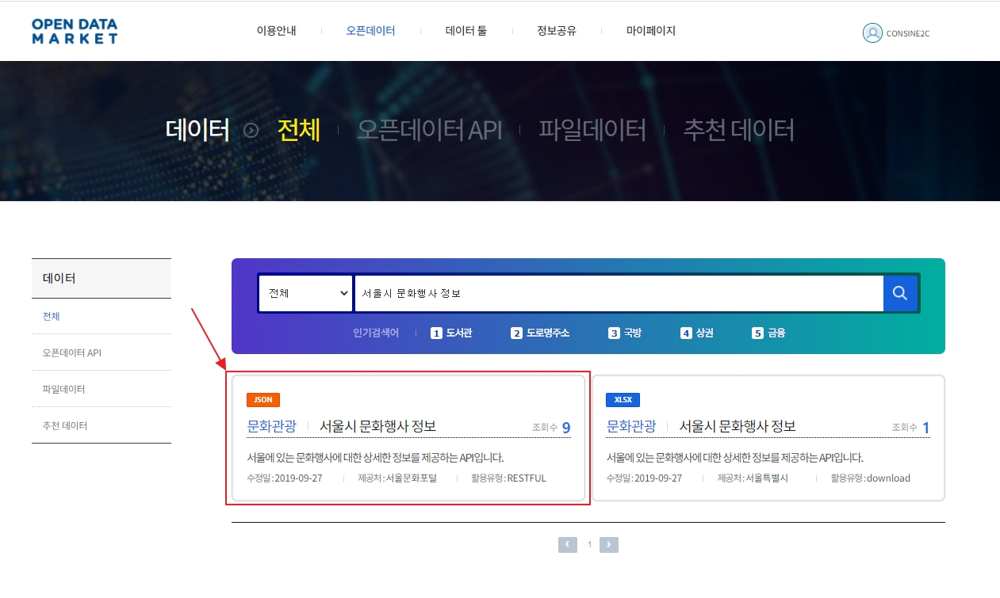

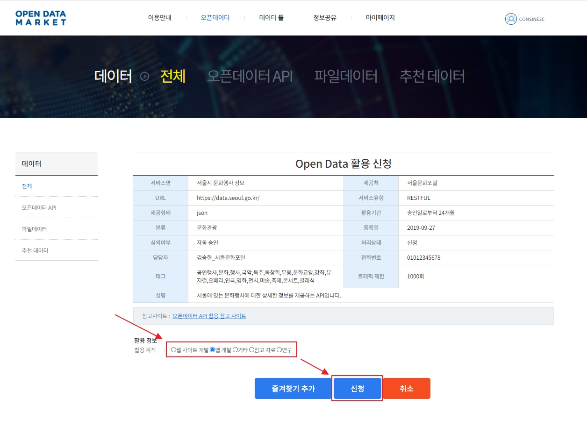


- 신청 후, 상단 '마이페이지' > '나의 오픈 API' 페이지로 이동하면, 다음과 같이 신청한 오픈 데이터가 표시됩니다.

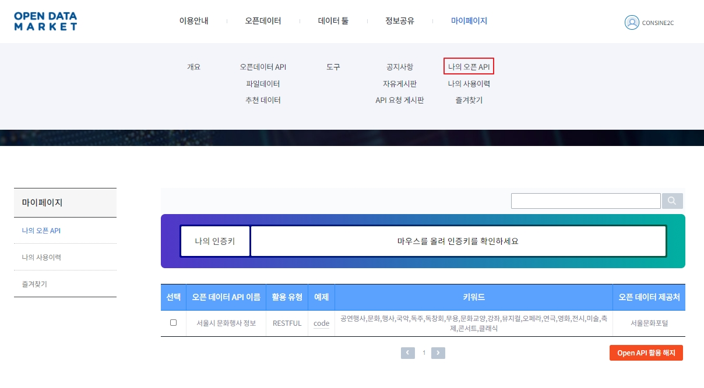


2. API 주소 및 인증키 복사

- 예제 탭의 'code'에 마우스를 올리면 다음과 같이 레이어 팝업을 통해 예제 코드를 알려줍니다.
- 예제는 Node 샘플 코드이지만, HTTP Get Methods 를 통해 데이터를 요청하는 방식익 때문에 종속성없이 인터넷이 가능한 환경이라면 어디서든 활용이 가능합니다.
- URL(필수), auth_key(필수)
- 위에 표시된 query string 값은 제공처 또는 데이터마다 달라질 수 있습니다.
- 필수 값인 인증키를 복사합니다.

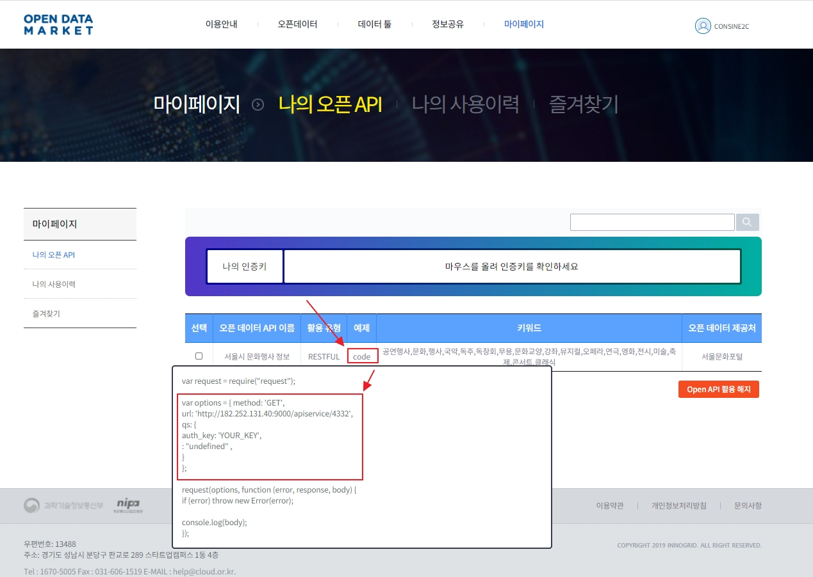


- 필수 값인 인증키를 복사합니다.

  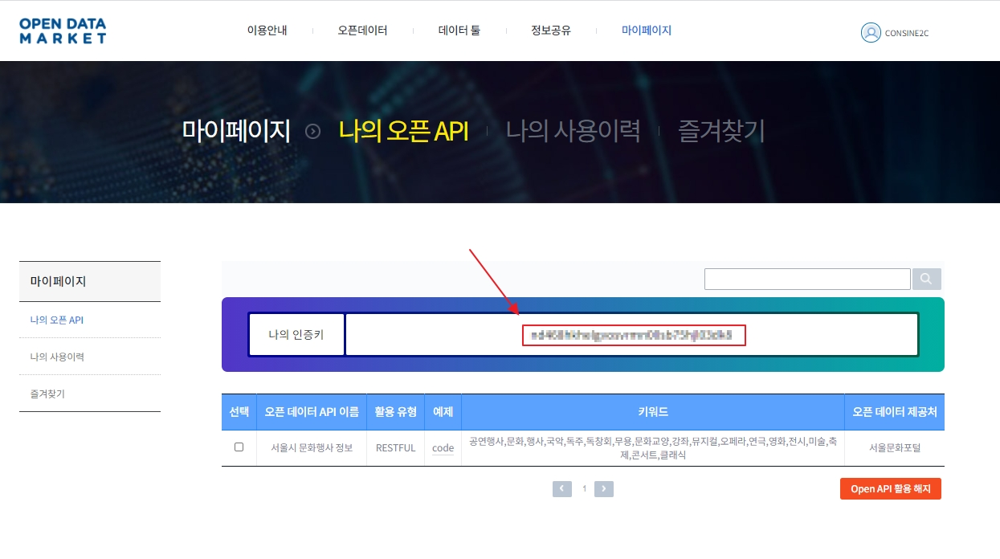

- 주소에 위에서 복사한 주소를 기입합니다.

  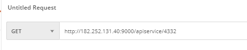


- 그리고, 위 예제코도에서 필요한 값을 복사해서 Params 탭에 넣어줍니다.

  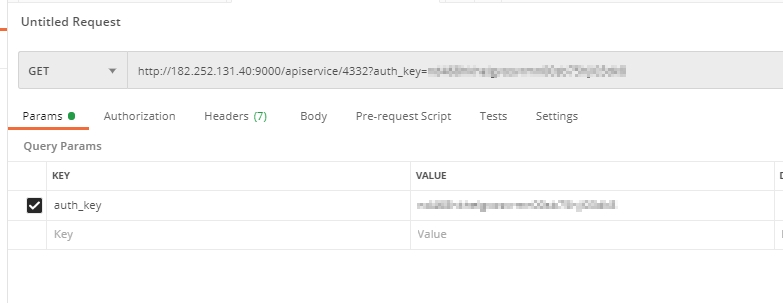


#### 서울시 문화행사정보 API 결과

- Send를 누르시면 다음과 같이 결과가 하단에 표시됩니다.

  


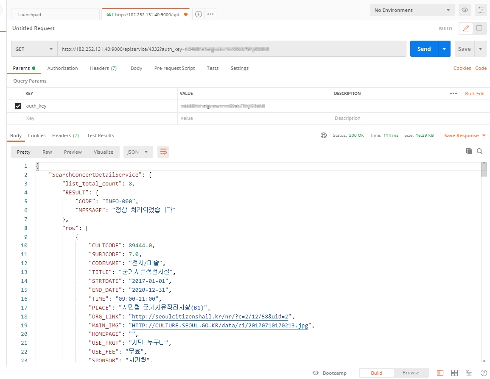


- 그 이외에도 우측 Save 밑에 'Code' 버튼을 눌러보면, 다음과 같이 다양한 언어로의 샘플 코드를 확인할 수 있습니다. 

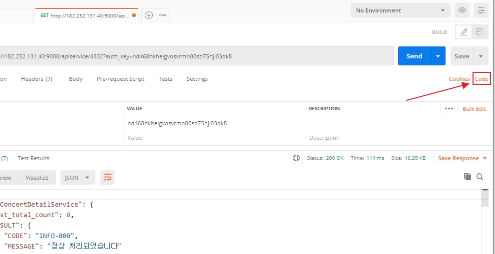


이를 활용하여 언어 또는 플랫폼에 상관없이 데이터 마켓에서 신청한 API를 통해 데이터를 활용할 수 있습니다.


----------------------  The End -----------------------------------

