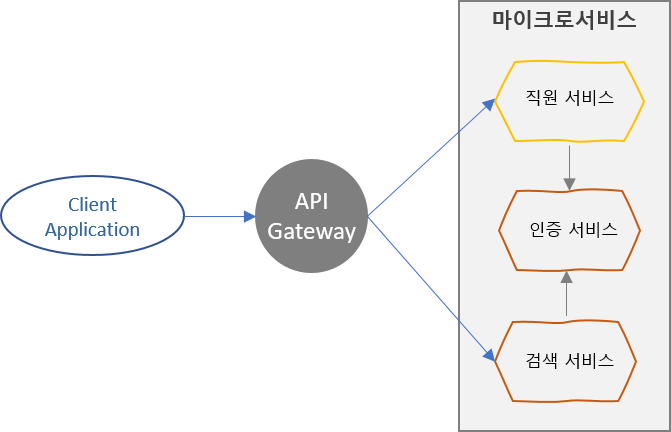
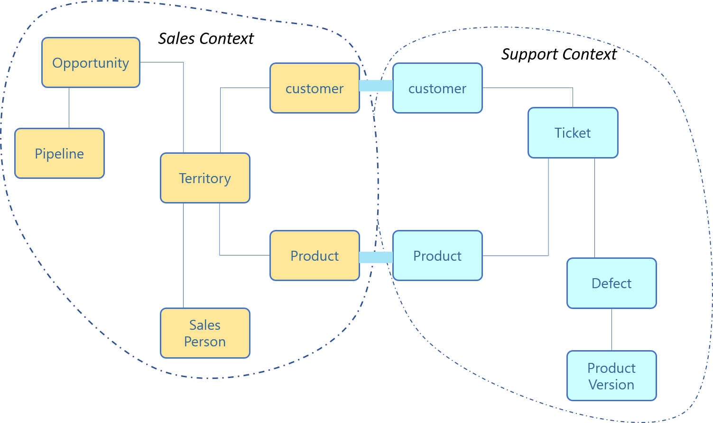
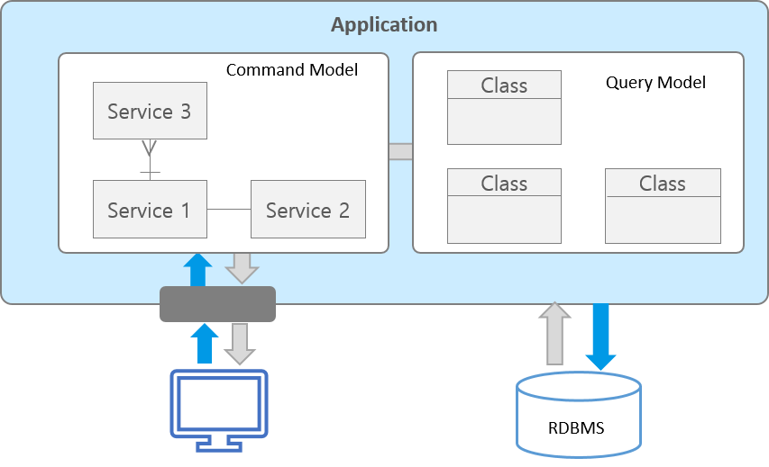
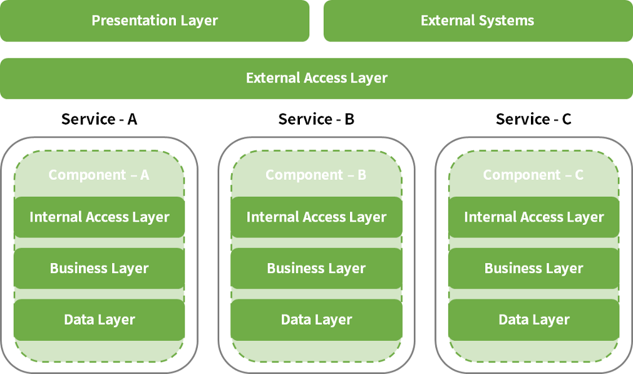

# 마이크로서비스 기반 SW개발 프로세스

### 마이크로서비스 아키텍처 기반 개발 개요

SW개발 방법에는 전통적인 개발 방법인 구조적 방법부터 소프트웨어 개발환경이 호스트 환경에서 Client/Server 환경으로 변화되었고 인터넷이 활성화되면서 웹개발 환경으로 급속도로 진화하였다. 클라우드 환경은 이미 저변 확대되고 있으며 기존 개발환경도 클라우드로 빠르게 전환 발전하고 있다. 이런 변화에 따라 클라우드 환경에 최적화된 SaaS(Software-as-a-service) 개발 방법이 출현하였다. 

​     클라우드 환경에서 애플리케이션은 여러 개의 서로 독립적인 기능을 하는 서비스로 구성한다. 이 서비스들을 어떻게 구성하고 어떻게 연결하고 어떻게 관리하느냐가 관건이다. 서비스를 묶어서 하나의 통합된 ‘비지니스 서비스’를 할 수 있도록 하기 위한 다양한 기능과 기술이 필요하다. 

​     기존 모놀리식 아키텍처는 단일 애플리케이션에 많은 서비스가 실행되기 때문에 문제가 발생하면 심각한 경우 서비스를 중지해야 한다. 또한, 서비스 간의 종속성이 높아 아주 작은 결함에도 연관된 모든 서비스를 점검하고 이슈를 해결해야 하는 문제가 있다. 이런 문제를 조금이라도 해소할 수 있는 방법으로 마이크로서비스 아키텍처가 등장하게 되었다. 마이크로서비스 아키텍처는 클라우드 환경과 개별 기능을 하는 서비스 중심으로 개발하고 각 서비스는 느슨하게 결합되어 있어야 한다. 마이크로서비스 앱 개발은 기존 모놀리식 애플리케이션과 코딩은 동일하게 수행하지만 애플리케이션 단위가 매우 작고 애플리케이션 간의 API Gateway를 통해서 네트워크가 연결되기 때문에 설계 단계에서부터 마이크로서비스로의 설계 및 API 설계가 매우 중요하다. 본 개발 프로세스 가이드에서는 마이크로서비스 애플리케이션 개발을 위한 절차를 설명한다.

#### 특징

클라우드 네이티브 애플리케이션 개발을 근거로 하여 마이크로서비스 기반 개발프로세스를 정의하였다. 기존 모놀리식 애플리케이션과 달리 마이크로서비스 기반 개발 시 고려 사항 위주의 절차를 정의하였다. 또한, 본 가이드는 마이크로서비스 스튜디오를 이용하여 마이크로서비스를 구성(설정) 하는 방법을 동시에 제공하여 마이크로서비스를 좀 더 쉽게 적용할 수 있도록 하였다. 마이크로서비스 개발은 클라우드와 밀접한 관계가 있어 클라우드 환경에서 클라우드 플랫폼과 마이크로서비스를 연동하여 개발하는 절차도 같이 제공한다.

마이크로서비스 아키텍처의 실질적 개발에 빠르게 적용할 수 있도록 절차(프로세스)와 해당 프로세스가 마이크로서비스 스튜디오에서 제공하는 기능이 있는 경우 기능에 대한 설명을 포함하고 있다. 특히, 마이크로서비스 애플리케이션 개발은 Spring Cloud와 같은 마이크로서비스 개발에 적합한 프레임워크가 거의 필수 요소이다. 마이크로서비스 스튜디오는 클라우드 플랫폼과 프레임워크를 연동하여 사용자가 쉽고 편리하게 개발하고 운영할 수 있는 기능을 갖고 있어 관련된 가이드도 포함하고 있다. 

### 마이크로서비스 아키텍처 설계 지침

마이크로서비스 기반 개발을 위한 비즈니스 분석은 서비스 분할 방법을 적용하여 각 서비스 영역 간에 관계 정의가 매우 중요하다. 서비스가 사용하는 데이터 또한 완전하게 분리되어야 하고 각 서비스 간의 결합도는 최소화되어 있어야 한다. 

   마이크로서비스 아키텍처 설계는 이미 알려진 다양한 패턴이 있는데 가장 많이 사용하고 있는 업무 영역별로 서비스를 분할하는 서브도메인 설계와 도메인 모델, 서비스간의 통신을 위한 API 설계 및 데이터 분산 패턴을 적용할 수 있다. 마이크로서비스 아키텍처 설계는 애플리케이션의 하위 기능 단위를 마이크로서비스 단위로 하는데 기능의 결합도에 따라 1개 또는 그 이상의 기능으로 마이크로서비스를 구성할 수 있다. 

- 기능간 호출관계가 복잡한 기능은 묶어서 하나의 마이크로서비스로 구성
- 직접 구현/관리 가능한 기능은 마이크로서비스 내부에 직접 구현
- 공통 기능은 서비스로 구현
- 마이크로서비스 간의 호출을 위한 API 설계
- 마이크로서비스 단위로 데이터베이스 분산

#### 설계 방법

애플리케이션 대부분의 새로운 요구 사항과 변경된 요구 사항이 단일 서비스에만 영향을 미치는 방식으로 분해된다. 여러 서비스에 영향을 미치는 변경 사항은 여러 팀 간에 조정이 필요하므로 개발 속도가 느려질 수 있기 때문이다. 목표는 해당 비즈니스 규칙이 개발자를 변경할 때 적은 수의 패키지 (이상적으로는 하나만)로 코드를 변경하면 된다는 것이다. 이러한 변화는 각 변경 사항이 하나의 서비스에만 영향을 미치도록 서비스를 설계할 때 의미가 있다.

- 핵심 - 비지니스와 애플리케이션의 가장 중요한 부분을 위한 차별화 요소
- 지원 - 비지니스가 하는 것과 관련이 있지만 차별화 요소는 아님
- 일반 - 비지니스에만 국한되지 않으며 상횽 소프트웨어를 사용하여 이상적으로 구현

도메인은 프로젝트가 다루는 영역 : 용어, 유비쿼터스 언어, 요구사항 및 문제 해결이 있다. 자동차, 은행, 담보 대출, 신용, 직불 계좌, 신용 카드, 소매 대출, 콘텐츠 관리 등이 구체적인 영역을 포함할 수 있지만 모든 영역을 포함할 수 없다.

#### 설계 원칙

마이크로서비스 아키텍처의 설계를 위한 몇 가지 기본 사항이 있다.

[참고 : https://dzone.com/articles/9-fundamentals-to-a-successful-microservice-design]

##### 1) 마이크로서비스 단위

애플리케이션의 하위 기능 단위(하나의일만 처리하는)인 컴포넌트를 마이크로서비스 단위로 할 수 있다. 기능 간 결합도에 따라 1개 또는 그 이상의 기능으로 마이크로서비스를 구성할 수 있다. 고유한 기능을 설정하거나 지원할 수 있는 독립적인 소프트웨어 모듈의 기능을 식별하는 것이 필수이다. 

   마이크로서비스의 단위를 정의하는 방법에 정확하게 정의된 규칙은 없지만 단위를 정의할 수 있는 몇 가지 지침이나 사례는 있다. 아래 단계를 참조하여 마이크로서비스 단위를 정의할 수 있다.

- 다른 모듈에서 반복적으로 사용하는 코드를 식별하여 얼마나 자주 반복되는지 확인한다. 서로 다른 모듈에서 매번 설정을 해야 한다면 마이크로서비스는 반복되는 코드 부분을 처리하는 것이다.
- 또 다른 단계는 모듈이 다른 모듈에 의존되어 있지 않은지 또는 더 간단한 용어로 확인한다. 모듈이 나머지 서비스와 느슨하게 연결되어 있는지 확인한다. 이런 경우는 마이크로서비스의 범위는 전체 모듈의 범위가 된다.
- 기능이 과부하로 사용되는지 확인한다. 짧은 시일 내에 마이크로서비스를 확장해야 하는지 확인하면, 확장 가능한 범위의 다른 기능과 결합하기보다는 확장 가능한 마이크로서비스 단위로 정의하는 것이 좋다.

##### 2) 느슨한 결합과 높은 응집력

 마이크로서비스의 주요 특징중의 하나는 서로 독립적인 서비스를 제공하는 것이다. 다른 서비스를 방해하지 않으면서 새로운 서비스를 편집, 업데이트 및 배포할 수 있기 때문에 상호의존성이 낮은 경우에 가능하다. 결합도가 낮낮게 연결된 시스템은 한 서비스가 다른 서비스에 대해 전혀 모르는 시스템일 수 있다. 또한, 느슨한 결합만큼 중요한 부분이 응집력이다. 응집력이 높을수록 더 좋은 마이크로서비스 아키텍처이다. 응집력이 낮으면 서로 다른 서비스간 통신이 너무 많아 시스템 성능이 저하될 수 있다.

##### 3) API 통합

모놀리식 아키텍처의 설계는 여러 서비스로 분류하면 서비스가 함께 조정되어 시스템을 구성하게 된다. 그러나 이러한 서비스는 통신은 어떻게 구성하는지 알아야 한다. 여러 기술을 사용하여 다른 서비스를 생성한다고 가정해보면 그들 간의 서로 어떻게 관련이 있을지 예측할 수 있어야 한다. API(Application Programming Interface)를 사용하는 것은 가장 좋은 각 서비스 간의 통신 문제를 해결 할 수 있는 방법이다. 마이크로서비스 설계 원칙의 기본은 정확한 API를 사용하는 것은 서비스와 클라이언트 호출 간의 통신을 유지하는데 중요하다. 적절한 기능을 위해서는 쉬운 전환과 실행이 중요하다. API를 생성할 때 또 다른 중요한 사항은 비즈니스 영역이다. 이러한 도메인 정의는 기능의 차별화를 쉽게 할 수 있다. 시스템 외부에는 여러 클라이언트가 있고 클라이언트는 다른 애플리케이션이나 사용자일 수 있다. 비즈니스 로직이 호출될 때마다 요청을 리턴하고 데이터베이스를 변경하는 어댑터에 의해 처리한다.

##### 4) 데이터 스토리지 분리

특정 서비스에 대해 저장된 모든 데이터는 해당 특정 서비스에 대해 비공개로 만들어야 한다. 즉, 데이터에 대한 모든 액세스 권한은 서비스에서 소유해야 한다. 이 데이터는 API를 통해서만 다른 서비스와 공유할 수 있다. 데이터에 대한 제한된 액세스를 유지하고 ‘서비스 연결’을 피하기 위해 매우 중요하다. 사용자를 기준으로 데이터를 분류하는 것도 중요하며 CQRS(Command and Query Responsibility Segregation)를 통해 수행할 수 있다.

##### 5) 트래픽 관리

API가 설정되고 시스템이 실행되면 다른 서비스로의 다양한 트래픽이 발생한다. 트래픽은 클라이언트가 특정 서비스로 보내는 것을 말한다. 실제 시나리오에서, 하나의 서비스는 느리게 실행됨에 따라 API를 호출하는데 더 많은 시간이 걸릴 수 있다. 또는 서비스 호출이 초과할 수 있다. 두 경우 모두 소프트웨어나 하드웨어 충돌을 발생하여 성능에 영향을 미친다.

   높은 트래픽 수요는 관리가 필요하고 호출을 하거나 받는 구체적인 방법은 원활한 트래픽 흐름이 해답이다. 서비스는 지연을 유발하고 성능에 영향을 미치는 모든 인스턴스를 종료할 수 있어야 한다. 이는 필요할 때마다 즉각적인 조치로 서비스를 지속적으로 추적하는 ‘자동확장’이라는 프로세스를 사용하여 달성할 수도 있다. 경우에 따라 호출이 끊어지거나 서비스가 응답하지 않는 경우 사용할 수 있는 정보를 제공하려면 ‘Circuit Breaker Pattern’을 이용할 수 있다.

##### 6) 최소 단위의 데이터베이스 테이블

데이터를 패치하기 위해 데이터베이스 테이블에 액세스하는 것은 시간이 오래 걸릴 수 있다. 시간과 에너지를 소비할 수 있다. 마이크로서비스를 설계하는 동안 주요 동기는 데이터베이스와 그 동작보다는 비즈니스 기능을 중심으로 해야 한다. 이를 위해 수백만 개의 데이터 항목이 있어도 마이크로서비스 디자인에는 몇 개의 테이블만 있어야 한다. 최소 수치 외에도 비즈니스 중심의 초점이 핵심이다.

### 마이크로서비스 식별

마이크로서비스 크기(규모)에 대한 일반적인 지침은 없다. 대개는 마이크로서비스는 하나의 기능을 수행하고 제한된 컨텍스트가 있어야 한다. 또한, 일부 기능이 다른 기능보다 자주 변경되면 별도의 서비스를 선택할 수 있다. 

​     마이크로서비스 크기(규모)를 식별하기 위한 사례를 통하여 이해할 수 있다. 

​      ·직원 서비스

​      ·인증 서비스

 만약 위에 정의한 직원 서비스와 인증 서비스 두 개의 서비스에 추가로 직원 검색 서비스를 추가하는 경우에 어떻게 마이크로서비스를 식별할 수 있는지 확인해보자. 우선 재사용 가능한 일반적인 구성이어야 하기 때문에 ‘검색 서비스‘를 선택한다. 이를 통해 기존 테스트에 영향을 미치지 않으면 쉽게 분리하고 문제를 해결하고 배포할 수 있다.

마이크로서비스를 서로 독립적으로 업데이트, 구축, 배포 및 확장할 수 있어야 하기 때문에 일반적으로 새로운 코드 저장소, 지속적인 통합 및 지속적인 배포를 위한 별도의 파이프라인 및 환경 구성 데이터가 필요하다.

 ※ 마이크로서비스를 식별하는 과정에서 발생하는 문제 중에

​     - 나노 서비스를 정의하지 말아야 한다. 

​     - 모든 마이크로서비스를 미리 식별하는데 시간으로 소비하지 말아야 한다. 

​     - 초기에 더 세분화된(소규모 서비스에서 마이크로서비스)로 기본 혜택과 요구를 분해할 수 있는 좀 더 큰 규모         의 서비스를 사용하는 것이 좋다.

### 도메인 주도 설계

마이크로서비스 아키텍처 설계는 서비스를 잘게 쪼개는 것부터 시작이다. 서비스를 분할하는 다양한 방법들이 있지만 여기에서는 도메인 주도 설계(Domain Driven Design) 기법을 이용하여 마이크로서비스 아키텍처를 설계한다. 

- 모델과 핵심 설계는 상호 영향을 주고받으며 구체화된다.
- 모델은 모든 팀 구성원들이 사용하는 언어의 근간을 이룬다.
- 모델은 불필요한 사항을 걸러낸 핵심 내용만 포함한다.

[출처 : http://martinfowler.com/bliki/BoundedContext.html]

##### 1) Bounded Context

솔루션 도메인을 결정한 후 초기 목표 중 하나는 제한된 컨텍스트를 식별하는 것이다. 경계 컨텍스트를 명시적으로 정의하면 일반적으로 여러 컨텍스트를 확장하려는 모델 요소가 있는지 확인할 수 있다. 경계 컨텍스트는 도메인 모델이 적용되는 개념적 경계이다. 전체 비즈니스 모델이 너무 크고 복잡하여 하나의 단위로 이해하기 어렵고 전체 엔터프라이즈에 대한 통합 모델을 유지할 수 없다. 서로 다른 모델간의 경계와 관계를 표시해야 한다. 거기에서 전략적 설계를 사용할 수 있다.

- 경계 컨텍스트 당 한 개의 팀
- 각 경게 컨텍스트를 위한 코드 리파지토리 분리
- 도메인 모델 + DB 스키마 + UI + Web Services(API)
- 커다란 영역을 더 작은 컨텍스트로 분리
- 각 컨텍스트는 고유한 유비쿼터스 언어와 자체 모델을 가질 수 있다.
- 경게 컨텍스트는 일부 영역을 공유할 수 있다.

독립적으로 서비스 될 때 문제없는 업무 범위로 생각할 수 있으며, 쇼핑몰 사이트를 예로 들면 제품 판매 컨텍스트(sales context), 판매지원 컨텍스트(support context) 등과 같이 분류할 수 있다. 이런 여러 context 내에 비슷해 보이는 용어가 서로 틀린 의미로 사용될 수 있기 때문이다. 

  예를 들어, 상품 정보를 다루는 프로그램 작성자가 Product라는 테이블을 만들어서 쓰고 있어다고 가정하자. 그런데, 다른 개발자가 기획자에게 새로운 요구를 받았을 경우 실제 상품 사양이 확정되지 않았지만, 대략의 세트 구성으로 상품 이미지를 올려서 홍보할 수 있게 프로그램을 고쳐달라고 한다. 그리고, 가격과 사양을 확정하면 팔 수 있게 해달라는 것이다. 기존 상품과 다른 듯하지만, 개발자는 기존 프로그램과 테이블을 최대한 활용하기 마련이다. 그러면, Product 테이블에 세트 속성을 추가하고 이런 경우 재고 수량 계산 등의 방식이나 화면에 보여지는 정보를 조금 다르게 표현하도록 프로그램을 수정한다. 

※ BoundedContext 예시

두 계층으로 나누어 연결한 상품(Prodcut)와 개별항목(Item) 개념 예시이다.

| Product                                                      | Item                                                         |
| ------------------------------------------------------------ | ------------------------------------------------------------ |
| 공급 받은 상품 기준으로 판매액과 수량이 알고 싶다.    실물 상품 코드 기준으로 식별이 가능해야 한다.  공급 상품의 매장 도착 시간 등을 확인할 때 기준을 제시한다. | 공급 상품 기준으로 팔 수도 있지만 세트 구성을 할 수 있다.  특정 기간에만 할인을 적용할 수 있다.  공급 업체와 대금 정산할 때 기준을 줄 수 있어야 한다.   매장에서 손님 기호에 맞춰 상품 구성을 바꿀 수 있게 유연성을 준다. |

온라인 쇼핑몰을 구축하는데 상품 10개만 파는 아주 작은 쇼핑몰을 구현하려는 경우를 가정하자. 한정된 상품만 팔기 때문에 주문이 들어오면 주문 내역을 확인해서 배송만 보내주면 된다. 이런 경우 상품 관리라는 것도 필요 없고, 판매 사이트와 결제 기능만 있으면 모든 것이 완료될 수 있다. 그럼 판매와 결제가 커다란 Bounded Context 될 것이다. 온라인 결제 시스템을 이 사이트를 위해 개발한다면 오히려 결제 시스템 개발 자체가 위험 요소가 될 만큼 커다란 기능이 될 수 있다. 이런 경우 결제 시스템을 개발하지 않고 Paypal 같은 이미 운영되는 결제 서비스를 이용하는 것이 맞다. 그러면, 이 두가지 영역이 이미 Bounded Context이고 마이크로서비스로 구현이 되는 것이다. 판매 기능만 개발하고 결제는 다른 시스템을 이용하여 이미 제공되는 서비스를 메쉬업 시켜서 서비스를 구현할 수도 있다. 만약 상품관리가 필요하고 추가로 배송 시스템과 연계하고 싶다면 상품관리와 배송 2개의 Bounded Context가 새로 추가되는 것이고, 각각의 마이크로서비스가 될 수 있는 것이다. 배송 시스템도 Paypal과 같이 배송업체의 API를 이용하게 되면 상품관리 도메인만 추가로 개발하면 된다. 

##### 2) 서비도메인으로 분할 하기

마이크로서비스 설계 시 다양한 기법을 활용할 수 있다. 여기에서는 Domain Driven Design을 이용하여 비즈니스 도출 및 분할 방법을 정의한다.

※ 주문관리의 서브도메인 예시

- Product Catalog Service
- Inventory management services
- Order management services
- Delivery management service

### API 설계 관점

마이크로서비스 아키텍처 기반 개발은 상세한 유저스토리를 바탕으로 프론트엔드와 백엔드를 각각 개발하역 검증한다. 프론트엔드 개발은 개발 --> Mock Test --> API 연동과 같은 순서로 진행하고 백엔드 개발은 개발단계 이후 단위 테스트 단계에서 프론트 엔드의 API 연동 테스트를 수행한다.

API를 사용하면 구현 방식을 알지 못해도 제품 또는 서비스가 서로 커뮤니케이션할 수 있어 개발 간소화와 시간 및 비용을 절약할 수 있다. 

API 설계 시 다음을 고려한다.

- API를 먼저 정의하라.

- API를 REST API Maturity Level 2 이상이 되도록 강제화하라.

- API 문서를 유지하라.(예:swagger)

- ORM을 활용하라.

- DB에 너무 의존하지 마라.

- 도메인 내부에서만 의미있는 값을 외부에 노출하는 것을 지양하라.

- 마이크로서비스가 별다른 설정없이도 바로 기동 가능하게 하라.

  (예: java의 경우, spring boot + embedded WAS 활용)

  

##### 1) REST API 정의

- 소프트웨어가 서로 의사소통하는 규약
- 특정 태스크가 수행되는 방법을 표현
- 일반적 의미로는 운영체제, 애플리케이션, 랑이브러리 등 다양한 수준의 인터페이스를 총칭
- Rest API와 같은 표준화된 방식의 API를 사용하여 각 서비스/애플리케이션 간이 통신
- 표준화된 통신 방식을 사용하기 때문에 각 서비스의 구현은 폴리그랏 프로그래밍과 같이 다양한 방향으로 구현 가능

### 마이크로서비스 아키텍처 패턴

마이크로서비스는 독립적으로 배포/확장될 수 있는 서비스들을 조합하여 커다란 어플리케이션을 구성하는 아키텍처 패턴이다. 일반적으로 Service Discovery, API Gateway, Orchestration, Choreography, Context Boundary 등 서비스들의 조합으로 이루어져 있다. 마이크로서비스 패턴은 microservices.io 및 가트너(Gartner) 등에서 소개하고 있다. 

| 마이크로서비스 패턴    | 구분                               | Spring Cloud & *CF        |
| ---------------------- | ---------------------------------- | ------------------------- |
| Cross cutting concerns | Configuration Management           | Config Server             |
|                        | Service Discovery                  | Eureka                    |
|                        | Load Balancing                     | Ribbon                    |
| External API           | API Gateway                        | Zuul                      |
| Security               | Service Security                   | Spring Cloud Security     |
| Observerability        | Centralized Logging                | ELK Stack(LogStash)       |
|                        | Centralized Metrics                | Spectator                 |
|                        | Disctributed Tracing               | Zipkin                    |
| Reliability            | Resilience & Fault Tolerance       | Hystrix, Turbine & Ribbon |
| Deployment Patterns    | Auto Scaling & Self Healing        | PaaS(Cloud Foundry)       |
|                        | Packaging, Deployment & Scheduling | Spring, Spring boot       |
|                        | Job Management                     | Spring Batch              |

*CF : Cloud Foundry(Pivotal의 클라우드 플랫폼)

#### 데이터 분산을 위한 데이터베이스 패턴

분산 데이터 관리를 위한 패턴으로 각 마이크로서비스는 개별 데이터베이스를 가질 수 있으며 제공하는 비즈니스 기능을 구현하는데 필요한 데이터 유지하고 전용 데이터베이스에만 접근할 수 있고 다른 마이크로서비스의 데이터베이스에는 액세스할 수 없음

- 데이터베이스 완전 분리 : 분산 데이터 관리는 완전히 분리된 마이크로서비스를 제공하고 이종 데이터 관리 기술을 선택할 수 있는 자유를 제공. 여러 마이크로서비스에 동기화 메시징이 필요한 경우 API를 통한 데이터베이스 업데이트
- CQRS(Command Query Responsibility Segregation)
  - 시스템에서 명령을 처리하는 책임과 조회를 처리하는 책임을 분리하는 것이 CQRS의 핵심
  - 명령과 조회에 대해 정의할 필요가있으며, CQRS에서 명령은 시스템의 상태를 변경하는 작업을 의미하며 조회는 시스템의 상태를 반환하는 작업을 의미함. CQRS는 시스템의 상태를 변경하는 작업과 시스템의 상태를 반환하는 작업의 책임을 분리하는 것이다.

[출저:Gartner]

### 마이크로서비스 아키텍처 구현 방법

마이크로서비스 아키텍처는 독립적으로 배포 가능한 아주 작은 서비스들의 묶음으로 애플리케이션을 설계하는 방법이다. 서비스의 경우 대개 도메인을 기준으로 나뉜다. 컴포넌트들 간의 결합도를 낮춘 것만으로 기존 모놀리식 아키텍처의 단점을 효과적으로 해결할 수 있다. 

#### 고려사항

- 성능 : 서로 독립적인 서비스로 분리된 컴포넌트들은 API 통신을 통해 데이터를 주고 받아야 하기 때문에 성능 저하가 발생할 수 있다.
- 트랜잭션 관리의 어려움 : 서로 독립적인 서비스로 분리된 컴포넌트들 간의 발생한 트랜잭션의 관리의 어려움
- 데이터 무결성 보장의 어려움 : 서비스 단위로 데이터 레이어 간의 역정규화를 하게 될 경우, 해당 데이터에 대한 무결성 보장의 어려움

#### 마이크로서비스 구현 요소

##### 1) Service Discovery

각 서비스의 네트워크 위치 정보(IP, Port)를 저장하고 관리한다. 특히, 클라우드와 같이 각 서비스의 네트워크 정보가 동적으로 바뀔 수 있는 환경에서는 필수적이다. 

##### 2) API Gateway

서비스에 해당하는 각 API 서버의 엔드 포인트를 단일화하여 클라이언트의 요청을 처리할 적합한 서비스로 라우팅한다.

##### 3) Circuit Breaker

특정 서비스에서의 장애가 다른 서비스로 전파되지 않도록 한다.

##### 4) Message Queue

서비스들 간의 통신은 비동기로 구현하여 서비스들 간의 통신으로 인한 의존성이 발생하지 않도록 한다.

##### 5) Load balancing

소프트웨어 클라이언트에서 로드 밸런서(ribbob client)을 구성하고 런타임 시 자동 구성

#### PaaS환경에서 배포 패턴(Deploying Patterns)

마이크로서비스 아키텍처 기반 개발은 각기 다른 서비스가 연결되어 구성되기 때문에 수시로 배포가 발생할 수 밖에 없다. 클라우드 플랫폼은 개별 업데이트와 개별 배포가 가능하고 자동화 스크립트를 활용할 수 있다. 특히 각 개별 서비스의 위치를 알려주는 유일한 주소(URL)을 가지고 있다. 

PaaS를 이용한 마이크로서비스 애플리케이션의 개발과 운영 시 Auto Scaling, Packaging 등고 같은 유용한 기능을 쉽고 빠르게 적용할 수 있다.

- 복잡한 분산시스템 배포 : 보안, 복원력, 이중화, 로드밸런스가 가능하고 분산 문제를 해결하는데 잘 알려진 패턴을 갖고 있다.
- 마이크로서비스 시스템 설정(구성) : 마이크로서비스 기반에 적합한 시스템을 구성할 수 있다.
- 애플리케이션 단위 배포 : 서비스단위(애플리케이션)의 인스턴스가 배포 단위이다.
- 독립적 시작/중지/재시작 : 독립적으로 애플리케이션 시작과 중지, 재시작 및 애플리케이션 관리 기능을 제공한다.
- 로드밸런싱 기능을 제공한다.
- 오토 스케일링 및 라우팅 : 스케일링을 자유롭게 설정하고 관리할 수 있고 애플리케이션 단위의 라우팅 기능을 제공한다.

