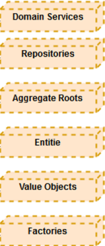

# 마이크로서비스 기반 SW개발 프로세스

### 마이크로서비스 아키텍처 기반 개발 개요

SW개발 방법에는 전통적인 개발 방법인 구조적 방법부터 소프트웨어 개발환경이 호스트 환경에서 Client/Server 환경으로 변화되었고 인터넷이 활성화되면서 웹개발 환경으로 급속도로 진화하였다. 클라우드 환경은 이미 저변 확대되고 있으며 기존 개발환경도 클라우드로 빠르게 전환 발전하고 있다. 이런 변화에 따라 클라우드 환경에 최적화된 SaaS(Software-as-a-service) 개발 방법이 출현하였다. 

​     클라우드 환경에서 애플리케이션은 여러 개의 서로 독립적인 기능을 하는 서비스로 구성한다. 이 서비스들을 어떻게 구성하고 어떻게 연결하고 어떻게 관리하느냐가 관건이다. 서비스를 묶어서 하나의 통합된 ‘비지니스 서비스’를 할 수 있도록 하기 위한 다양한 기능과 기술이 필요하다. 

​     기존 모놀리식 아키텍처는 단일 애플리케이션에 많은 서비스가 실행되기 때문에 문제가 발생하면 심각한 경우 서비스를 중지해야 한다. 또한, 서비스 간의 종속성이 높아 아주 작은 결함에도 연관된 모든 서비스를 점검하고 이슈를 해결해야 하는 문제가 있다. 이런 문제를 조금이라도 해소할 수 있는 방법으로 마이크로서비스 아키텍처가 등장하게 되었다. 마이크로서비스 아키텍처는 클라우드 환경과 개별 기능을 하는 서비스 중심으로 개발하고 각 서비스는 느슨하게 결합되어 있어야 한다. 마이크로서비스 앱 개발은 기존 모놀리식 애플리케이션과 코딩은 동일하게 수행하지만 애플리케이션 단위가 매우 작고 애플리케이션 간의 API Gateway를 통해서 네트워크가 연결되기 때문에 설계 단계에서부터 마이크로서비스로의 설계 및 API 설계가 매우 중요하다. 본 개발 프로세스 가이드에서는 마이크로서비스 애플리케이션 개발을 위한 절차를 설명한다.

#### 특징

클라우드 네이티브 애플리케이션 개발을 근거로 하여 마이크로서비스 기반 개발프로세스를 정의하였다. 기존 모놀리식 애플리케이션과 달리 마이크로서비스 기반 개발 시 고려 사항 위주의 절차를 정의하였다. 또한, 본 가이드는 마이크로서비스 스튜디오를 이용하여 마이크로서비스를 구성(설정) 하는 방법을 동시에 제공하여 마이크로서비스를 좀 더 쉽게 적용할 수 있도록 하였다. 마이크로서비스 개발은 클라우드와 밀접한 관계가 있어 클라우드 환경에서 클라우드 플랫폼과 마이크로서비스를 연동하여 개발하는 절차도 같이 제공한다.

마이크로서비스 아키텍처의 실질적 개발에 빠르게 적용할 수 있도록 절차(프로세스)와 해당 프로세스가 마이크로서비스 스튜디오에서 제공하는 기능이 있는 경우 기능에 대한 설명을 포함하고 있다. 특히, 마이크로서비스 애플리케이션 개발은 Spring Cloud와 같은 마이크로서비스 개발에 적합한 프레임워크가 거의 필수 요소이다. 마이크로서비스 스튜디오는 클라우드 플랫폼과 프레임워크를 연동하여 사용자가 쉽고 편리하게 개발하고 운영할 수 있는 기능을 갖고 있어 관련된 가이드도 포함하고 있다. 

### 마이크로서비스 아키텍처 설계 지침

마이크로서비스 기반 개발을 위한 비즈니스 분석은 서비스 분할 방법을 적용하여 각 서비스 영역 간에 관계 정의가 매우 중요하다. 서비스가 사용하는 데이터 또한 완전하게 분리되어야 하고 각 서비스 간의 결합도는 최소화되어 있어야 한다. 

​    마이크로서비스 아키텍처 설계는 이미 알려진 다양한 패턴이 있는데 가장 많이 사용하고 있는 업무 영역별로 서비스를 분할하는 서브도메인 설계와 도메인 모델, 서비스간의 통신을 위한 API 설계 및 데이터 분산 패턴을 적용할 수 있다. 

​    마이크로서비스 아키텍처 설계는 애플리케이션의 하위 기능 단위를 마이크로서비스 단위로 하는데 기능의 결합도에 따라 1개 또는 그 이상의 기능으로 마이크로서비스를 구성할 수 있다. 

- 기능간 호출관계가 복잡한 기능은 묶어서 하나의 마이크로서비스로 구성
- 직접 구현/관리 가능한 기능은 마이크로서비스 내부에 직접 구현
- 공통 기능은 서비스로 구현
- 마이크로서비스 간의 호출을 위한 API 설계
- 마이크로서비스 단위로 데이터베이스 분산

#### 설계 방법

애플리케이션 대부분의 새로운 요구 사항과 변경된 요구 사항이 단일 서비스에만 영향을 미치는 방식으로 분해된다. 여러 서비스에 영향을 미치는 변경 사항은 여러 팀 간에 조정이 필요하므로 개발 속도가 느려질 수 있기 때문이다. 목표는 해당 비즈니스 규칙이 개발자를 변경할 때 적은 수의 패키지 (이상적으로는 하나만)로 코드를 변경하면 된다는 것이다. 이러한 변화는 각 변경 사항이 하나의 서비스에만 영향을 미치도록 서비스를 설계할 때 의미가 있다.

- 핵심 - 비지니스와 애플리케이션의 가장 중요한 부분을 위한 차별화 요소
- 지원 - 비지니스가 하는 것과 관련이 있지만 차별화 요소는 아님
- 일반 - 비지니스에만 국한되지 않으며 상횽 소프트웨어를 사용하여 이상적으로 구현

도메인은 프로젝트가 다루는 영역 : 용어, 유비쿼터스 언어, 요구사항 및 문제 해결이 있다. 자동차, 은행, 담보 대출, 신용, 직불 계좌, 신용 카드, 소매 대출, 콘텐츠 관리 등이 구체적인 영역을 포함할 수 있지만 모든 영역을 포함할 수 없다.

#### 설계 원칙

마이크로서비스 아키텍처의 설계를 위한 몇 가지 기본 사항이 있다.

 [출처 :https://dzone.com/articles/9-fundamentals-to-a-successful-microservice-design]

##### 1) 서비스의 범위

 제품별로 고유한 기능을 설정하거나 지원하기 위해 서로 다른팀이 개발 및 배포를 동시에 구현하면 마이크로서비스 범위를 정의하는 것이 매우 중요한 작업이다. 많은 사람들이 너무 많은 작은 마이크로서비스를 만드는 것에 대한 고민을 갖고 있다. 마이크로서비스 범위를 정하려면 독립적인 소프트웨어 모듈의 기능을 언급한다. 거의 상태 변화가 없는 시스템으로 수행할 수 있는 마이크로서비스 기능을 통해 독립적으로 개발할 수 있다. 따라서, 마이크로서비스가 구현할 기능을 식별하는 것이 필수적이다. 

   마이크로서비스의 범위를 정의하는 방법에 정확하게 정의된 규칙은 없지만 범위를 정의할 수 있는 몇 가지 지침이나 사례는 있다. 아래 단계를 참조하여 마이크로서비스 범위를 정의할 수 있다.

- 다른 모듈에서 반복적으로 사용하는 코드를 식별하여 얼마나 자주 반복되는지 확인한다. 서로 다른 모듈에서 매번 설정하는데 많은 노력을 필요로 한다면 마이크로서비스의 범위는 반복되는 코드 부분을 처리하는 것이다.
- 수행할 수 있는 또 다른 단계는 모듈이 다른 모듈에 의존되어 있지 않은지 또는 더 간단한 용어로 확인한다. 모듈이 나머지 서비스와 느슨하게 연결되어 있는지 확인한다. 이런 경우는 마이크로서비스의 범위는 전체 모듈의 범위가 된다.
- 기능이 과부하로 사용되는지 확인한다. 짧은 시일 내에 마이크로서비스를 확장해야 하는지 확인하면, 확장 가능한 비트를 다른 기능과 결합하기보다는 확장 가능한 비트를 마이크로서비스 범위로 정의하는 것이 좋다.

##### 2) 느슨한 결합과 결합된 높은 응집력

 마이크로서비스의 주요 특징은 서로 독립적인 서비스를 제공하는 것이다. 다른 서비스를 방해하지 않으면서 새로운 서비스를 편집, 업데이트 및 배포할 수 있음을 의미한다. 상호의존성이 낮은 경우에 가능하다. 느슨하게 연결된 시스템은 한 서비스가 다른 서비스에 대해 전혀 모르는 시스템일 수 있다. 

   응집력이 높을수록 마이크로서비스 아키텍처가 더 좋다. 응집력이 낮으면 서로 다른 서비스 간 통신이 너무 많아 시스템 성능이 저하될 수 있다.

##### 3) 고유한 식별 원칙

 마이크로서비스 설계의 기본에 따라 모든 서비스가 나머지 시스템의 고유한 식별 소스가 되는 것이 중요하다. 전자상거래의 경우 웹사이트에서 주문한 후, 주문 ID가 사용자에게 제공되고 생성된 주문 ID에는 주문에 관한 모든 정보가 포함된다. 마이크로서비스로서 주문 ID는 주문 서비스와 관련된 정보의 유일한 소스이다. 따라서 다른 서비스가 주문 서비스에 관한 정보를 찾는 경우 주문 ID는 실제 속성이 아닌 정보의 소스로 작동한다.

##### 4) API 통합

모놀리식 아키텍처의 설계는 여러 서비스로 분류하면 서비스가 함께 조정되어 시스템을 구성하게 된다. 그러나 이러한 서비스는 통신은 어떻게 구성하는지 알야 한다. 여러 기술을 사용하여 다른 서비스를 생성한다고 가정해보면 그들 간의 서로 어떻게 관련이 있을까 ?

   간단하게 API(Application Programming Interface)를 사용하는 것이다. 마이크로서비스 설계의 기본은 정확한 API를 사용하는 것이다. 이는 서비스와 클라이언트 호출 간의 통신을 유지하는데 중요하다. 적절한 기능을 위해서는 쉬운 전환과 실행이 중요하다. API를 생성할 때 또 다른 중요한 사항은 비즈니스 영역이다. 이러한 도메인 정의는 기능을 차별화하는 프로세스를 용이하게 한다. 시스템 외부에는 여러 클라이언트가 있고 클라이언트는 다른 애플리케이션이나 사용자일 수 있다. 비즈니스 로직이 호출될 때마다 요청을 리턴하고 데이터베이스를 변경하는 어댑터에 의해 처리한다.

##### 5) 데이터 스토리지 분리

특정 서비스에 대해 저장된 모든 데이터는 해당 특정 서비스에 대해 비공개로 만들어야 한다. 즉, 데이터에 대한 모든 액세스 권한은 서비스에서 소유해야 한다. 이 데이터는 API를 통해서만 다른 서비스와 공유할 수 있다. 데이터에 대한 제한된 액세스를 유지하고 ‘서비스 연결’을 피하기 위해 매우 중요하다. 사용자를 기준으로 데이터를 분류하는 것도 중요하며 CQRS(Command and Query Responsibility Segregation)를 통해 수행할 수 있다.

##### 6) 트래픽 관리

API가 설정되고 시스템이 실행되면 다른 서비스로의 다양한 트래픽이 발생한다. 트래픽은 클라이언트가 특정 서비스로 보내는 것을 말한다. 실제 시나리오에서, 하나의 서비스는 느리게 실행됨에 따라 API를 호출하는데 더 많은 시간이 걸릴 수 있다. 또는 서비스 호출이 초과할 수 있다. 두 경우 모두 소프트웨어나 하드웨어 충돌을 발생하여 성능에 영향을 미친다.

   높은 트래픽 수요는 관리가 필요하고 호출을 하거나 받는 구체적인 방법은 원활한 트래픽 흐름이 해답이다. 서비스는 지연을 유발하고 성능에 영향을 미치는 모든 인스턴스를 종료할 수 있어야 한다. 이는 필요할 때마다 즉각적인 조치로 서비스를 지속적으로 추적하는 ‘자동확장’이라는 프로세스를 사용하여 달성할 수도 있다. 경우에 따라 호출이 끊어지거나 서비스가 응답하지 않는 경우 사용할 수 있는 정보를 제공하려면 ‘Circuit Breaker Pattern’을 이용할 수 있다.

##### 7) 프로세스 자동화

독립적으로 설계된 마이크로서비스는 자체적으로 작동할 수 있어야 한다. 자동화는 사람의 개입없이 자체 배치 및 기능을 가능하게 한다. 이 프로세스를 통해 서비스는 본질적으로 클라우드 네이티브가 될 수 있으며 모든 환경에 배포할 수 있다. 그러나 이것을 달성하려면 DevOps팀이 서비스의 발전을 위해 지속적으로 노력하는 것이 매우 중요하다.    

##### 8) 최소 단위의 데이터베이스 테이블

데이터를 패치하기 위해 데이터베이스 테이블에 액세스하는 것은 시간이 오래 걸릴 수 있다. 시간과 에너지를 소비할 수 있다. 마이크로서비스를 설계하는 동안 주요 동기는 데이터베이스와 그 동작보다는 비즈니스 기능을 중심으로 해야 한다. 이를 위해 수백만 개의 데이터 항목이 있어도 마이크로서비스 디자인에는 몇 개의 테이블만 있어야 한다. 최소 수치 외에도 비즈니스 중심의 초점이 핵심이다.

### 마이크로서비스 식별

마이크로서비스 크기(규모)에 대한 일반적인 지침은 없다. 대개는 마이크로서비스는 하나의 기능을 수행하고 제한된 컨텍스트가 있어야 한다. 또한, 일부 기능이 다른 기능보다 자주 변경되면 별도의 서비스를 선택할 수 있다. 

​     마이크로서비스 크기(규모)를 식별하기 위한 사례를 통하여 이해할 수 있다. 

​      ·직원 서비스

​      ·인증 서비스

 만약 위에 정의한 직원 서비스와 인증 서비스 두 개의 서비스에 추가로 직원 검색 서비스를 추가하는 경우에 어떻게 마이크로서비스를 식별할 수 있는지 확인해보자. 우선 재사용 가능한 일반적인 구성이어야 하기 때문에 ‘검색 서비스‘를 선택한다. 이를 통해 기존 테스트에 영향을 미치지 않으면 쉽게 분리하고 문제를 해결하고 배포할 수 있다.

마이크로서비스를 서로 독립적으로 업데이트, 구축, 배포 및 확장할 수 있어야 하기 때문에 일반적으로 새로운 코드 저장소, 지속적인 통합 및 지속적인 배포를 위한 별도의 파이프라인 및 환경 구성 데이터가 필요하다.

 ※ 마이크로서비스를 식별하는 과정에서 발생하는 문제 중에

​     - 나노 서비스를 정의하지 말아야 한다. 

​     - 모든 마이크로서비스를 미리 식별하는데 시간으로 소비하지 말아야 한다. 

​     - 초기에 더 세분화된(소규모 서비스에서 마이크로서비스)로 기본 혜택과 요구를 분해할 수 있는 좀 더 큰 규모         의 서비스를 사용하는 것이 좋다.

### 도메인 주도 설계

마이크로서비스 아키텍처 설계는 서비스를 잘게 쪼개는 것부터 시작이다. 서비스를 분할하는 다양한 방법들이 있지만 여기에서는 도메인 주도 설계(Domain Driven Design) 기법을 이용하여 마이크로서비스 아키텍처를 설계한다. 

- 모델과 핵심 설계는 상호 영향을 주고받으며 구체화된다.
- 모델은 모든 팀 구성원들이 사용하는 언어의 근간을 이룬다.
- 모델은 불필요한 사항을 걸러낸 핵심 내용만 포함한다.

[출처 : http://martinfowler.com/bliki/BoundedContext.html]

##### 1) Bounded Context

솔루션 도메인을 결정한 후 초기 목표 중 하나는 제한된 컨텍스트를 식별하는 것이다. 경계 컨텍스트를 명시적으로 정의하면 일반적으로 여러 컨텍스트를 확장하려는 모델 요소가 있는지 확인할 수 있다. 경계 컨텍스트는 도메인 모델이 적용되는 개념적 경계이다. 전체 비즈니스 모델이 너무 크고 복잡하여 하나의 단위로 이해하기 어렵고 전체 엔터프라이즈에 대한 통합 모델을 유지할 수 없다. 서로 다른 모델간의 경계와 관계를 표시해야 한다. 거기에서 전략적 설계를 사용할 수 있다.

- 경계 컨텍스트 당 한 개의 팀
- 각 경게 컨텍스트를 위한 코드 리파지토리 분리
- 도메인 모델 + DB 스키마 + UI + Web Services(API)
- 커다란 영역을 더 작은 컨텍스트로 분리
- 각 컨텍스트는 고유한 유비쿼터스 언어와 자체 모델을 가질 수 있다.
- 경게 컨텍스트는 일부 영역을 공유할 수 있다.

독립적으로 서비스 될 때 문제없는 업무 범위로 생각할 수 있으며, 쇼핑몰 사이트를 예로 들면 제품 판매 컨텍스트(sales context), 판매지원 컨텍스트(support context) 등과 같이 분류할 수 있다. 이런 여러 context 내에 비슷해 보이는 용어가 서로 틀린 의미로 사용될 수 있기 때문이다. 

  예를 들어, 상품 정보를 다루는 프로그램 작성자가 Product라는 테이블을 만들어서 쓰고 있어다고 가정하자. 그런데, 다른 개발자가 기획자에게 새로운 요구를 받았을 경우 실제 상품 사양이 확정되지 않았지만, 대략의 세트 구성으로 상품 이미지를 올려서 홍보할 수 있게 프로그램을 고쳐달라고 한다. 그리고, 가격과 사양을 확정하면 팔 수 있게 해달라는 것이다. 기존 상품과 다른 듯하지만, 개발자는 기존 프로그램과 테이블을 최대한 활용하기 마련이다. 그러면, Product 테이블에 세트 속성을 추가하고 이런 경우 재고 수량 계산 등의 방식이나 화면에 보여지는 정보를 조금 다르게 표현하도록 프로그램을 수정한다. 

※ BoundedContext 예시

두 계층으로 나누어 연결한 상품(Prodcut)와 개별항목(Item) 개념 예시이다.

| Product                                                      | Item                                                         |
| ------------------------------------------------------------ | ------------------------------------------------------------ |
| 공급 받은 상품 기준으로 판매액과 수량이 알고 싶다.    실물 상품 코드 기준으로 식별이 가능해야 한다.  공급 상품의 매장 도착 시간 등을 확인할 때 기준을 제시한다. | 공급 상품 기준으로 팔 수도 있지만 세트 구성을 할 수 있다.  특정 기간에만 할인을 적용할 수 있다.  공급 업체와 대금 정산할 때 기준을 줄 수 있어야 한다.   매장에서 손님 기호에 맞춰 상품 구성을 바꿀 수 있게 유연성을 준다. |

온라인 쇼핑몰을 구축하는데 상품 10개만 파는 아주 작은 쇼핑몰을 구현하려는 경우를 가정하자. 한정된 상품만 팔기 때문에 주문이 들어오면 주문 내역을 확인해서 배송만 보내주면 된다. 이런 경우 상품 관리라는 것도 필요 없고, 판매 사이트와 결제 기능만 있으면 모든 것이 완료될 수 있다. 그럼 판매와 결제가 커다란 Bounded Context 될 것이다. 온라인 결제 시스템을 이 사이트를 위해 개발한다면 오히려 결제 시스템 개발 자체가 위험 요소가 될 만큼 커다란 기능이 될 수 있다. 이런 경우 결제 시스템을 개발하지 않고 Paypal 같은 이미 운영되는 결제 서비스를 이용하는 것이 맞다. 그러면, 이 두가지 영역이 이미 Bounded Context이고 마이크로서비스로 구현이 되는 것이다. 판매 기능만 개발하고 결제는 다른 시스템을 이용하여 이미 제공되는 서비스를 메쉬업 시켜서 서비스를 구현할 수도 있다. 만약 상품관리가 필요하고 추가로 배송 시스템과 연계하고 싶다면 상품관리와 배송 2개의 Bounded Context가 새로 추가되는 것이고, 각각의 마이크로서비스가 될 수 있는 것이다. 배송 시스템도 Paypal과 같이 배송업체의 API를 이용하게 되면 상품관리 도메인만 추가로 개발하면 된다. 

##### 2) 서비도메인으로 분할 하기

마이크로서비스 설계 시 다양한 기법을 활용할 수 있다. 여기에서는 Domain Driven Design을 이용하여 비즈니스 도출 및 분할 방법을 정의한다.

※ 주문관리의 서브도메인 예시

- Product Catalog Service
- Inventory management services
- order management services
- Delivery management service

##### 3) Context Map

엔터프라이즈 애플리케이션에는 여러 모델이 있으며 각 모델에는 고유한 바운드 컨텍스트가 있다. 컨텍스트를 팀 구성의 기초로 사용하는 것이 좋다. 같은 팀 사람들은 보다 쉽게 의사소통할 수 있으며 모델과 구현을 통합하여 더 나은 작업을 수행할 수 있다. 모든 팀이 모델을 작업하는 동안 모든 사람이 전체적인 그림을 이해하는 것이 좋다.

##### 4) Entities, aggregates 및 services 정의

entity, value object, aggregate, factory 및 repository는 전체 구현을 위한 도메인 주도 설계의 전술적 접근방식으로도 알려진 빌딩 블록이다.

[출처:https://medium.com/design-and-tech-co/implementing-domain-driven-design-for-microservice-architecture-26eb0333d72e]

- Entity : 엔터티를 추출하는 방법은 개별성과 정체성을 정확하게 파악할 필요가 있을 때 도메인 오브젝을 엔터티로 설계한다. 
  - 고유 명사
  - 변경 가능하고 시간이 지남에 따라 상태가 변경될 수 있음
  - 다른 엔터티와 Value Object 사이에 연결될 수 있음
  - 공유할 수 없음
  - Entity는 내역과 추적할 수 있어야 함

##### 5) Value Object

alue Object는 모델에 관한 속성항목과 식별되지 않는 것에 관한 도메인 개념으로 설계한다. 가능한 경우 엔터티 대신 Value Object를 사용하여 모델링 해야 한다. 

개념이 Value 인지 결정하려면, 이러한 특성을 보유하고 있는지 결정해야 한다.

- 도메인의 사물을 측정, 정량화 또는 설명
- 변경없이 유지 또는 상태 변경할 수 없음
- 관련 속성을 필수 단위로 구성하여 개념 전체를 모델링한다.
- 측정 또는 설명이 변경되면 완전히 교체 가능
- 동일한 Value 인지 평가하여 비교할 수 있어야 함
- 협력자에게 문제없는 행위를 제공

### 마이크로서비스 아키텍처 패턴

마이크로서비스는 독립적으로 배포/확장될 수 있는 서비스들을 조합하여 커다란 어플리케이션을 구성하는 아키텍처 패턴이다. 일반적으로 Service Discovery, API Gateway, Orchestration, Choreography, Context Boundary 등 서비스들의 조합으로 이루어져 있다. 마이크로서비스 패턴은 microservices.io 및 가트너(Gartner) 등에서 소개하고 있다. 

| 마이크로서비스 패턴    | 구분                               | Spring Cloud & *CF        |
| ---------------------- | ---------------------------------- | ------------------------- |
| Cross cutting concerns | Configuration Management           | Config Server             |
|                        | Service Discovery                  | Eureka                    |
|                        | Load Balancing                     | Ribbon                    |
| External API           | API Gateway                        | Zuul                      |
| Security               | Service Security                   | Spring Cloud Security     |
| Observerability        | Centralized Logging                | ELK Stack(LogStash)       |
|                        | Centralized Metrics                | Spectator                 |
|                        | Disctributed Tracing               | Zipkin                    |
| Reliability            | Resilience & Fault Tolerance       | Hystrix, Turbine & Ribbon |
| Deployment Patterns    | Auto Scaling & Self Healing        | PaaS(Cloud Foundry)       |
|                        | Packaging, Deployment & Scheduling | Spring, Spring boot       |
|                        | Job Management                     | Spring Batch              |

*CF : Cloud Foundry(Provotal의 클라우드 플랫폼)

#### 관리 컨테이너

개별 서비스 인스턴스에는 작동할 컨텍스트가 필요하다. 가상 컴퓨터, Docker 컨테이너 또는 조정된 프로세스로 구현된 관리 컨테이너는 이러한 기능을 제공한다. 이 구성 요소는 인스턴스 관리 및 조정을 제공하고 필요에 따라 새 인스턴스를 회전하며 개별 인스턴스의 수명주기를 관리한다.

#### 외부 게이트웨이

마이크로서비스 아키텍처 구현은 비즈니스 응용 프로그램 및 응용 프로그램에서 사용할 수 있는 API 형태로 기능을 노출할 수 있다. 서비스 외부 게이트웨이는 이러한 서비스에 대한 액세스를 관리하고 트래픽 관리 및 보안 정책을 적용하여 마이크로서비스 환경을 보호한다. 외부 게이트웨이 기능은 종종 API 관리 제품을 사용하여 구현되기도 한다.

#### 서비스 메쉬 기능

서비스 메쉬는 서비스 간의 통신을 느슨하게 결합, 신뢰성 및 유연성을 유지하는 데 도움이 되는 기능으로 말한다. 이러한 기능을 통해 서비스 분리, 버전 관리 전략 지원 및 부하 시 탄성 확장성 관리가 가능하다.

- 서비스 라우팅 : 클라이언트 응용 프로그램에서 또는 마이크로서비스 사이의 요청은 구성 및 정책에 따라 올바른 마이크로서비스로 라우팅해야 한다.
- 로드 밸런싱 : 각 마이크로서비스의 인스턴스는 확장성을 지워나기 위해 로드밸런싱이 필요하며 로드밸런싱의 세밀성 및 구성은 각 서비스를 관리하는 팀에 의해 제어되어야 한다.
- 서비스 발견 : 서비스는 느슨하게 결합된 방식으로 검색 가능해야 한다. 서비스 검색은 일반적으로 서비스 레지스트리를 사용하여 구현되며, 이 서비스는 레지스트리에서 마이크로서비스 소유자는 런타임에 다른 서비스가 필요로 하는 정보를 등록 및 구성하여 찾아서 호출할 수 있다. 이것은 네트워크 수준의 DNS와 유사하게 생각할 수 있다. 서비스 발견은 또한 마이크로서비스 간에 존재할 종속성을 관리하는데 도움을 주며 환경 변화를 관리할 때 중요하다.
- 구성 저장소 : 서비스 인스턴스는 마이크로서비스와 전체 환경과 관련된 구성을 공유해야 한다. 예를 들어 환경에 배포된 마이크로서비스에는 서비스 검색 레지스트리의 위치와 로그 이벤트를 내보내는 위치를 파악하는 방법이 필요하다. 마이크로서비스 환경의 분산 특성으로 인해 분산 키 - 값 저장소를 사용하여 구현되는 경우가 많다.
- ID공급자 : 서비스 인스턴스는 신뢰할 수 있는 ID를 사용하여 통신해야 한다. 서비스 메쉬는 이러한 ID를 제공하고 유효성을 검사한다. 여기에는 외부 ID공급자 또는 디렉토리와의 통합이 포함될 수 있다. 

#### 서비스 이미지 레지스트리

사용자 환경의 어딘가에는 빌드되고 테스트된 서비스의 불변 이미지를 저장하는 레지스트리가 있다. 이 저장소에 사용되는 기술은 사용하는 배포 단위에 따라 다르다. 코드 저장소 (동적으로 생성된 서비스의 경우), Docker 이미지 레지스트리, 이진 아티팩트 저장소 또는 VM 이미지의 BLOB (Binary Large Object) 기반 저장소 일 수 있다.

#### 메시지 지향 미들웨어

가장 간단한 MSA 구현은 HTTP와 같은 동기식 프로토콜 또는 gRPC 또는 Thrift와 같은 보다 효율적인 프로토콜을 사용하여 지속 가능할 수 있다. 그러나 대부분의 마이크로서비스는 게시/가입 같은 이벤트 및 메시지 중심 패턴을 지원하기 위해 비동기 메시징 채널이 필요하다.

#### 빌드 및 테스트 자동화

마이크로서비스의 개발 민첩성 이점은 개발 결과물의 품질을 극대화하고 전달을 간소화하기 위해 개발주기에서 높은 수준의 빌드 및 테스트 자동화가 필요하다.

#### 배포 자동화

개발 민첩성 이점을 완전히 실현하려면 배포를 자동화해야 한다. 새롭거나 향상된 마이크로서비스의 배포를 자동화할 뿐만 아니라 외부 아키테처 자체의 변경자동화(예:배포의 일부로 서비스 라우팅, 로드 균현 조정, 서비스 검색 및 서비스 구성 데이터 업데이트)를 지원해야 한다. 

#### 플랫폼 자동화

마이크로서비스의 런타임 확장성과 적응성 이점을 실현하려면 외부 아키텍처엥 기본 플랫폼과 관련된 자동화 기능 지원이 포함되어야 한다. 여기에는 VM 또는 컨테이너의 프로비저닝 및 각 마이크로서비스의 실행 중인 인터스턴스 관리가 포함된다.

#### 모니터링 및 경고

분산 환경은 환경에서 문제가 발생할 때 모니터링 및 경고의 복잡성을 증가시킨다. 외부 아키텍처는 일관되고 효율적으로 이를 수행할 수 있는 기능을 제공해야 한다.

#### 로깅 및 진단

분산 환경에서 문제가 발생하면 근본 원인을 식별하고 격리하기가 어려울 수 있다. 분산된 프로세스의 추적을 포함하여 자세한 계측 및 진단 분석을 지원함으로써 외부 아키텍처는 마이크로서비스 팀이 문제를 보다 신속하게 분류하고 해결할 수 있도록 지원한다.

#### ID 제공

토큰 기반 서비스를 사용하여 인증 및 권한 부여를 외부화하는 것응 안전한 고객 대 서비스 및 서비스 대 서비스 상호 작용을 보장하는 것이 좋다.

### 데이터 분산을 위한 데이터베이스 패턴

분산 데이터 관리를 위한 패턴으로 각 마이크로서비스는 개별 데이터베이스를 가질 수 있으며 제공하는 비즈니스 기능을 구현하는데 필요한 데이터 유지하고 전용 데이터베이스에만 접근할 수 있고 다른 마이크로서비스의 데이터베이스에는 액세스할 수 없음

- 데이터베이스 완전 분리 : 분산 데이터 관리는 완전히 분리된 마이크로서비스를 제공하고 이종 데이터 관리 기술을 선택할 수 있는 자유를 제공. 여러 마이크로서비스에 동기화 메시징이 필요한 경우 API를 통한 데이터베이스 업데이트
- CQRS(Command Query Responsibility Segregation)
  - 시스템에서 명령을 처리하는 책임과 조회를 처리하는 책임을 분리하는 것이 CQRS의 핵심
  - 명령과 조회에 대해 정의할 필요가있으며, CQRS에서 명령은 시스템의 상태를 변경하는 작업을 의미하며 조회는 시스템의 상태를 반환하는 작업을 의미함. CQRS는 시스템의 상태를 변경하는 작업과 시스템의 상태를 반환하는 작업의 책임을 분리하는 것이다.

[출저:Gartner]

### 구현 방법

마이크로서비스 아키텍처는 독립적으로 배포 가능한 아주 작은 서비스들의 묶음으로 애플리케이션을 설계하는 방법이다. 서비스의 경우 대개 도메인을 기준으로 나뉜다. 컴포넌트들 간의 결합도를 낮춘 것만으로 기존 모놀리식 아키텍처의 단점을 효과적으로 해결할 수 있다. 

#### 고려사항

- 성능 : 서로 독립적인 서비스로 분리된 컴포넌트들은 API 통신을 통해 데이터를 주고 받아야 하기 때문에 성능 저하가 발생할 수 있다.
- 트랜잭션 관리의 어려움 : 서로 독립적인 서비스로 분리된 컴포넌트들 간의 발생한 트랜잭션의 관리의 어려움
- 데이터 무결성 보장의 어려움 : 서비스 단위로 데이터 레이어 간의 역정규화를 하게 될 경우, 해당 데이터에 대한 무결성 보장의 어려움

#### 마이크로서비스 구현 요소

##### 1) Service Discovery

각 서비스의 네트워크 위치 정보(IP, Port)를 저장하고 관리한다. 특히, 클라우드와 같이 각 서비스의 네트워크 정보가 동적으로 바뀔 수 있는 환경에서는 필수적이다. 

##### 2) API Gateway

서비스에 해당하는 각 API 서버의 엔드 포인트를 단일화하여 클라이언트의 요청을 처리할 적합한 서비스로 라우팅한다.

##### 3) Circuit Breaker

특정 서비스에서의 장애가 다른 서비스로 전파되지 않도록 한다.

##### 4) Message Queue

서비스들 간의 통신은 비동기로 구현하여 서비스들 간의 통신으로 인한 의존성이 발생하지 않도록 한다.

##### 5) Load balancing

소프트웨어 클라이언트에서 로드 밸런서(ribbob client)을 구성하고 런타임 시 자동 구성

### 12 Factor 방법

클라우드 상에서 Software as a Service를 개발하기 위한 방법론으로 어떤 프로그래밍 언어로 작성된 응용 프로그램에도 적용할 수 있고 백엔드 서비스 (데이터베이스, 메시지 서버, 메모리 캐시 등)와 조합하여 적용한다.

클라우드 네이티브 개발로 이관하는 주요 동기는 품질을 유지하면서 애플리케이션의 구현 및 배포를 빠르게 하기 위함이다. 대부분의 경우 마이크로서비스가 이런 부분을 달성하도록 도와준다. 

이러한 마이크로서비스를 설계하려면 프로그램을 개발해야 하는데 많은 것을 고려해야 한다. 분산시스템 기반의 애플리케이션을 위한 아키텍처지만, 마이크로서비스아키텍처는 서비스가 아닌 환경에 더 집중하는 경우가 많아졌다.

- 설치 자동화에 대한 선언적인 형식을 사용하여 프로젝트에 추가된 새로운 개발자가 시간과 비용을 최소화
- 하부 OS에 의존 관계를 명확히 하고 실행 환경 사이에 이식성을 최대화
- 현대적인 클라우드 플랫폼에서의 배포에 적합하며, 서버 관리 및 시스템 관리가 불필요
- 개발 환경과 운영 환경의 차이를 최소화하고 민첩성을 극대화하는 지속적인 배포 가능
- 아키텍처 개발 사례를 크게 변경하지 않고 확장

| #    | 요소                  | 설명                                                         |
| ---- | --------------------- | ------------------------------------------------------------ |
| 1    | 코드베이스            | 코드를 한곳에서 관리하고 Git 사용 추천, 다양한 배포가 가능   |
| 2    | 종속성                | 명시적으로 선언되고 분리된 종속성                            |
| 3    | 설정                  | 환경(environment)에 저장된 설정                              |
| 4    | 백엔드 서비스         | 백엔드 서비스를 연결된 리소스로 취급                         |
| 5    | 빌드, 릴리즈, 실행    | 철저하게 분리된 빌드와 실행 단계                             |
| 6    | 프로세스              | 애플리케이션을 하나 혹은 여러개의 무상태(stateless) 프로세스로 실행 |
| 7    | 포트 바인딩           | 포트 바인딩을 사용해서 서비스를 공개함                       |
| 8    | 동시성                | 프로세스 모델을 사용한 확장                                  |
| 9    | 폐기 가능             | 빠른 시작과 그레이스풀 셧다운(graceful shutdown)을 통한 안정성 극대화 |
| 10   | 개발/프로덕션환경일치 | 개발, 스테이징, 프로덕션 환경을 최대한 비슷하게 유지         |
| 11   | 로그                  | 로그를 이벤트 스트림으로 취급                                |
| 12   | Admin프로세스         | admin/mainatenance 작업을 일회성 프로세스로 실행             |

<출처 : 12factor.net>